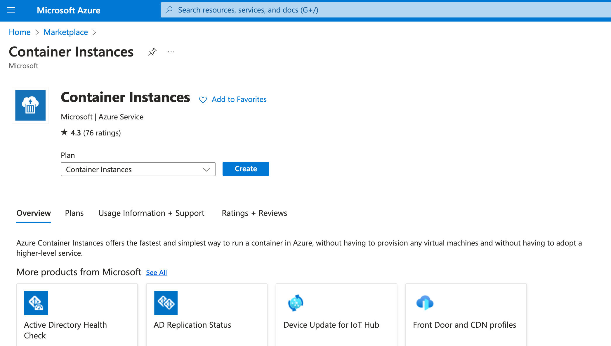
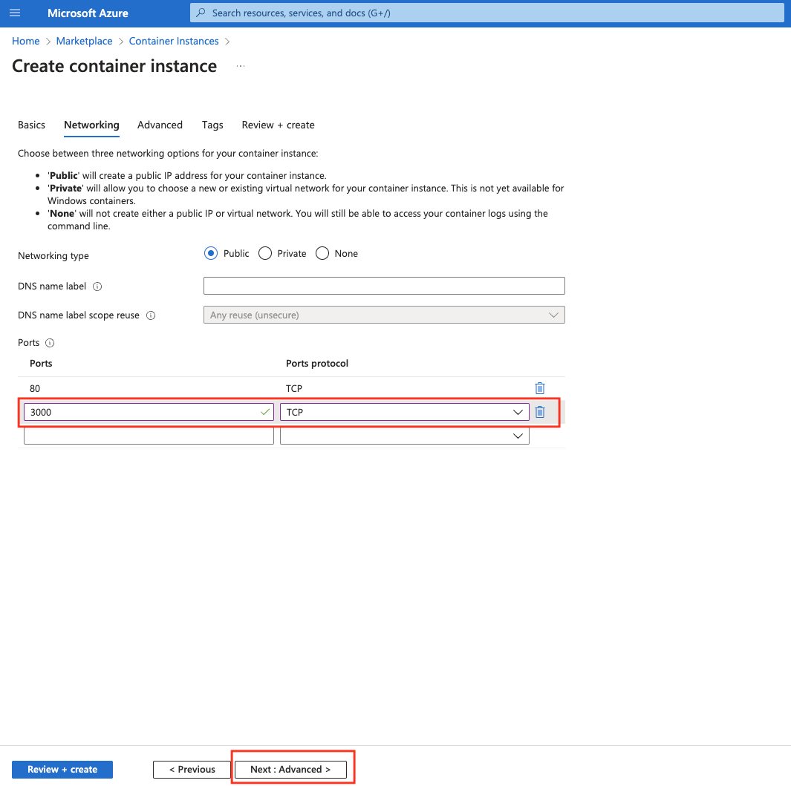
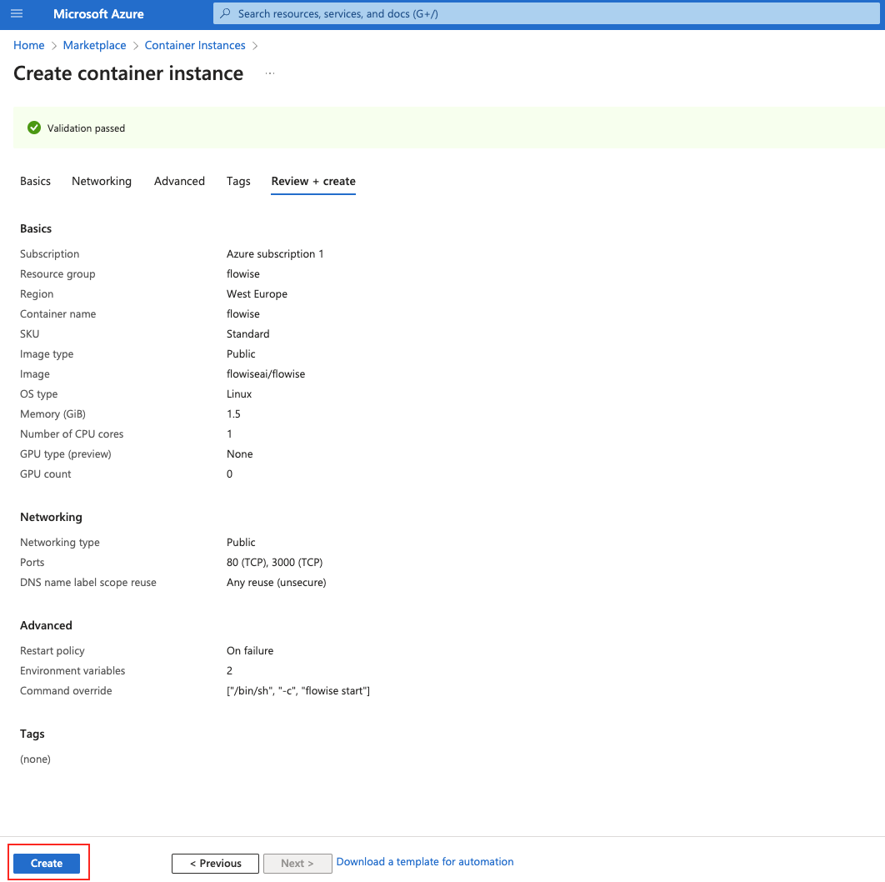
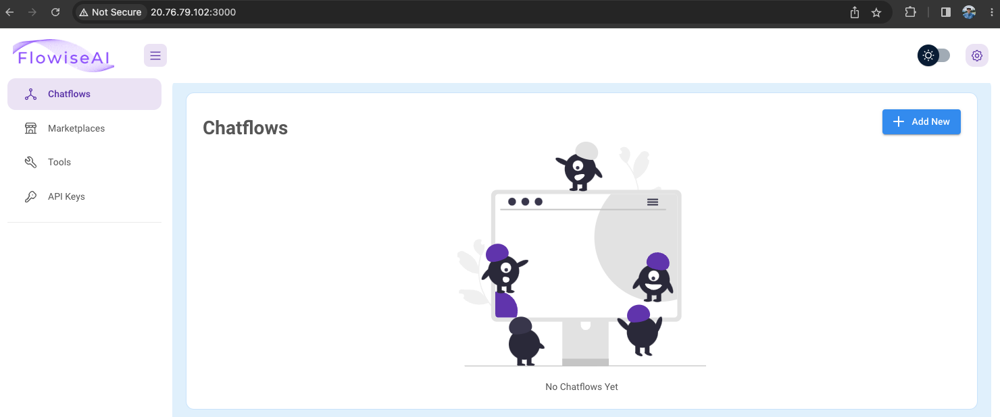

# Azure

***

## Postgresを使用したAzure App ServiceとしてのFlowise: Terraformの使用

### 前提条件

1. **Azureアカウント**: アクティブなサブスクリプションを持つAzureアカウントが必要です。アカウントをお持ちでない場合は、[Azureポータル](https://portal.azure.com/)でサインアップしてください。
2. **Terraform**: マシンにTerraform CLIをインストールしてください。[Terraformのウェブサイト](https://www.terraform.io/downloads.html)からダウンロードできます。
3. **Azure CLI**: Azure CLIをインストールしてください。手順は[Azure CLIドキュメントページ](https://docs.microsoft.com/en-us/cli/azure/install-azure-cli)にあります。

### 環境のセットアップ

1. **Azureにログイン**: ターミナルまたはコマンドプロンプトを開き、以下を使用してAzure CLIにログインします:

```bash
az login --tenant <サブスクリプションID> --use-device-code
```

プロンプトに従ってログインプロセスを完了してください。

2. **サブスクリプションの設定**: ログイン後、以下を使用してAzureサブスクリプションを設定します:

```bash
az account set --subscription <サブスクリプションID>
```

3. **Terraformの初期化**:

Terraformプロジェクトディレクトリに`terraform.tfvars`ファイルがまだない場合は作成し、以下の内容を追加します:

```hcl
subscription_name = "サブスクリプション名"
subscription_id = "サブスクリプションID"
project_name = "Webアプリ名"
db_username = "Postgresユーザー名"
db_password = "強力なPostgresパスワード"
flowise_username = "Flowiseユーザー名"
flowise_password = "強力なFlowiseパスワード"
flowise_secretkey_overwrite = "長く強力なシークレットキー"
webapp_ip_rules = [
  {
    name = "許可されたIP"
    ip_address = "X.X.X.X/32"
    headers = null
    virtual_network_subnet_id = null
    subnet_id = null
    service_tag = null
    priority = 300
    action = "Allow"
  }
]
postgres_ip_rules = {
  "ValbyOfficeIP" = "X.X.X.X"
  // 必要に応じてキーと値のペアを追加
}
source_image = "flowiseai/flowise:latest"
tagged_image = "flow:v1"
```

プレースホルダーを実際のセットアップの値に置き換えてください。

ファイルツリー構造は以下の通りです:

```
flow
├── database.tf
├── main.tf
├── network.tf
├── output.tf
├── providers.tf
├── terraform.tfvars
├── terraform.tfvars.example
├── variables.tf
├── webapp.tf
├── .gitignore // .tfvarsと.lock.hcf、.terraformを無視
```

Terraform設定の各`.tf`ファイルには、インフラストラクチャのコードの異なる側面が含まれています:

<details>

<summary>`database.tf` は Postgres データベースの設定を定義します。</summary>

```yaml

// database.tf

// Database instance
resource "azurerm_postgresql_flexible_server" "postgres" {
  name                         = "postgresql-${var.project_name}"
  location                     = azurerm_resource_group.rg.location
  resource_group_name          = azurerm_resource_group.rg.name
  sku_name                     = "GP_Standard_D2s_v3"
  storage_mb                   = 32768
  version                      = "11"
  delegated_subnet_id          = azurerm_subnet.dbsubnet.id
  private_dns_zone_id          = azurerm_private_dns_zone.postgres.id
  backup_retention_days        = 7
  geo_redundant_backup_enabled = false
  auto_grow_enabled            = false
  administrator_login          = var.db_username
  administrator_password       = var.db_password
  zone                         = "2"

  lifecycle {
    prevent_destroy = false
  }
}

// Firewall
resource "azurerm_postgresql_flexible_server_firewall_rule" "pg_firewall" {
  for_each         = var.postgres_ip_rules
  name             = each.key
  server_id        = azurerm_postgresql_flexible_server.postgres.id
  start_ip_address = each.value
  end_ip_address   = each.value
}

// Database
resource "azurerm_postgresql_flexible_server_database" "production" {
  name      = "production"
  server_id = azurerm_postgresql_flexible_server.postgres.id
  charset   = "UTF8"
  collation = "en_US.utf8"

  # 偶発的なデータ損失の可能性を防ぐ
  lifecycle {
    prevent_destroy = false
  }
}

// Transport off
resource "azurerm_postgresql_flexible_server_configuration" "postgres_config" {
  name      = "require_secure_transport"
  server_id = azurerm_postgresql_flexible_server.postgres.id
  value     = "off"
}
```

</details>

<details>

<summary>`main.tf` は Azure プロバイダーの設定を含み、Azure リソースグループを定義するメインの設定ファイルです。</summary>

```yaml
// main.tf
resource "random_string" "resource_code" {
  length  = 5
  special = false
  upper   = false
}

// resource group
resource "azurerm_resource_group" "rg" {
  location = var.resource_group_location
  name     = "rg-${var.project_name}"
}

// Storage Account
resource "azurerm_storage_account" "sa" {
  name                     = "${var.subscription_name}${random_string.resource_code.result}"
  resource_group_name      = azurerm_resource_group.rg.name
  location                 = azurerm_resource_group.rg.location
  account_tier             = "Standard"
  account_replication_type = "LRS"

  blob_properties {
    versioning_enabled = true
  }

}

// File share
resource "azurerm_storage_share" "flowise-share" {
  name                 = "flowise"
  storage_account_name = azurerm_storage_account.sa.name
  quota                = 50
}

```

</details>

<details>

<summary>`network.tf` は仮想ネットワーク、サブネット、ネットワークセキュリティグループなどのネットワークリソースを含みます。</summary>

```yaml
// network.tf

// Vnet
resource "azurerm_virtual_network" "vnet" {
  name                = "vn-${var.project_name}"
  location            = azurerm_resource_group.rg.location
  resource_group_name = azurerm_resource_group.rg.name
  address_space       = ["10.3.0.0/16"]
}

resource "azurerm_subnet" "dbsubnet" {
  name                                      = "db-subnet-${var.project_name}"
  resource_group_name                       = azurerm_resource_group.rg.name
  virtual_network_name                      = azurerm_virtual_network.vnet.name
  address_prefixes                          = ["10.3.1.0/24"]
  private_endpoint_network_policies_enabled = true
  delegation {
    name = "delegation"
    service_delegation {
      name = "Microsoft.DBforPostgreSQL/flexibleServers"
    }
  }
  lifecycle {
    ignore_changes = [
      service_endpoints,
      delegation
    ]
  }
}

resource "azurerm_subnet" "webappsubnet" {

  name                 = "web-app-subnet-${var.project_name}"
  resource_group_name  = azurerm_resource_group.rg.name
  virtual_network_name = azurerm_virtual_network.vnet.name
  address_prefixes     = ["10.3.8.0/24"]

  delegation {
    name = "delegation"
    service_delegation {
      name = "Microsoft.Web/serverFarms"
    }
  }
  lifecycle {
    ignore_changes = [
      delegation
    ]
  }
}

resource "azurerm_private_dns_zone" "postgres" {
  name                = "private.postgres.database.azure.com"
  resource_group_name = azurerm_resource_group.rg.name
}

resource "azurerm_private_dns_zone_virtual_network_link" "postgres" {
  name                  = "private-postgres-vnet-link"
  resource_group_name   = azurerm_resource_group.rg.name
  private_dns_zone_name = azurerm_private_dns_zone.postgres.name
  virtual_network_id    = azurerm_virtual_network.vnet.id
}

```

</details>

<details>

<summary>`providers.tf` は Azure などの Terraform プロバイダーを定義します。</summary>

```yaml
// providers.tf
terraform {
  required_version = ">=0.12"

  required_providers {
    azurerm = {
      source  = "hashicorp/azurerm"
      version = "=3.87.0"
    }
    random = {
      source  = "hashicorp/random"
      version = "~>3.0"
    }
  }
}

provider "azurerm" {
  subscription_id = var.subscription_id
  features {}
}
```

</details>

<details>

<summary>`variables.tf` はすべての `.tf` ファイルで使用される変数を宣言します。</summary>

```yaml
// variables.tf
variable "resource_group_location" {
  default     = "westeurope"
  description = "Location of the resource group."
}

variable "container_rg_name" {
  default     = "acrllm"
  description = "Name of container regrestry."
}

variable "subscription_id" {
  type        = string
  sensitive   = true
  description = "Service Subscription ID"
}

variable "subscription_name" {
  type        = string
  description = "Service Subscription Name"
}


variable "project_name" {
  type        = string
  description = "Project Name"
}

variable "db_username" {
  type        = string
  description = "DB User Name"
}

variable "db_password" {
  type        = string
  sensitive   = true
  description = "DB Password"
}

variable "flowise_username" {
  type        = string
  description = "Flowise User Name"
}

variable "flowise_password" {
  type        = string
  sensitive   = true
  description = "Flowise User Password"
}

variable "flowise_secretkey_overwrite" {
  type        = string
  sensitive   = true
  description = "Flowise secret key"
}

variable "webapp_ip_rules" {
  type = list(object({
    name                      = string
    ip_address                = string
    headers                   = string
    virtual_network_subnet_id = string
    subnet_id                 = string
    service_tag               = string
    priority                  = number
    action                    = string
  }))
}

variable "postgres_ip_rules" {
  description = "A map of IP addresses and their corresponding names for firewall rules"
  type        = map(string)
  default     = {}
}

variable "flowise_image" {
  type        = string
  description = "Flowise image from Docker Hub"
}

variable "tagged_image" {
  type        = string
  description = "Tag for flowise image version"
}
```

</details>

<details>

<summary>`webapp.tf` はサービスプランと Linux Web アプリを含む Azure App Services の設定です</summary>

```yaml
// webapp.tf
# Linux App Service Plan の作成
resource "azurerm_service_plan" "webappsp" {
  name                = "asp${var.project_name}"
  resource_group_name = azurerm_resource_group.rg.name
  location            = azurerm_resource_group.rg.location
  os_type             = "Linux"
  sku_name            = "P3v3"
}

resource "azurerm_linux_web_app" "webapp" {
  name                = var.project_name
  resource_group_name = azurerm_resource_group.rg.name
  location            = azurerm_resource_group.rg.location
  service_plan_id     = azurerm_service_plan.webappsp.id

  app_settings = {
    DOCKER_ENABLE_CI                    = true
    WEBSITES_CONTAINER_START_TIME_LIMIT = 1800
    WEBSITES_ENABLE_APP_SERVICE_STORAGE = false
    APIKEY_PATH                         = "/root"
    DATABASE_TYPE                       = "postgres"
    DATABASE_HOST                       = azurerm_postgresql_flexible_server.postgres.fqdn
    DATABASE_NAME                       = azurerm_postgresql_flexible_server_database.production.name
    DATABASE_USER                       = azurerm_postgresql_flexible_server.postgres.administrator_login
    DATABASE_PASSWORD                   = azurerm_postgresql_flexible_server.postgres.administrator_password
    DATABASE_PORT                       = 5432
    FLOWISE_USERNAME                    = var.flowise_username
    FLOWISE_PASSWORD                    = var.flowise_password
    FLOWISE_SECRETKEY_OVERWRITE         = var.flowise_secretkey_overwrite
    PORT                                = 3000
    SECRETKEY_PATH                      = "/root"
    DOCKER_IMAGE_TAG                    = var.tagged_image
  }

  storage_account {
    name         = "${var.project_name}_mount"
    access_key   = azurerm_storage_account.sa.primary_access_key
    account_name = azurerm_storage_account.sa.name
    share_name   = azurerm_storage_share.flowise-share.name
    type         = "AzureFiles"
    mount_path   = "/root"
  }


  https_only = true

  site_config {
    always_on              = true
    vnet_route_all_enabled = true
    dynamic "ip_restriction" {
      for_each = var.webapp_ip_rules
      content {
        name       = ip_restriction.value.name
        ip_address = ip_restriction.value.ip_address
      }
    }
    application_stack {
      docker_image_name        = var.flowise_image
      docker_registry_url      = "https://${azurerm_container_registry.acr.login_server}"
      docker_registry_username = azurerm_container_registry.acr.admin_username
      docker_registry_password = azurerm_container_registry.acr.admin_password
    }
  }

  logs {
    http_logs {
      file_system {
        retention_in_days = 7
        retention_in_mb   = 35
      }

    }
  }

  identity {
    type = "SystemAssigned"
  }

  lifecycle {
    create_before_destroy = false

    ignore_changes = [
      virtual_network_subnet_id
    ]
  }

}

resource "azurerm_app_service_virtual_network_swift_connection" "webappvnetintegrationconnection" {
  app_service_id = azurerm_linux_web_app.webapp.id
  subnet_id      = azurerm_subnet.webappsubnet.id

  depends_on = [azurerm_linux_web_app.webapp, azurerm_subnet.webappsubnet]
}

```

</details>

注意: `.terraform` ディレクトリは、プロジェクトの初期化時（`terraform init`）に Terraform によって作成され、Terraform の実行に必要なプラグインとバイナリファイルが含まれています。`.terraform.lock.hcl` ファイルは、異なるマシン間で一貫したインストールを確保するために使用されている正確なプロバイダーのバージョンを記録するために使用されます。

Terraformプロジェクトディレクトリに移動して、以下を実行してください:

```bash
terraform init
```

これにより Terraform が初期化され、必要なプロバイダーがダウンロードされます。

### Terraform 変数の設定

### Terraform でのデプロイ

1.  **デプロイの計画**: Terraform plan コマンドを実行して、作成されるリソースを確認します：

    ```bash
    terraform plan
    ```
2.  **デプロイの適用**: プランに問題がなければ、変更を適用します：

    ```bash
    terraform apply
    ```

    プロンプトが表示されたら操作を確認し、Terraform がリソースの作成を開始します。
3. **デプロイの確認**: Terraform が完了すると、IP アドレスやドメイン名などの定義された出力が表示されます。Azure ポータルでリソースが正しくデプロイされていることを確認します。***

## Azure Container Instance: Azure ポータル UI または Azure CLI の使用

### 前提条件

1. _(オプション)_ CLI ベースのコマンドを使用する場合は、[Azure CLI をインストール](https://learn.microsoft.com/en-us/cli/azure/install-azure-cli)してください

## 永続ストレージなしでコンテナインスタンスを作成

永続ストレージがない場合、データはメモリに保持されます。つまり、コンテナを再起動すると、保存したすべてのデータが消失します。

### ポータルでの作成

1. マーケットプレイスで Container Instances を検索し、作成をクリックします：

<figure><figcaption><p>Azure のマーケットプレイスにある Container Instances のエントリ</p></figcaption></figure>

2. リソースグループの選択または作成、コンテナ名、リージョン、イメージソース `Other registry`、イメージタイプ、イメージ `flowiseai/flowise`、OS タイプ、サイズを選択します。その後、「次へ：ネットワーク」をクリックして Flowise のポートを設定します：

<figure><figcaption><p>Container Instance 作成ウィザードの最初のページ</p></figcaption></figure>

3. デフォルトの `80 (TCP)` の横に新しいポート `3000 (TCP)` を追加します。その後、「次へ：詳細設定」を選択します：

<figure><figcaption><p>Container Instance 作成ウィザードの2ページ目。ネットワークタイプとポートの設定を求められます。</p></figcaption></figure>

4. 再起動ポリシーを `On failure` に設定します。次に、2つの環境変数 `FLOWISE_USERNAME` と `FLOWISE_PASSWORD` を追加します。コマンドオーバーライドに `["/bin/sh", "-c", "flowise start"]` を追加します。最後に「確認と作成」をクリックします：

<figure><figcaption><p>Container Instance 作成ウィザードの3ページ目。再起動ポリシー、環境変数、コンテナ起動時に実行されるコマンドの設定を求められます。</p></figcaption></figure>

5. 最終設定を確認し、「作成」をクリックします：

<figure><figcaption><p>Container Instance の最終確認と作成ページ。</p></figcaption></figure>

6. 作成が完了したら、「リソースに移動」をクリックします

<figure><figcaption><p>Azure のリソース作成結果ページ。</p></figcaption></figure>

7. IP アドレスをコピーし、ポートとして :3000 を追加して Flowise インスタンスにアクセスします：

<figure><figcaption><p>Container Instance の概要ページ</p></figcaption></figure>

<figure><figcaption><p>Container Instance としてデプロイされた Flowise アプリケーション</p></figcaption></figure>

### Azure CLI を使用した作成

1. リソースグループの作成（まだ持っていない場合）

```bash
az group create --name flowise-rg --location "West US"
```

2. Container Instance の作成

```bash
az container create -g flowise-rg \
	--name flowise \
	--image flowiseai/flowise \
	--command-line "/bin/sh -c 'flowise start'" \
	--environment-variables FLOWISE_USERNAME=flowise-user FLOWISE_PASSWORD=flowise-password \
	--ip-address public \
	--ports 80 3000 \
	--restart-policy OnFailure
```

3. 上記のコマンドの出力に表示された IP アドレス（ポート :3000 を含む）にアクセスします。

## 永続ストレージを使用した Container Instance の作成

永続ストレージを使用した Container Instance の作成は CLI でのみ可能です：

1. リソースグループの作成（まだ持っていない場合）

```bash
az group create --name flowise-rg --location "West US"
```

2. 上記のリソースグループ内にストレージアカウントリソースを作成（または既存のものを使用）します。作成方法は[こちら](https://learn.microsoft.com/en-us/azure/storage/files/storage-how-to-use-files-portal?tabs=azure-portal)で確認できます。
3. Azure Storage 内に新しいファイル共有を作成します。作成方法は[こちら](https://learn.microsoft.com/en-us/azure/storage/files/storage-how-to-use-files-portal?tabs=azure-portal)で確認できます。
4. Container Instance の作成

```bash
az container create -g flowise-rg \
	--name flowise \
	--image flowiseai/flowise \
	--command-line "/bin/sh -c 'flowise start'" \
	--environment-variables FLOWISE_USERNAME=flowise-user FLOWISE_PASSWORD=flowise-password DATABASE_PATH=/opt/flowise/.flowise APIKEY_PATH=/opt/flowise/.flowise SECRETKEY_PATH=/opt/flowise/.flowise LOG_PATH=/opt/flowise/.flowise/logs BLOB_STORAGE_PATH=/opt/flowise/.flowise/storage \
	--ip-address public \
	--ports 80 3000 \
	--restart-policy OnFailure \
	--azure-file-volume-share-name ここにファイル共有の名前を入力 \
	--azure-file-volume-account-name ここにストレージアカウントの名前を入力 \
	--azure-file-volume-account-key ここにストレージアカウントのアクセスキーを入力 \
	--azure-file-volume-mount-path /opt/flowise/.flowise
```

5. 上記のコマンドの出力に表示された IP アドレス（ポート :3000 を含む）にアクセスします。
6. これ以降、データはファイル共有内にある SQLite データベースに保存されます。

Azure Container Instance へのデプロイに関するビデオチュートリアルをご覧ください：


