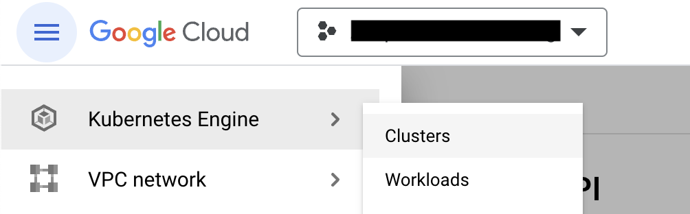
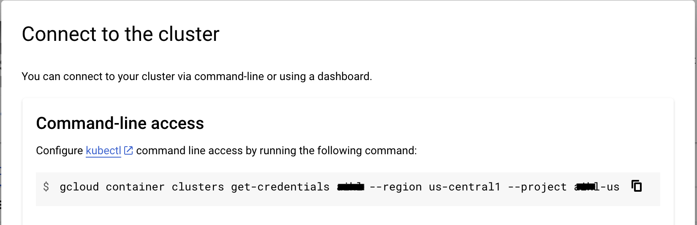
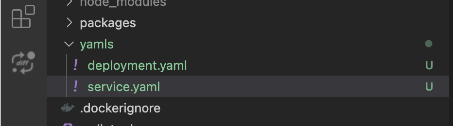

# GCP

***

## 前提条件

1. Google Cloudの[ProjectId]をメモしておく
2. [Git](https://git-scm.com/book/en/v2/Getting-Started-Installing-Git)をインストール
3. [Google Cloud CLI](https://cloud.google.com/sdk/docs/install-sdk)をインストール
4. [Docker Desktop](https://docs.docker.com/desktop/)をインストール

## Kubernetesクラスターのセットアップ

1. Kubernetesクラスターがない場合は作成します。

<figure><figcaption><p>「Clusters」をクリックして作成します。</p></figcaption></figure>

2. クラスターに名前を付け、適切なリソースロケーションを選択し、`Autopilot`モードを使用して、他のデフォルト設定はそのままにします。
3. クラスターが作成されたら、アクションメニューから「Connect」メニューをクリックします。

<figure><figcaption></figcaption></figure>

4. コマンドをコピーしてターミナルに貼り付け、Enterを押してクラスターに接続します。
5. 以下のコマンドを実行し、`gke_[ProjectId]_[DataCenter]_[ClusterName]`のような正しいコンテキスト名を選択します。

```
kubectl config get-contexts
```

6. 現在のコンテキストを設定します。

```
kubectl config use-context gke_[ProjectId]_[DataCenter]_[ClusterName]
```

## Dockerイメージのビルドとプッシュ

以下のコマンドを実行して、DockerイメージをビルドしGCPコンテナレジストリにプッシュします。

1. Flowiseをクローンします。

```
git clone https://github.com/FlowiseAI/Flowise.git
```

2. Flowiseをビルドします。

```
cd Flowise
pnpm install
pnpm build
```

3. `Dockerfile`を少し修正します。

> nodejsのプラットフォームを指定
>
> ```
> FROM --platform=linux/amd64 node:18-alpine
> ```
>
> python3、make、g++をインストールに追加
>
> ```
> RUN apk add --no-cache python3 make g++
> ```

3. Dockerイメージとしてビルドします。Docker desktopアプリが実行中であることを確認してください。

```
docker build -t gcr.io/[ProjectId]/flowise:dev .
```

4. DockerイメージをGCPコンテナレジストリにプッシュします。

```
docker push gcr.io/[ProjectId]/flowise:dev
```

## GCPへのデプロイ

1. プロジェクトに`yamls`ルートフォルダを作成します。
2. そのフォルダに`deployment.yaml`ファイルを追加します。

```yaml
# deployment.yaml
apiVersion: apps/v1
kind: Deployment
metadata:
  name: flowise
  labels:
    app: flowise
spec:
  selector:
    matchLabels:
      app: flowise
  replicas: 1
  template:
    metadata:
      labels:
        app: flowise
    spec:
      containers:
      - name: flowise
        image: gcr.io/[ProjectID]/flowise:dev
        imagePullPolicy: Always
        resources:
          requests:
            cpu: "1"
            memory: "1Gi"
```

3. そのフォルダに`service.yaml`ファイルを追加します。

```yaml
# service.yaml
apiVersion: "v1"
kind: "Service"
metadata:
  name: "flowise-service"
  namespace: "default"
  labels:
    app: "flowise"
spec:
  ports:
  - protocol: "TCP"
    port: 80
    targetPort: 3000
  selector:
    app: "flowise"
  type: "LoadBalancer"
```

以下のような構成になります。

<figure><figcaption></figcaption></figure>

4. 以下のコマンドを実行してyamlファイルをデプロイします。

```
kubectl apply -f yamls/deployment.yaml
kubectl apply -f yamls/service.yaml
```

5. GCPの`Workloads`に移動すると、ポッドが実行中であることが確認できます。

<figure><figcaption></figcaption></figure>

6. `Services & Ingress`に移動すると、Flowiseがホストされている`Endpoint`をクリックできます。

<figure><figcaption></figcaption></figure>

## おめでとうございます！

FlowiseアプリをGCPに正常にホストできました[🥳](https://emojipedia.org/partying-face/)

## タイムアウト

デフォルトでは、GCPによってプロキシに30秒のタイムアウトが設定されています。これにより、レスポンスが30秒の閾値を超えて返される場合に問題が発生します。この問題を解決するには、YAMLファイルに以下の変更を加えてください：

注：タイムアウトを（例えば）10分に設定するには、以下のように600秒を指定します。

1. 以下の内容で`backendconfig.yaml`ファイルを作成します：

```yaml
apiVersion: cloud.google.com/v1
kind: BackendConfig
metadata:
  name: flowise-backendconfig
  namespace: your-namespace
spec:
  timeoutSec: 600
```

2. 実行：`kubectl apply -f backendconfig.yaml`
3. `service.yaml`ファイルを`BackendConfig`への参照を含むように更新します：

```yaml
apiVersion: v1
kind: Service
metadata:
  annotations:
    cloud.google.com/backend-config: '{"default": "flowise-backendconfig"}'
  name: flowise-service
  namespace: your-namespace
...
```

4. 実行：`kubectl apply -f service.yaml`
