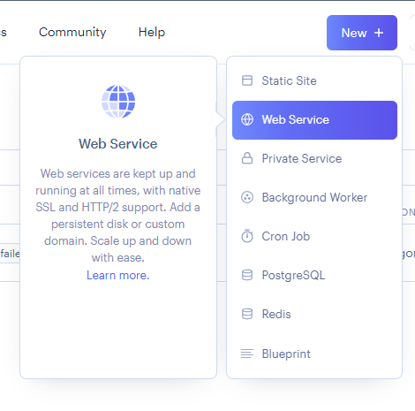
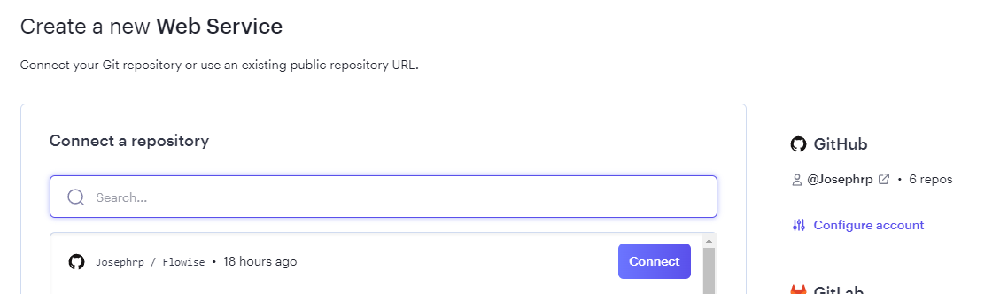

# Render

***

1. [Flowise公式リポジトリ](https://github.com/FlowiseAI/Flowise)をフォーク
2. GitHubプロフィールを確認し、フォークが成功したことを確認
3. [Render](https://dashboard.render.com)にサインイン
4. **New +**をクリック

<figure><figcaption></figcaption></figure>

5. **Web Service**を選択

<figure><figcaption></figcaption></figure>

6. GitHubアカウントを接続
7. フォークしたFlowiseリポジトリを選択し、**Connect**をクリック

<figure><figcaption></figcaption></figure>

8. 任意の**Name**と**Region**を入力
9. **Runtime**として`Docker`を選択

<figure><figcaption></figcaption></figure>

9. **Instance**を選択

<figure><figcaption></figcaption></figure>

10. _(オプション)_ アプリレベルの認証を追加するには、**Advanced**をクリックして`Environment Variable`を追加

* FLOWISE_USERNAME
* FLOWISE_PASSWORD

<figure><figcaption></figcaption></figure>

インスタンスを実行するノードバージョンとして、値が`18.18.1`の`NODE_VERSION`を追加します。

設定可能な環境変数の一覧は[environment-variables.md](../environment-variables.md "mention")を参照してください。

11. **Create Web Service**をクリック

<figure><figcaption></figcaption></figure>

12. デプロイされたURLに移動すれば完了です[🚀](https://emojipedia.org/rocket/)[🚀](https://emojipedia.org/rocket/)

<figure><figcaption></figcaption></figure>

## 永続ディスク

Renderで実行されるサービスのデフォルトのファイルシステムは一時的なものです。Flowiseのデータはデプロイや再起動時に保持されません。この問題を解決するために、[Render Disk](https://render.com/docs/disks)を使用できます。

1. 左側のサイドバーで**Disks**をクリック
2. ディスクに名前を付け、**Mount Path**を`/opt/render/.flowise`に指定

<figure><figcaption></figcaption></figure>

3. **Environment**セクションをクリックし、以下の新しい環境変数を追加：

* DATABASE_PATH - `/opt/render/.flowise`
* APIKEY_PATH - `/opt/render/.flowise`
* LOG_PATH - `/opt/render/.flowise/logs`
* SECRETKEY_PATH - `/opt/render/.flowise`
* BLOB_STORAGE_PATH - `/opt/render/.flowise/storage`

<figure><figcaption></figcaption></figure>

4. **Manual Deploy**をクリックし、**Clear build cache & deploy**を選択

<figure><figcaption></figcaption></figure>

5. Flowiseでフローを作成して保存してみてください。その後、サービスを再起動するか再デプロイしても、以前保存したフローを確認できるはずです。

Renderへのデプロイ方法の動画を見る




