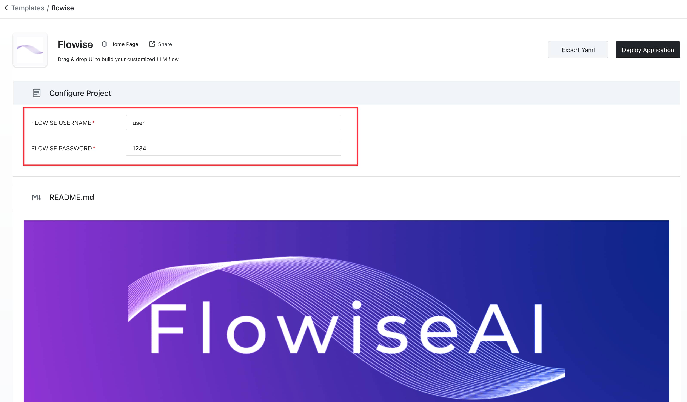

# Sealos

***

1. 以下の事前ビルドされた[テンプレート](https://template.cloud.sealos.io/deploy?templateName=flowise)をクリック
2. 認証を追加
   * FLOWISE_USERNAME
   * FLOWISE_PASSWORD

<figure><figcaption></figcaption></figure>

3. テンプレートページの「Deploy Application」をクリックしてデプロイを開始
4. デプロイが完了したら、「Details」をクリックしてアプリケーションの詳細に移動

<figure><figcaption></figcaption></figure>

5. アプリケーションのステータスが実行中に切り替わるまで待ちます。その後、外部リンクをクリックして外部ドメインを通じて直接アプリケーションのWebインターフェースを開きます。

<figure><figcaption></figcaption></figure>

## 永続ボリューム

アプリの詳細ページの右上にある「Update」をクリックし、「Advanced」->「Add volume」をクリックして、「mount path」の値に`/root/.flowise`を入力します。

<figure><figcaption></figcaption></figure>

最後に「Deploy」ボタンをクリックします。

Flowiseでフローを作成して保存してみてください。その後、サービスを再起動するか再デプロイしても、以前保存したフローを確認できるはずです。
