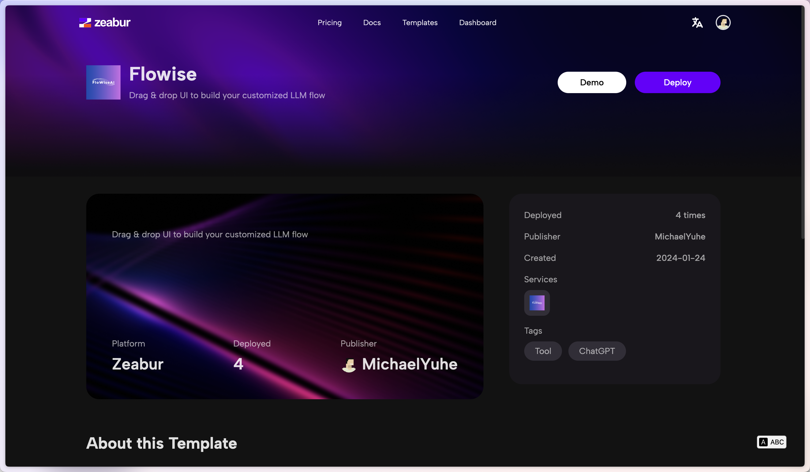
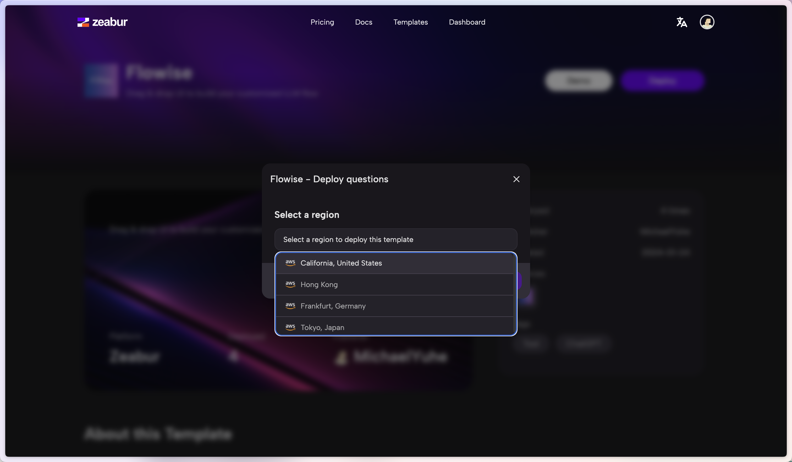

# Zeabur

***


Zeaburによって作成された以下のテンプレートは古いバージョン（2024-01-24時点）であることにご注意ください。


1. 以下の事前ビルドされた[テンプレート](https://zeabur.com/templates/2JYZTR)または下のボタンをクリックします。

2. Deployをクリック

<figure><figcaption></figcaption></figure>

3. 任意のリージョンを選択して続行

<figure><figcaption></figcaption></figure>

4. Zeaburのダッシュボードにリダイレクトされ、デプロイプロセスが表示されます

<figure><figcaption></figcaption></figure>

5. 認証を追加するには、Variablesタブに移動して以下を追加：

* FLOWISE_USERNAME
* FLOWISE_PASSWORD

<figure><figcaption></figcaption></figure>

6. 設定可能な環境変数の一覧は[environment-variables.md](../environment-variables.md "mention")を参照してください

これで完了です！ZeaburにFlowiseがデプロイされました[🎉](https://emojipedia.org/party-popper/)[🎉](https://emojipedia.org/party-popper/)

## 永続ボリューム

Zeaburは自動的に永続ボリュームを作成するため、この点について心配する必要はありません。
