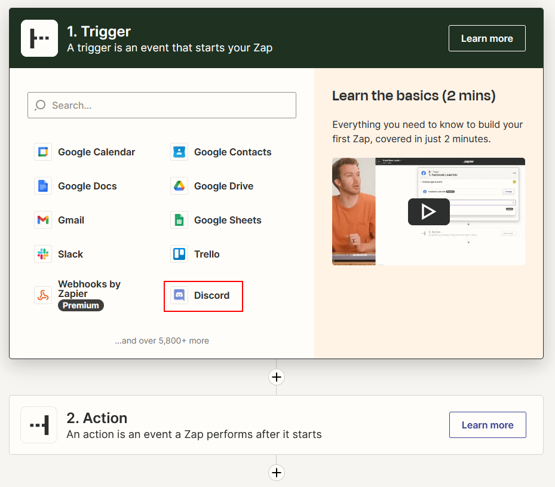
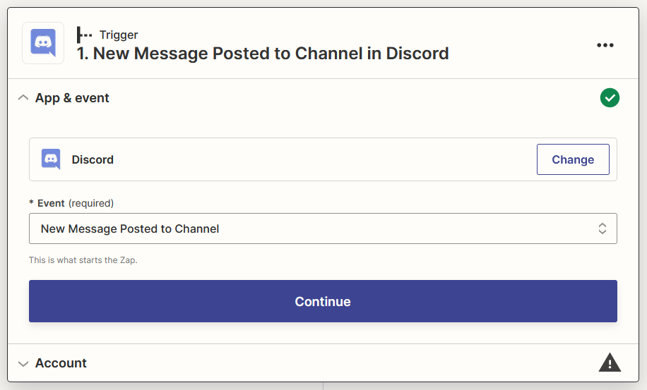
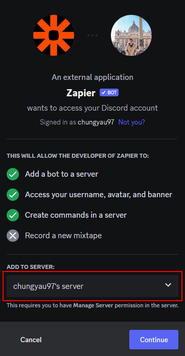
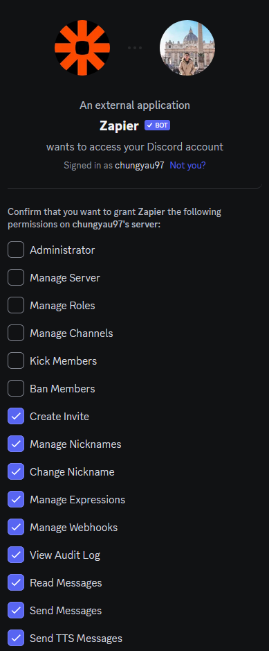
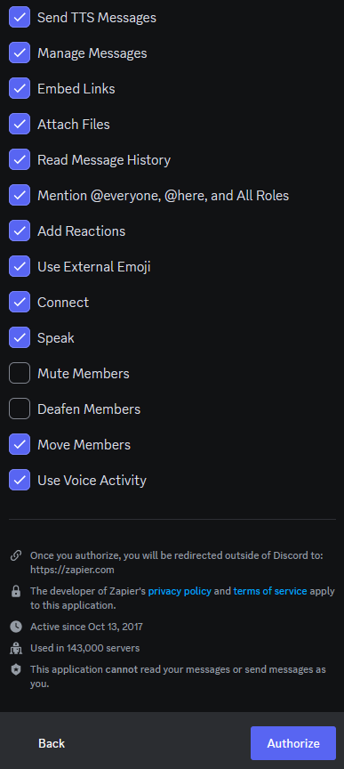
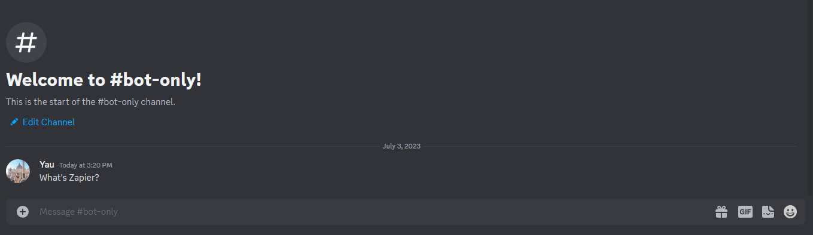
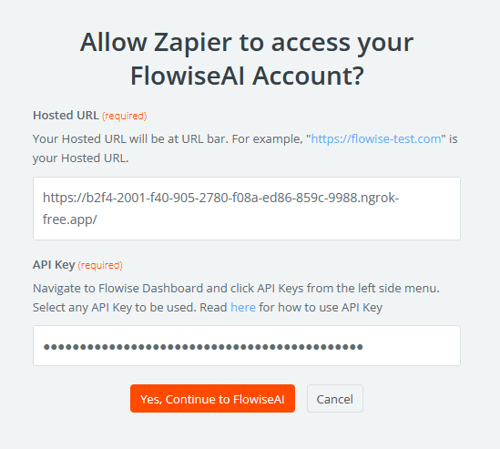
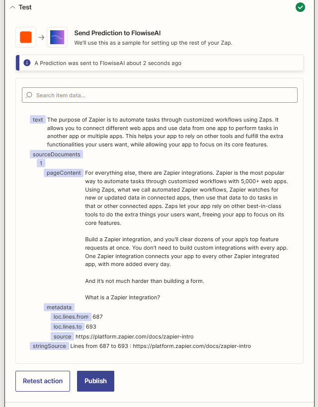

# Zapier Zaps

***

## 前提条件

1. Zapierに[ログイン](https://zapier.com/app/login)または[サインアップ](https://zapier.com/sign-up)する
2. [デプロイメント](../../configuration/deployment/)を参照してFlowiseのクラウドホスト版を作成する

## セットアップ

1. [Zapier Zaps](https://zapier.com/app/zaps)に移動
2. **Create**をクリック

<figure><figcaption></figcaption></figure>

### トリガーメッセージの受信

1. **Discord**をクリックまたは検索

    <figure><figcaption></figcaption></figure>

2. イベントとして**New Message Posted to Channel**を選択し、**Continue**をクリック

    <figure><figcaption></figcaption></figure>

3. Discordアカウントに**サインイン**

    <figure><figcaption></figcaption></figure>

4. 希望のサーバーに**Zapier Bot**を追加

    <figure><figcaption></figcaption></figure>

5. 適切な権限を付与して**Authorize**をクリックし、**Continue**をクリック

    <figure><figcaption></figcaption></figure>

    <figure><figcaption></figcaption></figure>

6. Zapier Botとやり取りする**希望のチャンネル**を選択し、**Continue**をクリック

    <figure><figcaption></figcaption></figure>

7. ステップ8で選択したチャンネルに**メッセージを送信**

    <figure><figcaption></figcaption></figure>

8. **Test trigger**をクリック

    <figure><figcaption></figcaption></figure>

9. メッセージを選択し、**Continue with the selected record**をクリック

    <figure><figcaption></figcaption></figure>

### Zapier Botのメッセージをフィルタリング

1. **Filter**をクリックまたは検索

    <figure><figcaption></figcaption></figure>

2. **Zapier Bot**からのメッセージを受信した場合は続行しないように**Filter**を設定し、**Continue**をクリック

    <figure><figcaption></figcaption></figure>

### FlowiseAIで結果メッセージを生成

1. **+**をクリックし、**FlowiseAI**をクリックまたは検索

    <figure><figcaption></figcaption></figure>

2. イベントとして**Make Prediction**を選択し、**Continue**をクリック

    <figure><figcaption></figcaption></figure>

3. **Sign in**をクリックして詳細を入力し、**Yes, Continue to FlowiseAI**をクリック

    <figure><figcaption></figcaption></figure>

    <figure><figcaption></figcaption></figure>

4. DiscordからのContentとFlow IDを選択し、**Continue**をクリック

    <figure><figcaption></figcaption></figure>

5. **Test action**をクリックして結果を待つ

    <figure><figcaption></figcaption></figure>

### 結果メッセージの送信

1. **+**をクリックし、**Discord**をクリックまたは検索

    <figure><figcaption></figcaption></figure>

2. イベントとして**Send Channel Message**を選択し、**Continue**をクリック

    <figure><figcaption></figcaption></figure>

3. サインインしたDiscordアカウントを選択し、**Continue**をクリック

    <figure><figcaption></figcaption></figure>

4. チャンネルに希望のチャンネルを選択し、Message TextにFlowiseAIからの**Text**と**String Source**(利用可能な場合)を選択して、**Continue**をクリック

    <figure><figcaption></figcaption></figure>

5. **Test action**をクリック

    <figure><figcaption></figcaption></figure>

6. できあがり[🎉](https://emojipedia.org/party-popper/) Discordチャンネルにメッセージが届いているはずです

    <figure><figcaption></figcaption></figure>

7. 最後に、Zapに名前を付けて公開

    <figure><figcaption></figcaption></figure>
