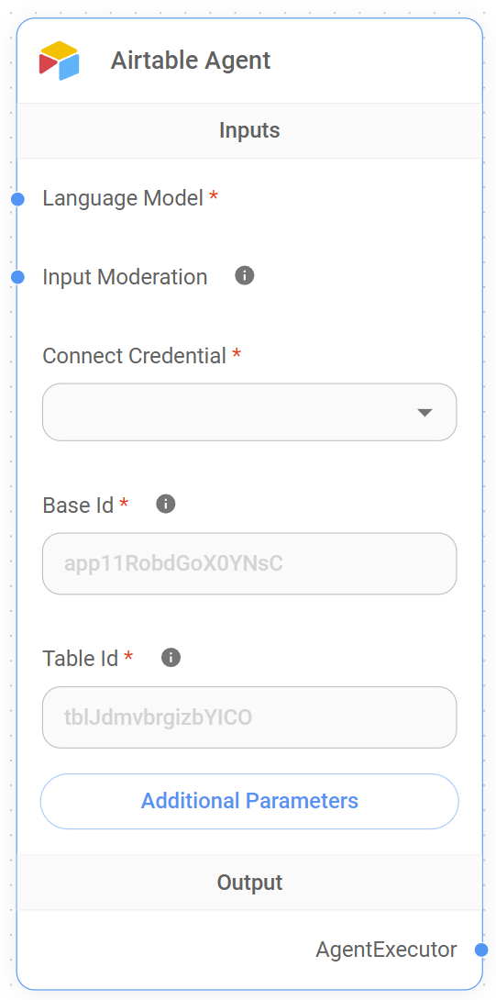

# Airtableエージェント

<figure><figcaption>
Airtableエージェントノード
</figcaption></figure>

## Airtableエージェントの機能

Airtableエージェントは、Flowise AIとAirtableテーブル間のインタラクションを容易にするように設計されており、ユーザーが会話形式でAirtableのデータにクエリを実行することを可能にします。このエージェントを使用することで、ユーザーはAirtableベースの内容について質問し、保存されたデータに基づいて関連する回答を受け取ることができます。これは、特定の情報を素早く抽出したり、ワークフローを自動化したり、Airtableに保存されたデータからサマリーを生成したりする際に特に有用です。

例えば、Airtableエージェントは以下のような質問に答えることができます：

* "プロジェクトトラッカーテーブルで未完了のタスクは何個ありますか？"
* "CRMに記載されているクライアントの連絡先詳細を教えてください"
* "先週追加されたすべてのレコードの要約を教えてください"

この機能により、ユーザーはAirtableインターフェースを操作することなくAirtableベースからインサイトを得ることができ、シームレスでインタラクティブな方法でデータを管理・分析することが容易になります。

## 入力

Airtableエージェントが効果的に機能するためには、以下の入力が必要です：

* **言語モデル**: クエリの処理に使用される言語モデル。この入力は必須で、エージェントが提供する応答の品質と精度を決定するのに役立ちます。
* **入力モデレーション**: コンテンツモデレーションを有効にするオプションの入力。クエリが適切で、攻撃的または有害なコンテンツを含まないことを確認するのに役立ちます。
* **接続クレデンシャル**: Airtableに接続するために必要な入力。ユーザーはAirtableデータにアクセスする権限を持つ適切なクレデンシャルを選択する必要があります。
* **ベースID**: 接続するAirtableベースのID。これは必須フィールドで、AirtableのAPIドキュメントまたはベース設定で確認できます。テーブルのURLが`https://airtable.com/app11RobdGoX0YNsC/tblJdmvbrgizbYlCO/viw9UrP77idOCE4ee`の場合、`app11RobdGoX0YNsC`がベースIDです。クエリを実行するデータを含むAirtableベースを指定するために使用されます。
* **テーブルID**: Airtableベース内の特定のテーブルのID。これも必須フィールドで、データ取得のために正しいテーブルを指定するのに役立ちます。例のURL`https://airtable.com/app11RobdGoX0YNsC/tblJdmvbrgizbYlCO/viw9UrP77idOCE4ee`では、`tblJdmvbrgizbYlCO`がテーブルIDです。
* **追加パラメータ**: エージェントの動作をカスタマイズするために使用できるオプションのパラメータ。これらのパラメータは特定のユースケースに基づいて設定できます。
  * **すべて返す**: 指定されたテーブルからすべてのレコードを返すオプション。有効にすると、すべてのレコードが取得され、そうでない場合は限られた数のレコードのみが返されます。
  * **制限**: **すべて返す**が有効でない場合に返されるレコードの最大数を指定します。デフォルト値は`100`です。

**注**: このセクションは作業中です。このセクションの完成にご協力いただける方を歓迎します。[コントリビューションガイド](../../../contributing/)をご確認の上、ご参加ください。
