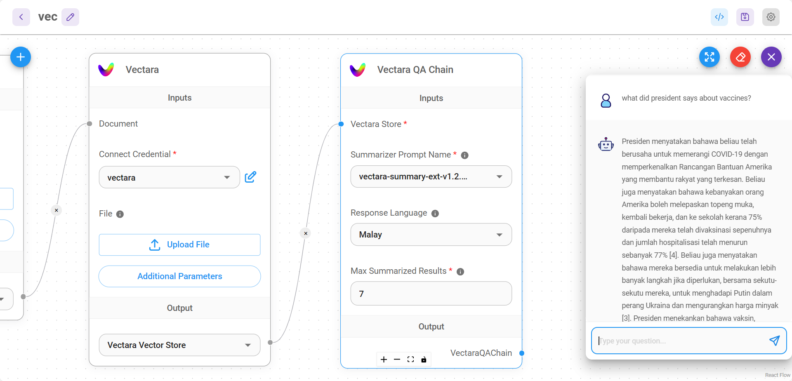

# Vectara QA チェーン

Vectaraを使用して質問応答タスクを実行するためのチェーンです。

<figure><figcaption></figcaption></figure>

## 定義

**リトリーバルベースの質問応答チェーン**は、Vectaraのリトリーバルコンポーネントと統合され、入力パラメーターを設定して質問応答タスクを実行することができます。

## 入力

* [Vectara ストア](../vector-stores/vectara.md)

## パラメーター

| 名前                   | 説明                                          |
| ---------------------- | --------------------------------------------- |
| Summarizer Prompt Name | 要約を生成するために使用するモデル            |
| レスポンスの言語       | レスポンスの希望する言語                      |
| 最大要約結果数         | 要約に使用するトップ結果の数（デフォルトは7） |

## 出力

| 名前           | 説明                       |
| -------------- | -------------------------- |
| VectaraQAChain | 応答を返すための最終ノード |
