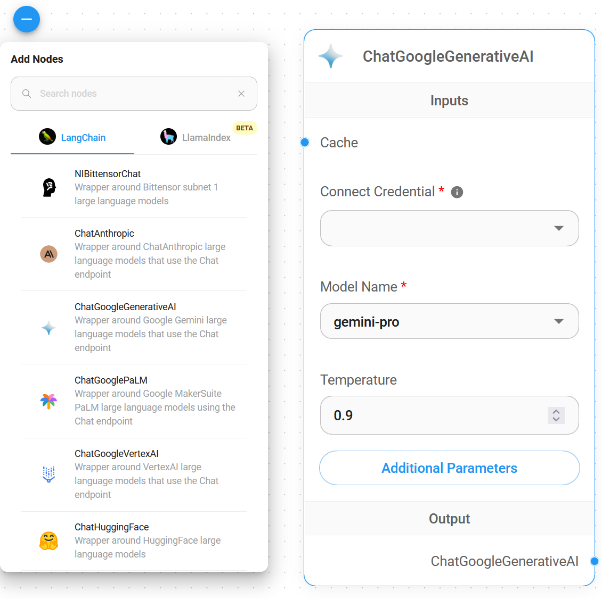
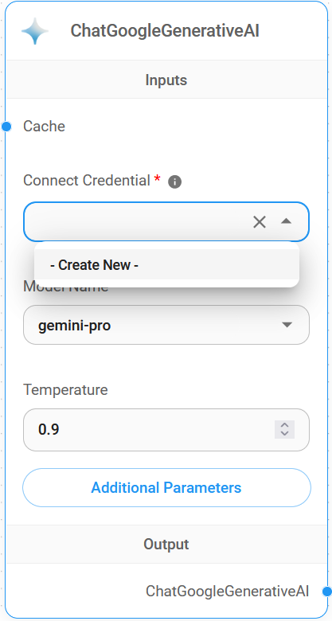
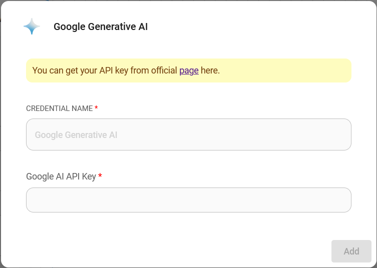
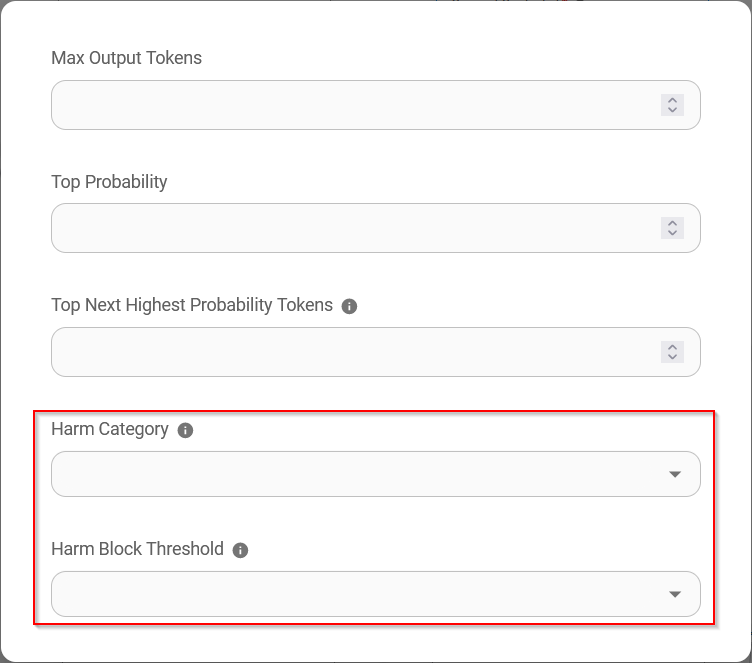
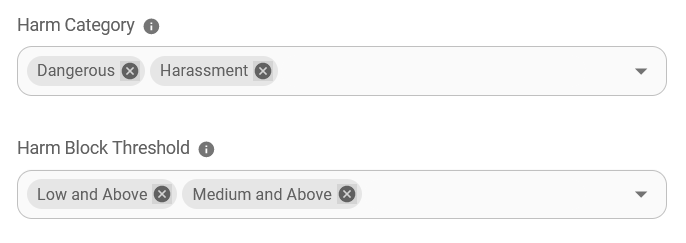

# ChatGoogleGenerativeAI

## 前提条件

1. [Google](https://accounts.google.com/InteractiveLogin)アカウントの登録
2. [APIキー](https://aistudio.google.com/app/apikey)の作成

## セットアップ

1. **Chat Models** > **ChatGoogleGenerativeAI**ノードをドラッグ

<figure><figcaption></figcaption></figure>

2. **Connect Credential** > **Create New**をクリック

<figure><figcaption></figcaption></figure>

3. **Google AI**クレデンシャルを入力

<figure><figcaption></figcaption></figure>

4. これで[🎉](https://emojipedia.org/party-popper/)Flowiseで**ChatGoogleGenerativeAIノード**が使用できるようになりました

<figure><figcaption></figcaption></figure>

## 安全性属性の設定

1. **Additonal Parameters**をクリック

<figure><figcaption></figcaption></figure>

* **Safety Attributes**を設定する際、**Harm Category**と**Harm Block Threshold**の選択数は同じである必要があります。同じでない場合は`Harm Category & Harm Block Threshold are not the same length`というエラーが発生します

* 以下の**Safety Attributes**の組み合わせにより、`Dangerous`は`Low and Above`に、`Harassment`は`Medium and Above`に設定されます

<figure><figcaption></figcaption></figure>

## リソース

* [LangChain JS ChatGoogleGenerativeAI](https://js.langchain.com/docs/integrations/chat/google_generativeai)
* [Google AI for Developers](https://ai.google.dev/)
* [Gemini APIドキュメント](https://ai.google.dev/docs)
