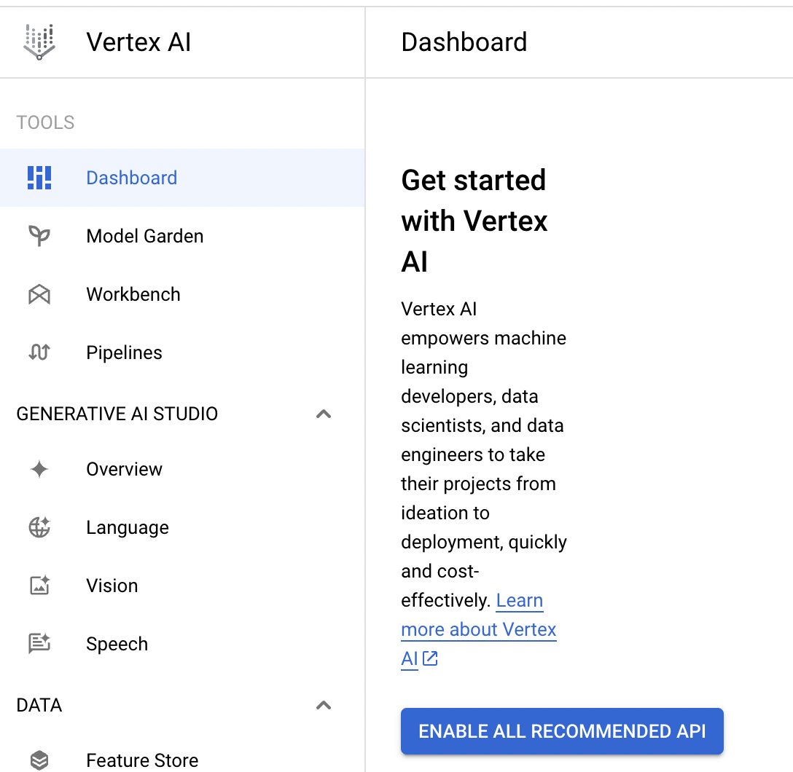
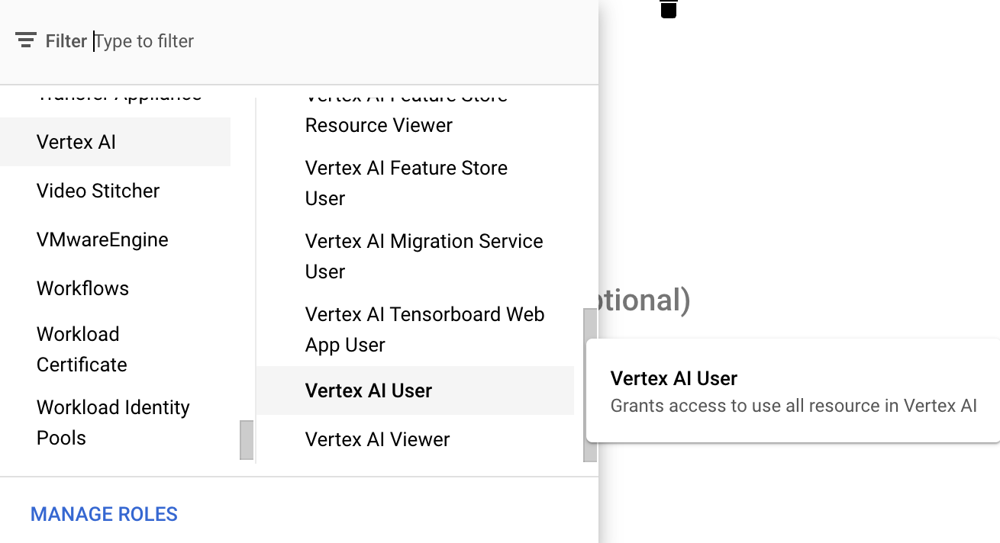
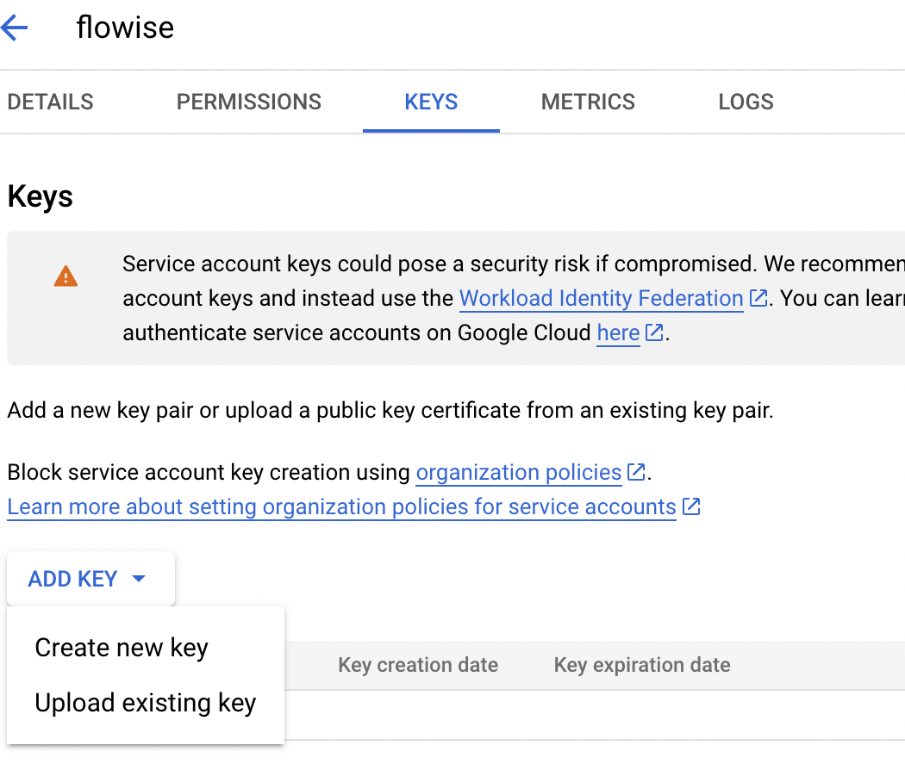
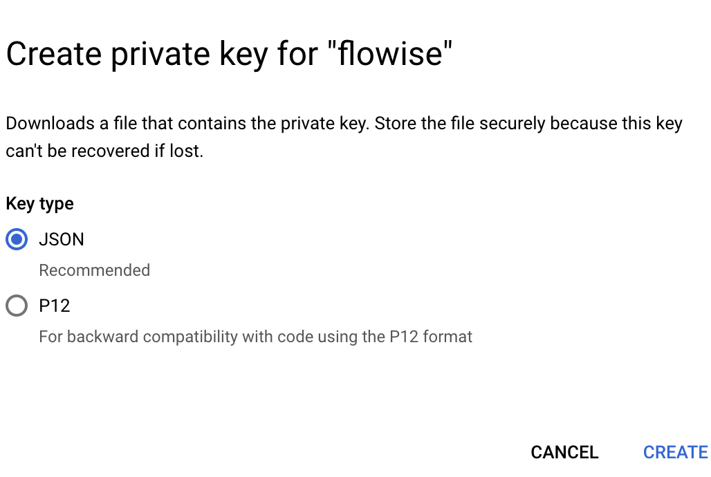
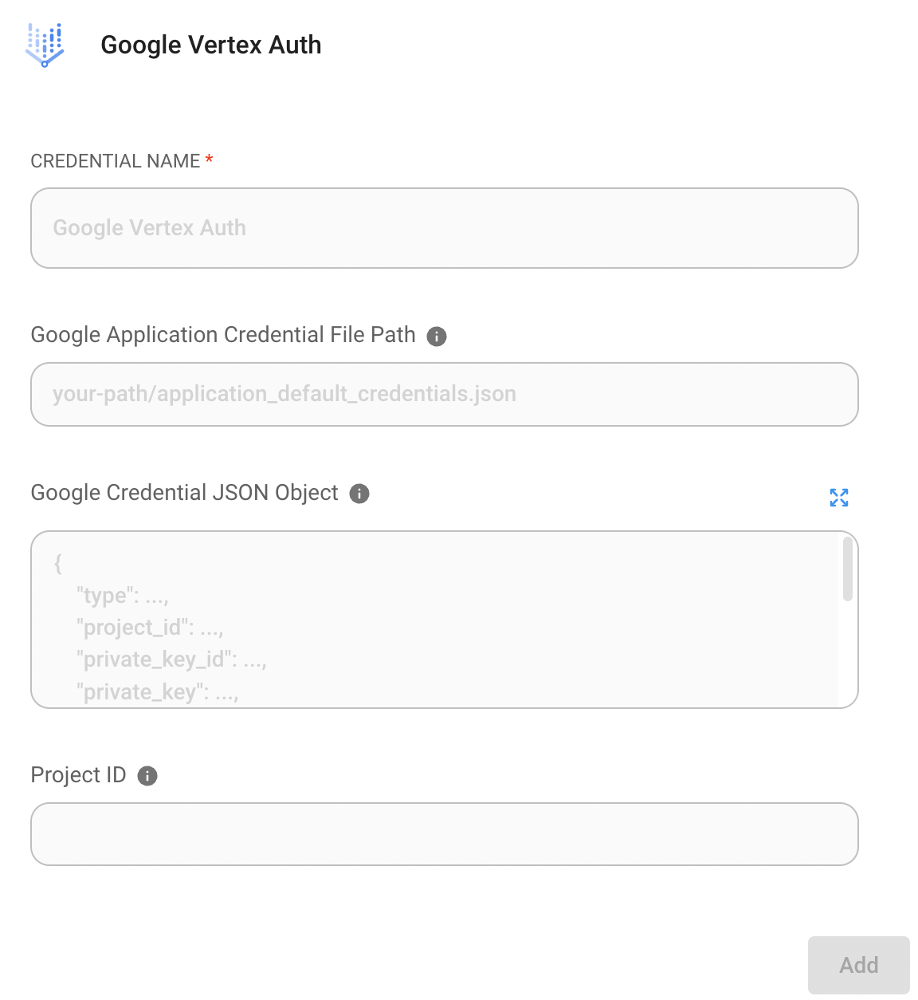

# Google VertexAI

## 前提条件

1. [GCPを開始](https://cloud.google.com/docs/get-started)
2. [Google Cloud CLI](https://cloud.google.com/sdk/docs/install-sdk)のインストール

## セットアップ

### Vertex AI APIの有効化

1. GCPのVertex AIに移動し、**"ENABLE ALL RECOMMENDED API"**をクリック

<figure><figcaption></figcaption></figure>

## クレデンシャルファイルの作成 _(オプション)_

クレデンシャルファイルを作成する方法は2つあります

### 方法1：GCP CLIを使用

1. ターミナルを開き、以下のコマンドを実行

```bash
gcloud auth application-default login
```

2. GCPアカウントにログイン
3. クレデンシャルファイルを確認。`~/.config/gcloud/application_default_credentials.json`にあります

### 方法2：GCPコンソールを使用

1. GCPコンソールに移動し、**"CREATE CREDENTIALS"**をクリック

<figure><figcaption></figcaption></figure>

2. サービスアカウントを作成

<figure><figcaption></figcaption></figure>

3. サービスアカウントの詳細フォームに記入し、**"CREATE AND CONTINUE"**をクリック
4. 適切なロール（例：Vertex AI User）を選択し、**"DONE"**をクリック

<figure><figcaption></figcaption></figure>

5. 作成したサービスアカウントをクリックし、**"ADD KEY" -> "Create new key"**をクリック

<figure><figcaption></figcaption></figure>

6. JSONを選択し**"CREATE"**をクリックするとクレデンシャルファイルがダウンロードされます

<figure><figcaption></figcaption></figure>

## Flowise

<figure><figcaption></figcaption></figure>

### クレデンシャルファイルなし

Cloud Runなどのサービスを使用している場合や、ローカルマシンにデフォルトクレデンシャルをインストールしている場合は、このクレデンシャルを設定する必要はありません。

### クレデンシャルファイルあり

1. Flowiseのクレデンシャルページで**"Add credential"**をクリック
2. Google Vertex Authをクリック

<figure><figcaption></figcaption></figure>

3. クレデンシャルファイルを登録。登録方法は2つあります。

<figure><figcaption></figcaption></figure>

* **オプション1：クレデンシャルファイルのパスを入力**
  * マシン上にクレデンシャルファイルがある場合、`Google Application Credential File Path`にパスを入力
* **オプション2：クレデンシャルファイルのテキストを貼り付け**
  * クレデンシャルファイル内のすべてのテキストをコピーして`Google Credential JSON Object`に貼り付け

4. 最後に"Add"ボタンをクリック
5. **🎉**これでFlowiseでクレデンシャルを使用してChatGoogleVertexAIが使用できるようになりました！

### リソース

* [LangChain JS GoogleVertexAI](https://js.langchain.com/docs/api/llms_googlevertexai/classes/GoogleVertexAI)
* [Googleサービスアカウントの概要](https://cloud.google.com/iam/docs/service-account-overview?)
* [FlowiseでGoogle Vertex AI Palm 2を試す：コーディングなしで直感的に活用](https://tech.beatrust.com/entry/2023/08/22/Try_Google_Vertex_AI_Palm_2_with_Flowise%3A_Without_Coding_to_Leverage_Intuition)
