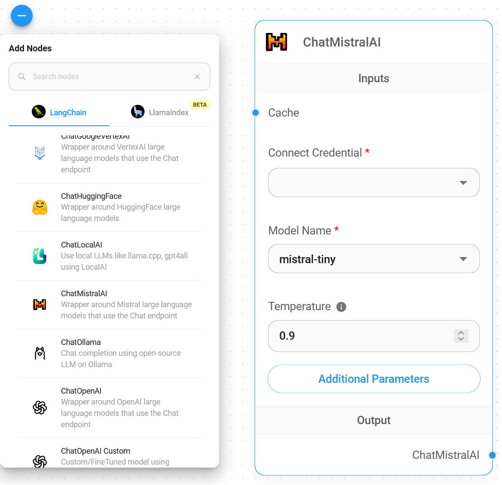
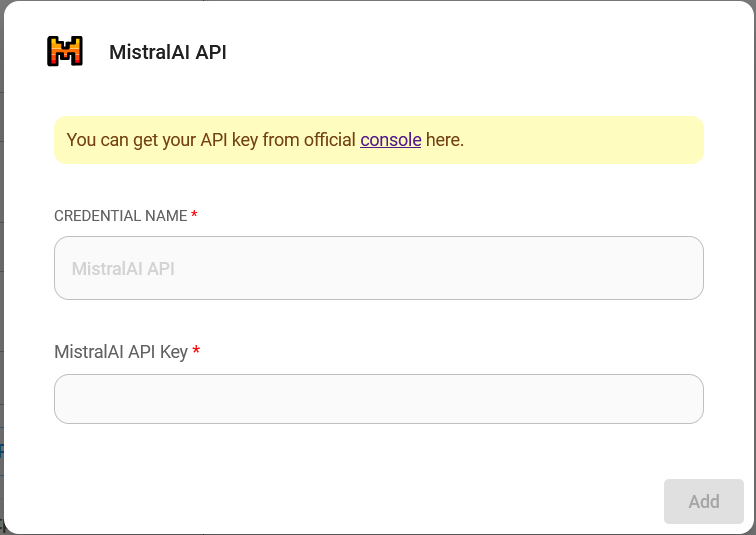
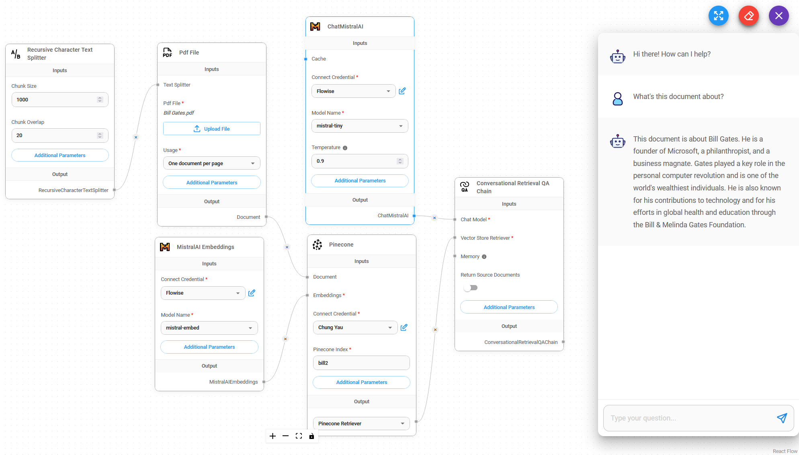

# ChatMistralAI

## 前提条件

1. [Mistral AI](https://mistral.ai/)アカウントの登録
2. [APIキー](https://console.mistral.ai/user/api-keys/)の作成

## セットアップ

1. **Chat Models** > **ChatMistralAI**ノードをドラッグ

<figure><figcaption></figcaption></figure>

2. **Connect Credential** > **Create New**をクリック

<figure><figcaption></figcaption></figure>

3. **Mistral AI**クレデンシャルを入力

<figure><figcaption></figcaption></figure>

4. これで[🎉](https://emojipedia.org/party-popper/)Flowiseで**ChatMistralAIノード**が使用できるようになりました

<figure><figcaption></figcaption></figure>

## リソース

* [LangChain JS ChatMistralAI](https://js.langchain.com/docs/integrations/chat/mistral)
* [Mistral AI](https://mistral.ai/)
* [Mistral AIドキュメント](https://docs.mistral.ai/)
