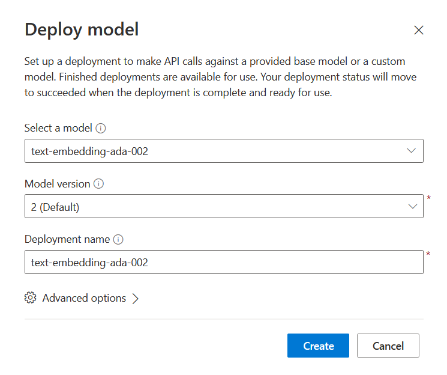
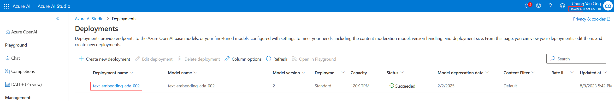
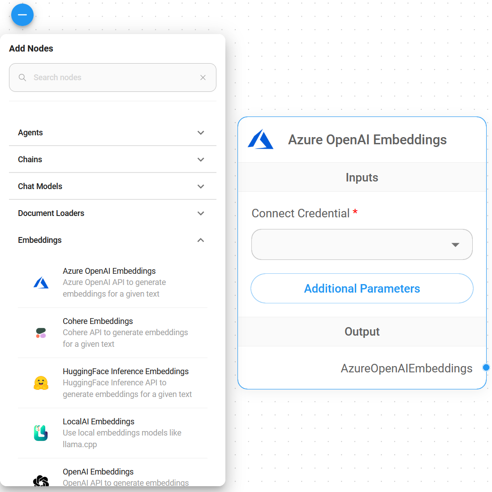
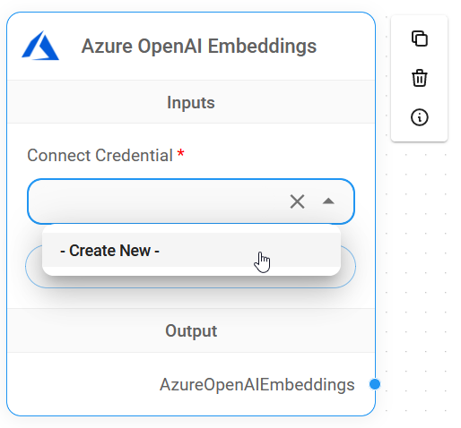
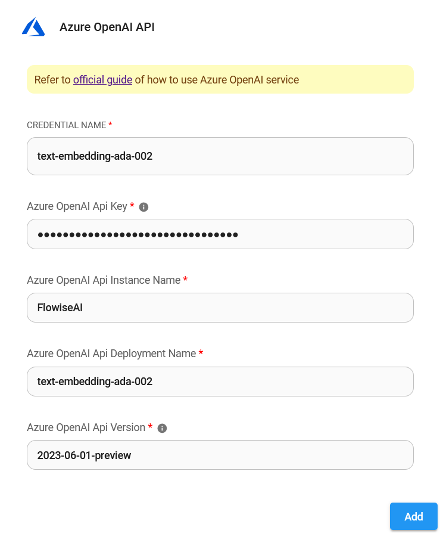

# Azure OpenAI エンベッディング

## 前提条件

1. Azureに[ログイン](https://portal.azure.com/)または[サインアップ](https://azure.microsoft.com/en-us/free/)
2. Azure OpenAIを[作成](https://portal.azure.com/#create/Microsoft.CognitiveServicesOpenAI)し、約10営業日の承認を待つ
3. APIキーは **Azure OpenAI** > **name_azure_openai**をクリック > **Click here to manage keys**をクリックで確認可能

<figure><figcaption></figcaption></figure>

## セットアップ

### Azure OpenAI エンベッディング

1. **Go to Azure OpenaAI Studio**をクリック

<figure><figcaption></figcaption></figure>

2. **Deployments**をクリック

<figure><figcaption></figcaption></figure>

3. **Create new deployment**をクリック

<figure><figcaption></figcaption></figure>

4. 以下のように選択し、**Create**をクリック

<figure><figcaption></figcaption></figure>

5. **Azure OpenAI エンベッディング**の作成が完了

* デプロイメント名: `text-embedding-ada-002`
* インスタンス名: `右上コーナー`

<figure><figcaption></figcaption></figure>

### Flowise

1. **Embeddings** > **Azure OpenAI Embeddings**ノードをドラッグ

<figure><figcaption></figcaption></figure>

2. **Connect Credential** > **Create New**をクリック

<figure><figcaption></figcaption></figure>

3. 各詳細(APIキー、インスタンス名、デプロイメント名、[APIバージョン](https://learn.microsoft.com/en-us/azure/ai-services/openai/reference#chat-completions))を**Azure OpenAI Embeddings**クレデンシャルにコピー＆ペースト

<figure><figcaption></figcaption></figure>

4. これで[🎉](https://emojipedia.org/party-popper/)Flowiseで**Azure OpenAI Embeddings ノード**の作成が完了しました

<figure><figcaption></figcaption></figure>

## リソース

* [LangChain JS Azure OpenAI Embeddings](https://js.langchain.com/docs/modules/data_connection/text_embedding/integrations/azure_openai)
* [Azure OpenAI Service REST APIリファレンス](https://learn.microsoft.com/en-us/azure/ai-services/openai/reference)
