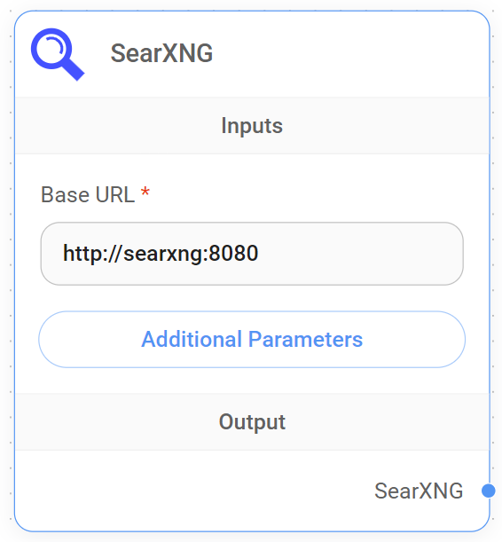

# SearXNG

<figure><figcaption><p>SearXNGノード</p></figcaption></figure>

### SearXNGのセットアップ

SearXNGをローカルにセットアップするには[公式ドキュメント](https://docs.searxng.org/admin/installation.html)に従ってください。ここでは、Docker Composeを使用してセットアップします。

[searxng-docker](https://github.com/searxng/searxng-docker)リポジトリに移動し、セットアップ手順に従ってください。

`server.limiter`が`false`に設定され、`search.formats`に`json`が含まれていることを確認してください。これらのパラメータは`searxng/settings.yml`で定義できます:

```yaml
server:
  limiter: false
general:
  debug: true
search:
  formats:
    - html
    - json
```

`docker-compose up -d`でコンテナを起動します。Webブラウザを開いて**http://localhost:8080/search**にアクセスすると、SearXNGのページが表示されます。

### Flowiseでの使用

SearXNGノードをキャンバスにドラッグ＆ドロップします。Base URLに**http://localhost:8080**を入力します。必要に応じて他の検索パラメータも指定できます。LLMは検索クエリの質問に何を使用するかを自動的に判断します。

<figure><figcaption></figcaption></figure>
