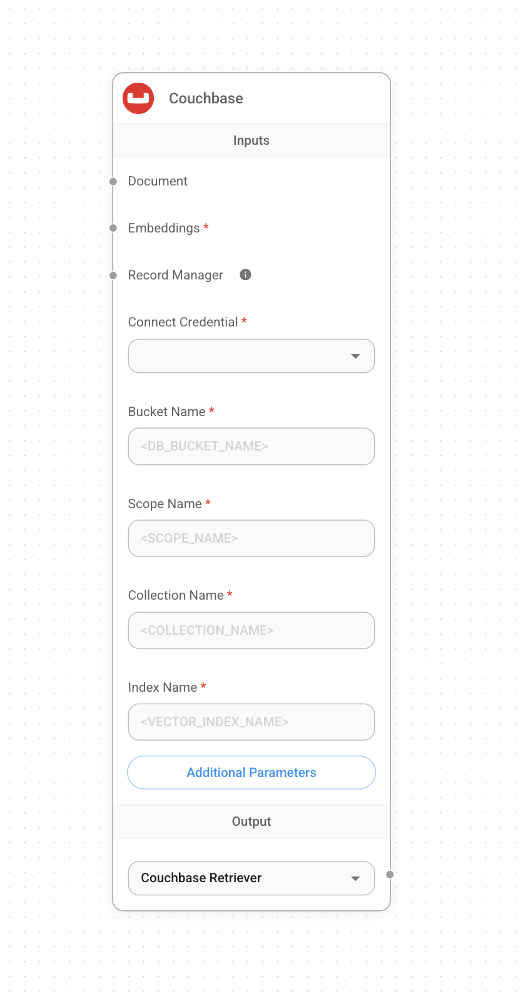
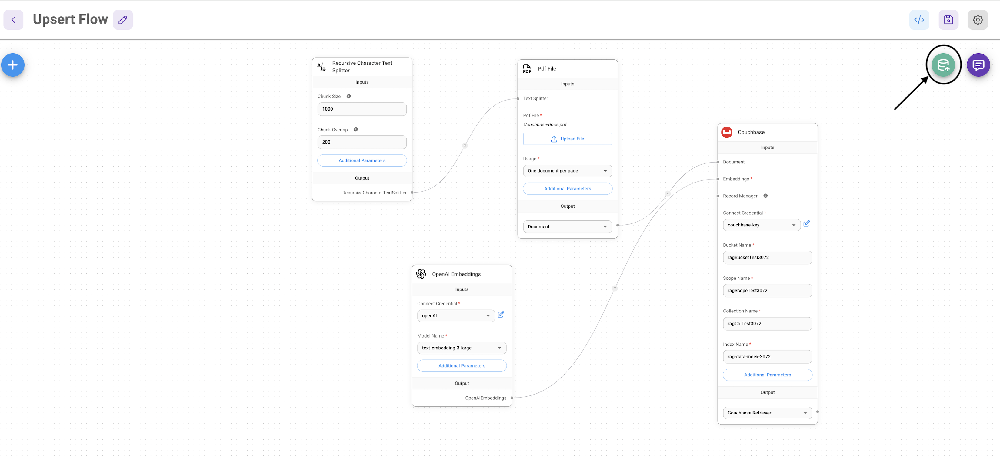
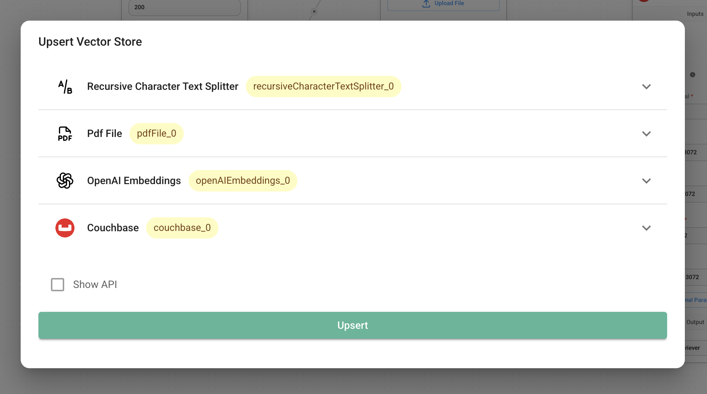

# Couchbase

## 前提条件

### 要件
1. [Search Service](https://docs.couchbase.com/server/current/search/search.html)を備えたCouchbaseクラスター（セルフマネージドまたはCapella）バージョン**7.6以上**
2. Capellaのセットアップ:
    Capellaクラスターへの接続について詳しくは、[手順](https://docs.couchbase.com/cloud/get-started/connect.html?_gl=1*1yhpmel*_gcl_au*MTMzNDE3NTQxLjE3MzY5MjA5MzQ.)に従ってください。

    具体的には以下が必要です:

    - クラスターにアクセスするための[データベース認証情報](https://docs.couchbase.com/cloud/clusters/manage-database-users.html?_gl=1*19zk7vq*_gcl_au*MTMzNDE3NTQxLjE3MzY5MjA5MzQ.)の作成
    - アプリケーションを実行するIPからクラスターへの[アクセスを許可](https://docs.couchbase.com/cloud/clusters/allow-ip-address.html?_gl=1*19zk7vq*_gcl_au*MTMzNDE3NTQxLjE3MzY5MjA5MzQ.)

    セルフマネージドのセットアップ:
    - 最新のCouchbaseデータベースサーバーインスタンスをインストールするには[Couchbaseインストールオプション](https://developer.couchbase.com/tutorial-couchbase-installation-options)に従ってください。Search Serviceを追加することを忘れないでください。

3. CouchbaseのFull Text Serviceでの検索インデックスの作成

### 検索インデックスのインポート

#### [Couchbase Capella]((https://docs.couchbase.com/cloud/search/import-search-index.html?_gl=1*18d2l9w*_gcl_au*MTMzNDE3NTQxLjE3MzY5MjA5MzQ.))
Capellaに検索インデックスをインポートするには以下の手順に従います:
- インデックス定義を`index.json`という新しいファイルにコピー
- ドキュメントの手順に従ってCapellaにファイルをインポート
- Create Indexをクリックしてインデックス作成を完了

#### [Couchbase Server]((https://docs.couchbase.com/server/current/search/import-search-index.html?_gl=1*18d2l9w*_gcl_au*MTMzNDE3NTQxLjE3MzY5MjA5MzQ.))
Couchbase Serverでは以下の手順に従います:
- Search → Add Index → Importに移動
- 提供されたインデックス定義をインポート画面にコピー
- Create Indexをクリックしてインデックス作成を完了

[Couchbase Capella](https://docs.couchbase.com/cloud/vector-search/create-vector-search-index-ui.html?_gl=1*1rglcpj*_gcl_au*MTMzNDE3NTQxLjE3MzY5MjA5MzQ.)と[Couchbase Self Managed Server](https://docs.couchbase.com/server/current/vector-search/create-vector-search-index-ui.html?_gl=1*t7aeet*_gcl_au*MTMzNDE3NTQxLjE3MzY5MjA5MzQ.)の両方で、Search UIを使用してベクトルインデックスを作成することもできます。

### インデックス定義

ここでは、ドキュメントに対して`vector-index`というインデックスを作成します。ベクトルフィールドは1536次元の`embedding`に設定され、テキストフィールドは`text`に設定されています。また、様々なドキュメント構造に対応するため、ドキュメント内の`metadata`以下のすべてのフィールドを動的マッピングとしてインデックス化して保存しています。類似度メトリックは`dot_product`に設定されています。これらのパラメータに変更がある場合は、インデックスを適宜調整してください。

```json
{
  "name": "vector-index",
  "type": "fulltext-index",
  "params": {
    "doc_config": {
      "docid_prefix_delim": "",
      "docid_regexp": "",
      "mode": "scope.collection.type_field",
      "type_field": "type"
    },
    "mapping": {
      "default_analyzer": "standard",
      "default_datetime_parser": "dateTimeOptional",
      "default_field": "_all",
      "default_mapping": {
        "dynamic": true,
        "enabled": false
      },
      "default_type": "_default",
      "docvalues_dynamic": false,
      "index_dynamic": true,
      "store_dynamic": false,
      "type_field": "_type",
      "types": {
        "_default._default": {
          "dynamic": true,
          "enabled": true,
          "properties": {
            "embedding": {
              "enabled": true,
              "dynamic": false,
              "fields": [
                {
                  "dims": 1536,
                  "index": true,
                  "name": "embedding",
                  "similarity": "dot_product",
                  "type": "vector",
                  "vector_index_optimized_for": "recall"
                }
              ]
            },
            "metadata": {
              "dynamic": true,
              "enabled": true
            },
            "text": {
              "enabled": true,
              "dynamic": false,
              "fields": [
                {
                  "index": true,
                  "name": "text",
                  "store": true,
                  "type": "text"
                }
              ]
            }
          }
        }
      }
    },
    "store": {
      "indexType": "scorch",
      "segmentVersion": 16
    }
  },
  "sourceType": "gocbcore",
  "sourceName": "pdf-chat",
  "sourceParams": {},
  "planParams": {
    "maxPartitionsPerPIndex": 64,
    "indexPartitions": 16,
    "numReplicas": 0
  }
}
```

## セットアップ

1. キャンバスに新しい**Couchbase**ノードを追加し、バケット名、スコープ名、コレクション名、インデックス名を入力

<figure><figcaption></figcaption></figure>

2. 新しい認証情報を追加し、以下のパラメータを入力:
    - Couchbase接続文字列
    - クラスターユーザー名
    - クラスターパスワード

<figure><figcaption></figcaption></figure>

3. キャンバスに追加のノードを追加してアップサート処理を開始
   - **Document**は[**Document Loader**](../document-loaders/)カテゴリの任意のノードと接続可能
   - **エンベッディング**は[**Embeddings**](../embeddings/)カテゴリの任意のノードと接続可能

<figure><figcaption></figcaption></figure>

<figure><figcaption></figcaption></figure>

5. Couchbase UIでデータが正常にアップサートされたことを確認してください！

## リソース

- LangChain Couchbaseベクトルストア統合
  - [Python](https://python.langchain.com/docs/integrations/vectorstores/couchbase/)
  - [NodeJS](https://js.langchain.com/docs/integrations/vectorstores/couchbase/)
- Couchbaseについて学ぶには[Couchbaseドキュメント](https://docs.couchbase.com/home/index.html)を参照してください。
