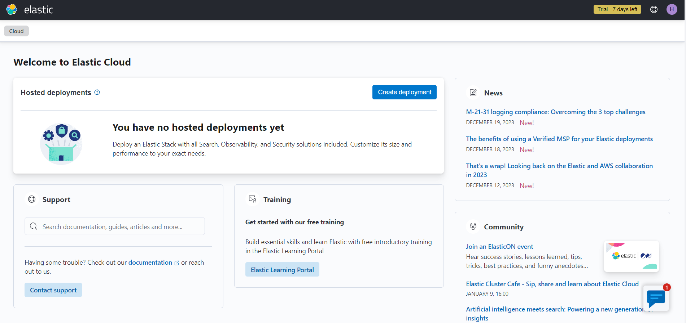
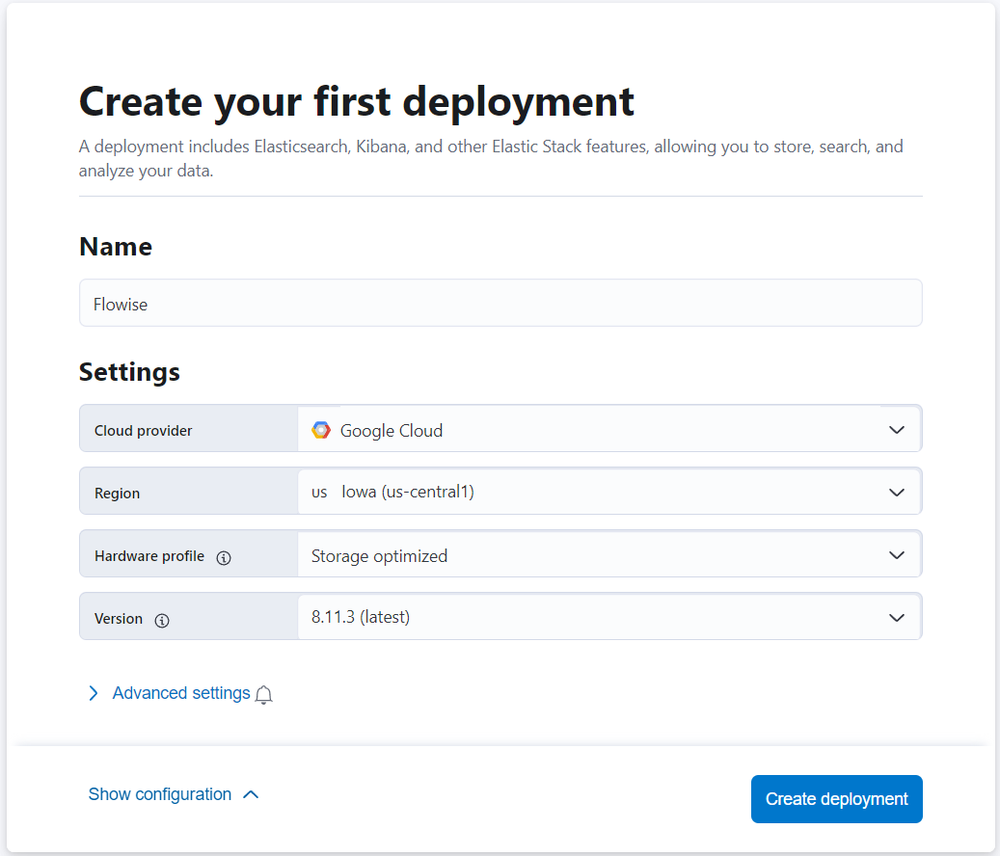
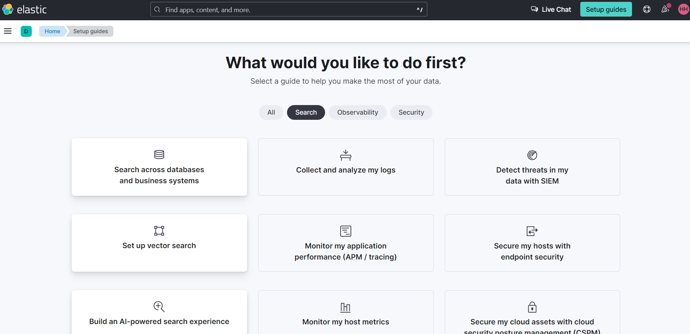
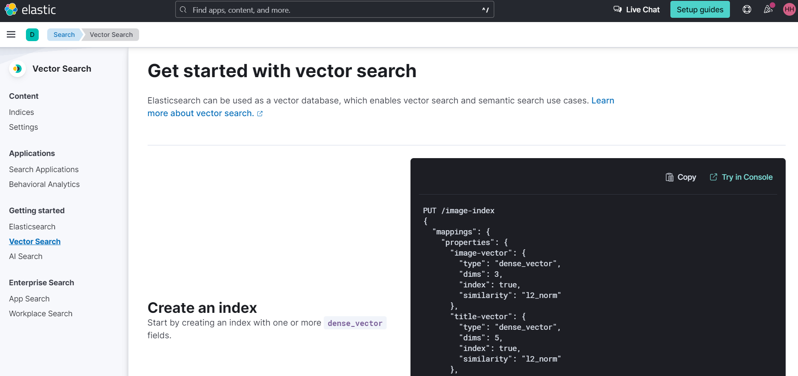
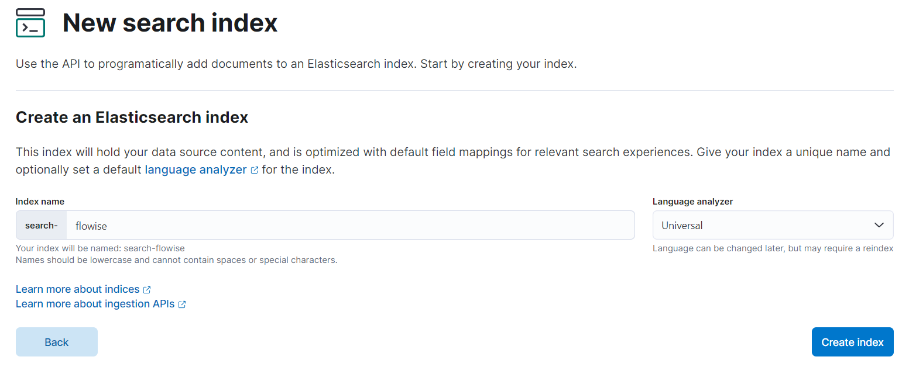
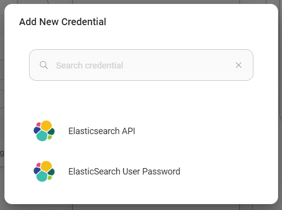

# Elastic

## 前提条件

1. [公式Dockerイメージ](https://www.elastic.co/guide/en/elasticsearch/reference/current/docker.html)を使用して開始するか、Elasticの公式クラウドサービスである[Elastic Cloud](https://www.elastic.co/cloud/)を使用できます。このガイドではクラウドバージョンを使用します。
2. Elastic cloudでアカウントを[登録](https://cloud.elastic.co/registration)するか、既存のアカウントで[ログイン](https://cloud.elastic.co/login)します。

<figure><figcaption></figcaption></figure>

3. **Create deployment**をクリックし、デプロイメントに名前を付け、プロバイダーを選択します。

<figure><figcaption></figcaption></figure>

4. デプロイメントが完了すると、以下のようなセットアップガイドが表示されます。**Set up vector search**オプションをクリックします。

<figure><figcaption></figcaption></figure>

5. **Vector Search**の**Getting started**ページが表示されます。

<figure><figcaption></figcaption></figure>

6. 左側のサイドバーで**Indices**をクリックし、**Create a new index**をクリックします。

<figure><figcaption></figcaption></figure>

7. **API**インジェスト方式を選択

<figure><figcaption></figcaption></figure>

8. 検索インデックス名を入力し、**Create Index**をクリック

<figure><figcaption></figcaption></figure>

9. インデックスが作成されたら、新しいAPIキーを生成し、生成されたAPIキーとURLの両方をメモしておきます

<figure><figcaption></figcaption></figure>

## Flowiseセットアップ

1. キャンバスに新しい**Elasticsearch**ノードを追加し、**Index Name**を入力

<figure><figcaption></figcaption></figure>

2. **Elasticsearch API**から新しい認証情報を追加

<figure><figcaption></figcaption></figure>

3. ElasticsearchからURLとAPIキーを取得し、フィールドに入力

<figure><figcaption></figcaption></figure>

4. 認証情報が正常に作成されたら、データのアップサートを開始できます

<figure><figcaption></figcaption></figure>

<figure><figcaption></figcaption></figure>

5. データが正常にアップサートされたら、Elasticダッシュボードで確認できます:

<figure><figcaption></figcaption></figure>

6. これで完了です！チャットで質問を開始できます

<figure><figcaption></figcaption></figure>

## リソース

* [LangChain JS Elastic](https://js.langchain.com/docs/integrations/vectorstores/elasticsearch)
* [Vector Search (kNN) 実装ガイド - APIエディション](https://www.elastic.co/search-labs/blog/articles/vector-search-implementation-guide-api-edition)
