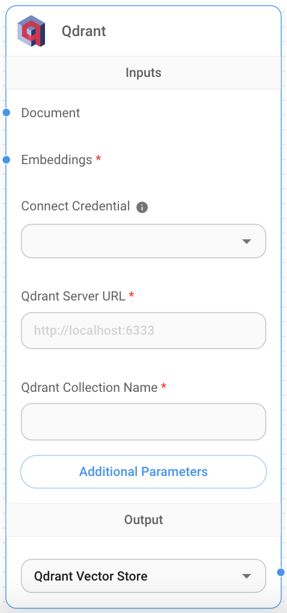

# Qdrant

## 前提条件

[ローカルで実行されているQdrantインスタンス](https://qdrant.tech/documentation/quick-start/)またはQdrantクラウドインスタンスが必要です。

Qdrantクラウドインスタンスを取得するには:

1. [クラウドダッシュボード](https://cloud.qdrant.io/overview)のClustersセクションに移動します。
2. **Clusters**を選択し、**+ Create**をクリックします。

<figure><figcaption></figcaption></figure>

3. クラスター構成とリージョンを選択します。
4. **Create**をクリックしてクラスターをプロビジョニングします。

## セットアップ

1. [クラウドダッシュボード](https://cloud.qdrant.io/overview)の**Data Access Control**セクションから**API Key**を取得/作成します。
2. キャンバスに新しい**Qdrant**ノードを追加します。
3. API Keyを使用して新しいQdrant認証情報を作成します。

<figure><figcaption></figcaption></figure>

4. **Qdrant**ノードに必要な情報を入力します:
   * QdrantサーバーURL
   * コレクション名

<figure><figcaption></figcaption></figure>

5. **Document**入力は[**Document Loader**](../document-loaders/)カテゴリの任意のノードと接続できます。
6. **エンベッディング**入力は[**Embeddings**](../embeddings/)カテゴリの任意のノードと接続できます。

## フィルタリング

メタデータキー`{source}`の下に一意の値を指定して、異なるドキュメントをアップサートしたとします。

<div align="left">

<figure><figcaption></figcaption></figure>


<figure><figcaption></figcaption></figure>

</div>

そして、それでフィルタリングしたい場合。Qdrantはフィルタリングに関して以下の[構文](https://qdrant.tech/documentation/concepts/filtering/#nested-key)をサポートしています:

**UI**

<figure><figcaption></figcaption></figure>

**API**

```json
"overrideConfig": {
    "qdrantFilter": {
        "should": [
            {
                "key": "metadata.source",
                "match": {
                    "value": "apple"
                }
            }
        ]
    }
}
```

## リソース

* [Qdrantドキュメント](https://qdrant.tech/documentation/)
* [LangChain JS Qdrant](https://js.langchain.com/docs/integrations/vectorstores/qdrant)
* [Qdrantフィルター](https://qdrant.tech/documentation/concepts/filtering/#nested-key)
