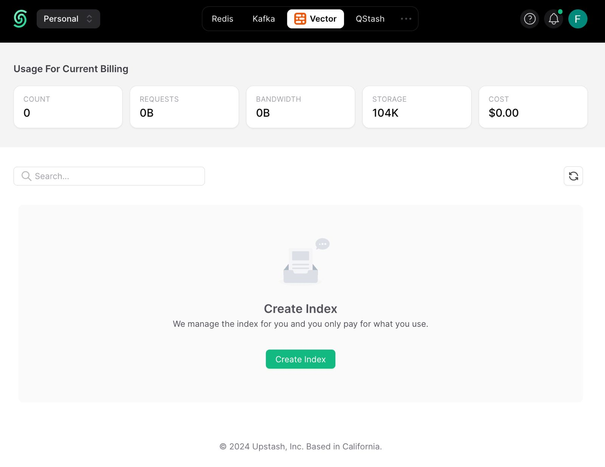
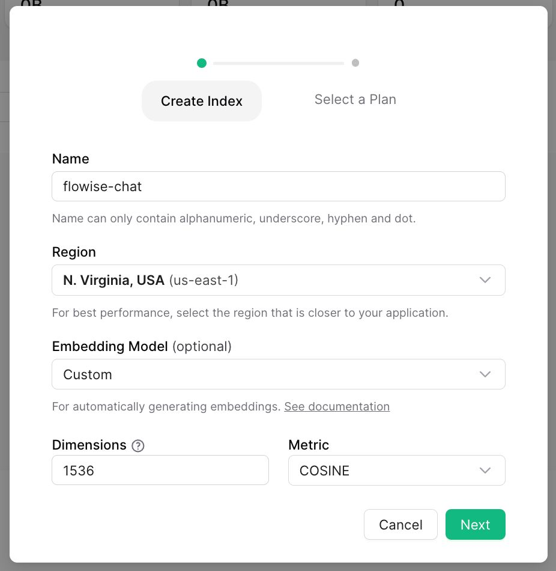
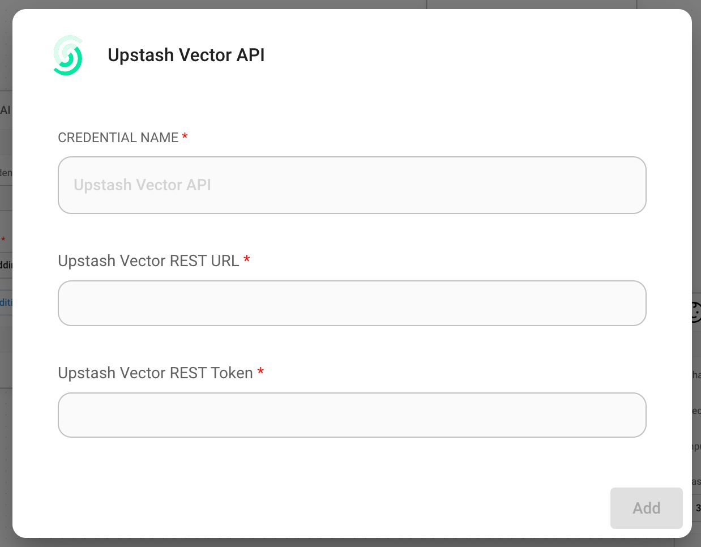
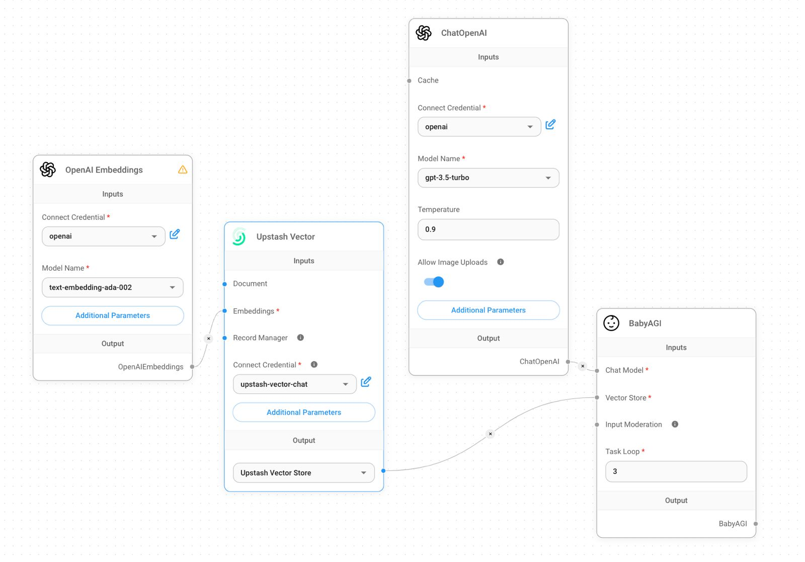
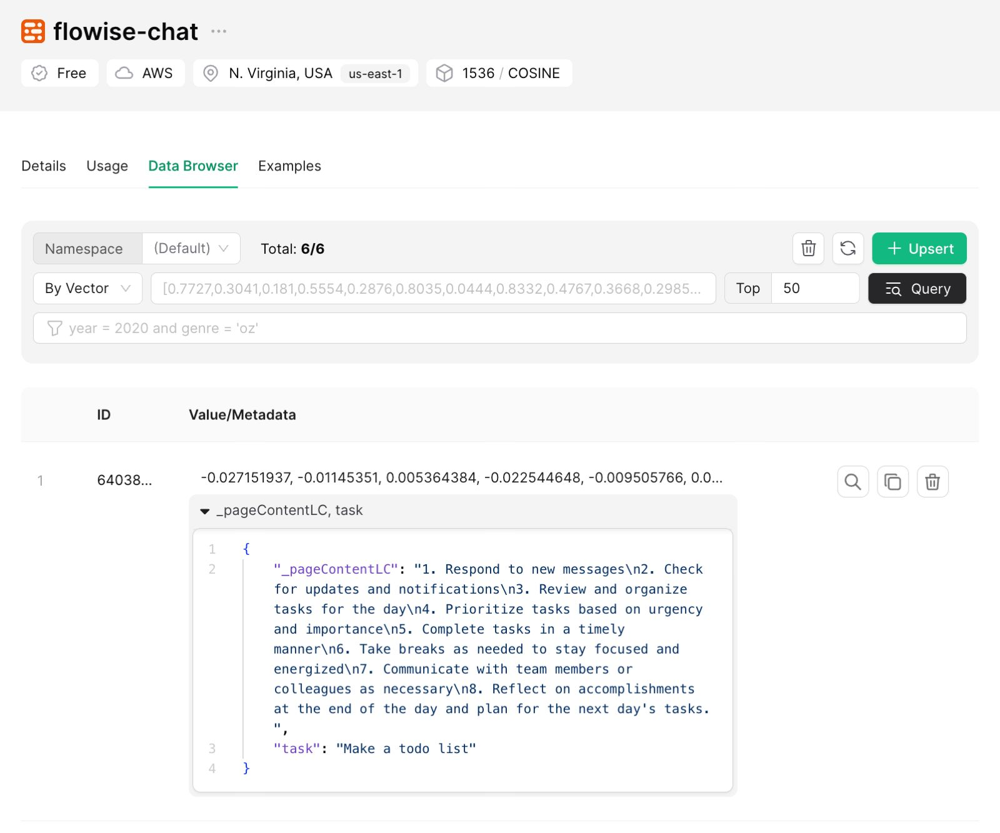

# Upstash

## 前提条件

1. [Upstashコンソール](https://console.upstash.com)にサインアップまたはサインイン
2. Vectorページに移動し、**Create Index**をクリック
   <figure><figcaption></figcaption></figure>
3. 必要な設定を行い、インデックスを作成。

   1. **Index Name**、作成するインデックスの名前（例: "flowise-upstash-demo"）
   2. **Dimensions**、インデックスに挿入するベクトルのサイズ（例: 1536）
   3. **Embedding Model**、[Upstash Embeddings](https://upstash.com/docs/vector/features/embeddingmodels)で使用するモデル。これはオプション。有効にすると、エンベッディングモデルを提供する必要はありません。

   <figure><figcaption></figcaption></figure>

## セットアップ

1. インデックスの認証情報を取得

<figure><figcaption></figcaption></figure>

2. 新しいUpstash Vector認証情報を作成し、以下を入力
   1. コンソールのUPSTASH_VECTOR_REST_URLからUpstash Vector REST URL
   2. コンソールのUPSTASH_VECTOR_REST_TOKENからUpstash Vector Rest Token

<figure><figcaption></figcaption></figure>

3. キャンバスに新しい**Upstash Vector**ノードを追加

<figure><figcaption></figcaption></figure>

4. キャンバスに追加のノードを追加してアップサート処理を開始
   - **Document**は[**Document Loader**](../document-loaders/)カテゴリの任意のノードと接続可能
   - **エンベッディング**は[**Embeddings**](../embeddings/)カテゴリの任意のノードと接続可能

<figure><figcaption></figcaption></figure>

5. [Upstashダッシュボード](https://console.upstash.com)でデータが正常に更新されたことを確認:

<figure><figcaption></figcaption></figure>
