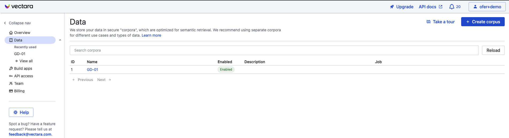
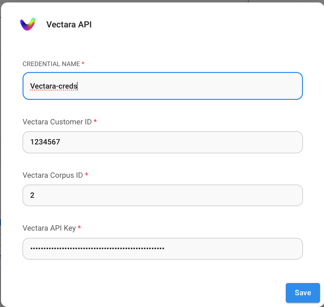

# Vectara

## クイックスタートチュートリアル



## 前提条件

1. [Vectara](https://vectara.com/integrations/flowise)のアカウントを登録
2. **Create Corpus**をクリック

<figure><figcaption></figcaption></figure>

作成するコーパスに名前を付け、**Create Corpus**をクリックしてコーパスのセットアップが完了するまで待ちます。

## セットアップ

1. コーパスビューで**"Access Control"**タブをクリック

<figure><figcaption></figcaption></figure>

2. **"Create API Key"**ボタンをクリックし、APIキーの名前を選択して**QueryService & IndexService**オプションを選択

<figure><figcaption></figcaption></figure>

3. **Create**をクリックしてAPIキーを作成
4. 新しいAPIキーの「copy」の下の下矢印をクリックして、**Corpus ID、API Key、Customer ID**を取得:

<figure><figcaption></figcaption></figure>

5. Flowiseキャンバスに戻り、チャットフローを作成。認証情報ドロップダウンから**Create New**をクリックしてVectara認証情報を入力。

<figure><figcaption></figcaption></figure>

6. お楽しみください！

## Vectaraクエリパラメータ

Vectaraクエリパラメータをより細かく制御するには、「**Additional Parameters**」をクリックして、以下のパラメータをデフォルトから更新できます:

* メタデータフィルター: Vectaraはメタデータフィルタリングをサポートしています。[フィルタリング](https://docs.vectara.com/docs/common-use-cases/filtering-by-metadata/filter-overview)を使用するには、フィルタリングしたいメタデータフィールドがVectaraコーパスで定義されていることを確認してください。
* "Sentences before"と"Sentences after": これらはVectara検索エンジンから返される結果として、一致するテキストの前後に何文を返すかを制御します
* Lambda: Vectaraの[ハイブリッド検索](https://docs.vectara.com/docs/learn/hybrid-search)の動作を定義します
* Top-K: クエリに対してVectaraから返す結果の数
* MMR-K: [MMR](https://docs.vectara.com/docs/api-reference/search-apis/reranking#maximal-marginal-relevance-mmr-reranker)（最大限界関連性）に使用する結果の数

<figure><figcaption></figcaption></figure>

## リソース

* [LangChain JS Vectaraブログ投稿](https://blog.langchain.dev/langchain-vectara-better-together/)
* [VectaraのLangchain統合を使用する5つの理由ブログ投稿](https://vectara.com/5-reasons-to-use-vectaras-langchain-integration/)
* [Vectaraでの最大限界関連性](https://vectara.com/blog/get-diverse-results-and-comprehensive-summaries-with-vectaras-mmr-reranker/)
* [Vectara Boomerangエンベッディングモデルブログ投稿](https://vectara.com/introducing-boomerang-vectaras-new-and-improved-retrieval-model/)
* [VectaraのHHEMによるハルシネーションの検出](https://vectara.com/blog/cut-the-bull-detecting-hallucinations-in-large-language-models/)
