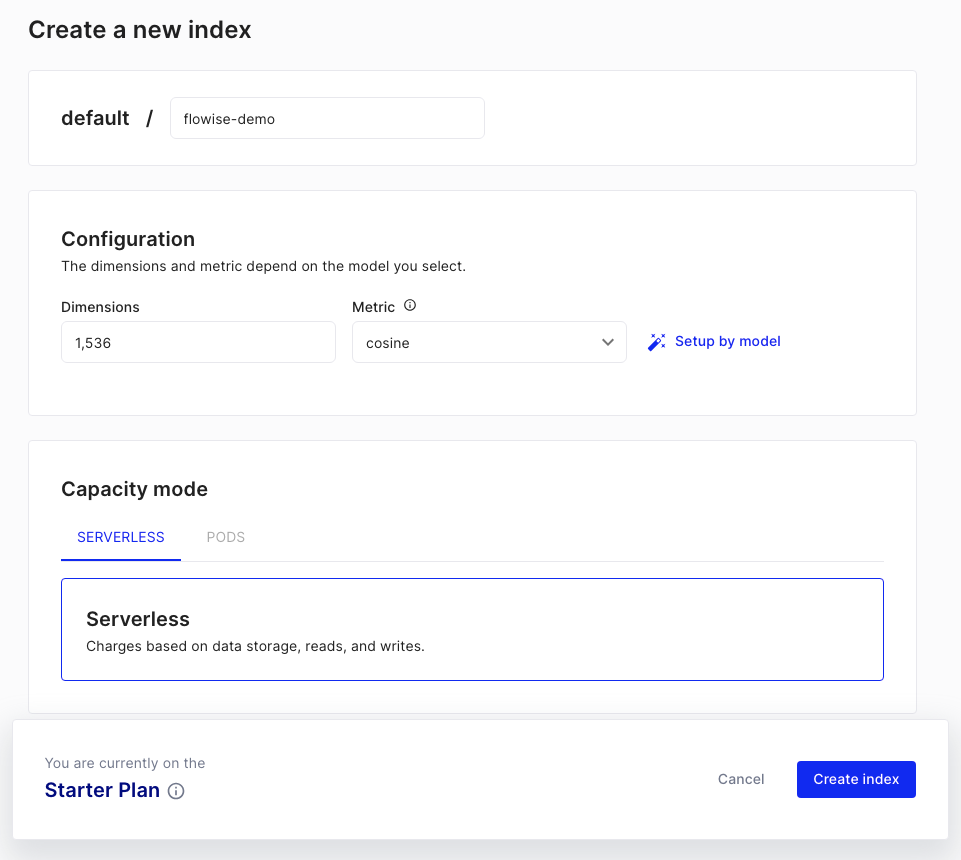
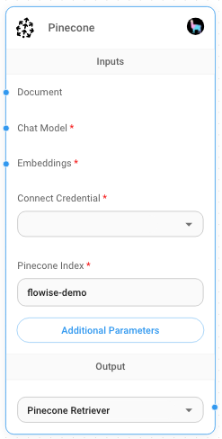
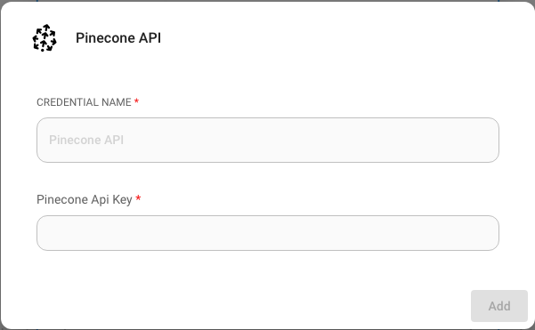
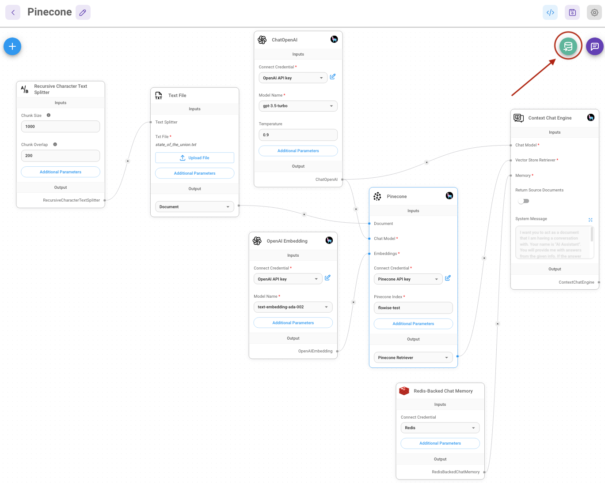
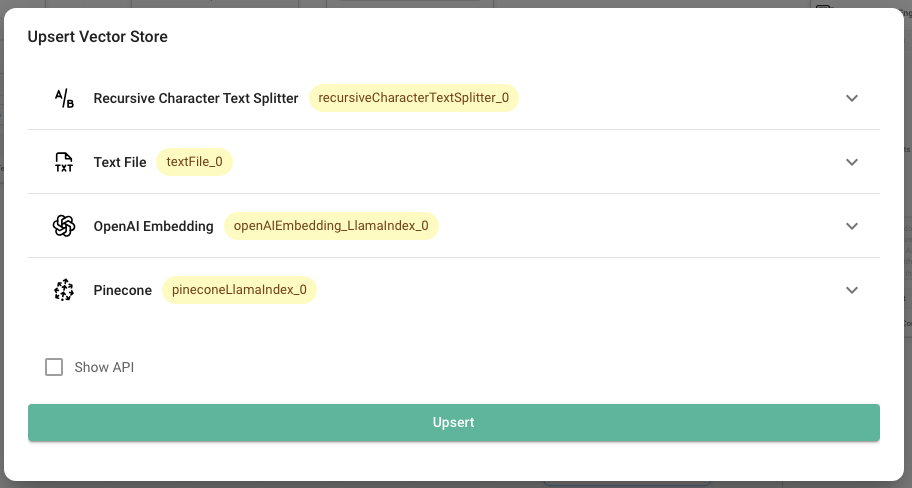

# Pinecone

## 前提条件

1. [Pinecone](https://app.pinecone.io/)のアカウントを登録
2. **Create index**をクリック

<figure><figcaption></figcaption></figure>

3. 必要なフィールドを入力:
   - **Index Name**、作成するインデックスの名前（例: "flowise-test"）
   - **Dimensions**、インデックスに挿入されるベクトルのサイズ（例: 1536）

<figure><figcaption></figcaption></figure>

4. **Create Index**をクリック

## セットアップ

1. **API Key**を取得/作成

<figure><figcaption></figcaption></figure>

2. キャンバスに新しい**Pinecone**ノードを追加し、パラメータを入力:
    - Pineconeインデックス
    - Pineconeネームスペース（オプション）

<figure><figcaption>
Pineconeノード
</figcaption></figure>

3. 新しいPineconeクレデンシャルを作成 -> **API Key**を入力

<figure><figcaption></figcaption></figure>

4. キャンバスに追加のノードを追加してアップサートプロセスを開始
   - **Document**は[**Document Loader**](../../langchain/document-loaders/)カテゴリの任意のノードと接続可能
     
     LlamaIndexのドキュメントローダーとテキストスプリッターはまだ利用できませんが、LangChainで利用可能なものを使用することで、通常通りLlamaIndexでクエリを実行できます。
     
   - **Embeddings**は[**Embeddings**](../embeddings/)カテゴリの任意のノードと接続可能

<figure><figcaption></figcaption></figure>

<figure><figcaption></figcaption></figure>

5. [Pineconeダッシュボード](https://app.pinecone.io)でデータが正常にアップサートされたことを確認:

<figure><figcaption></figcaption></figure>
