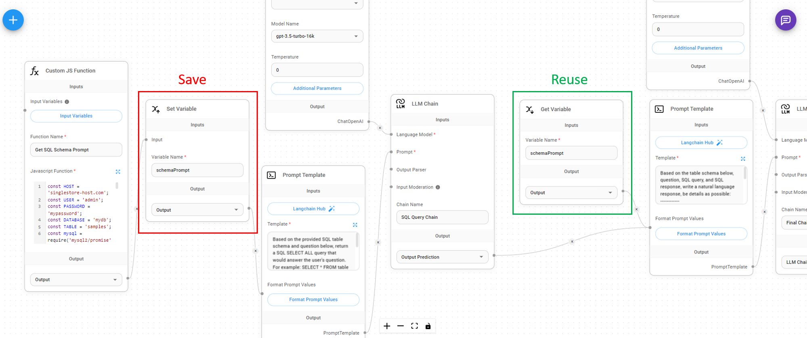

# 変数の設定/取得

カスタム関数やLLMチェーンを実行する際、同じ処理を再計算/再実行することなく、結果を他のノードで再利用したい場合があります。出力結果を変数として保存し、フローパスの下流にある他のノードで再利用することができます。

<figure><figcaption></figcaption></figure>

### 変数の設定

`string、number、boolean、json、array`を出力する任意のノードからの入力を受け取り、変数名を割り当てることができます。

<figure><figcaption></figcaption></figure>

### 変数の取得

後の段階で変数名から変数の値を取得することができます：

<figure><figcaption></figcaption></figure>
