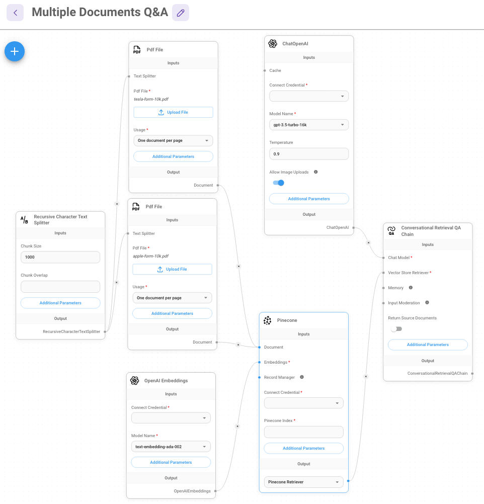
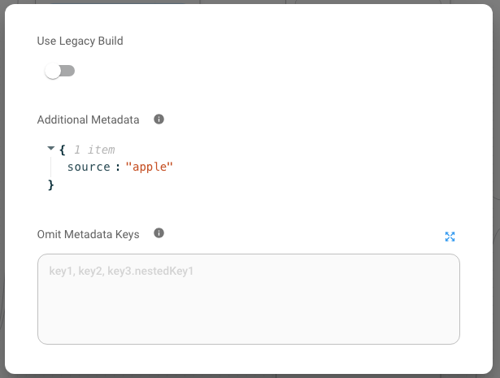
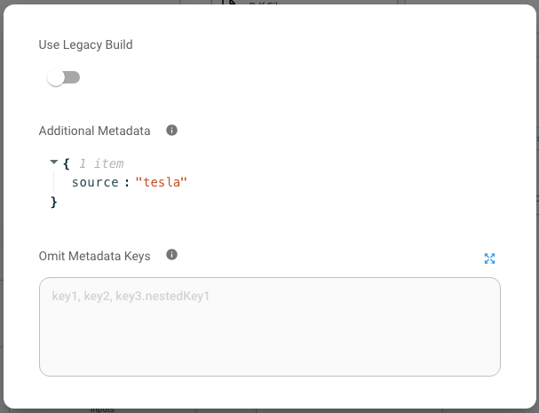
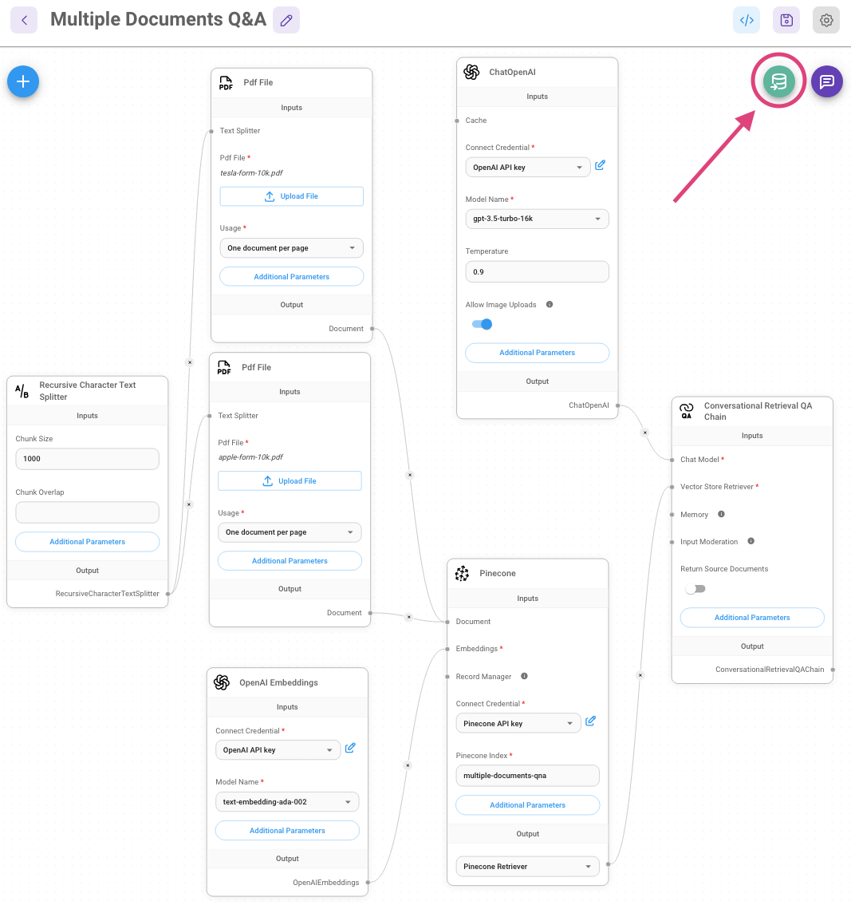
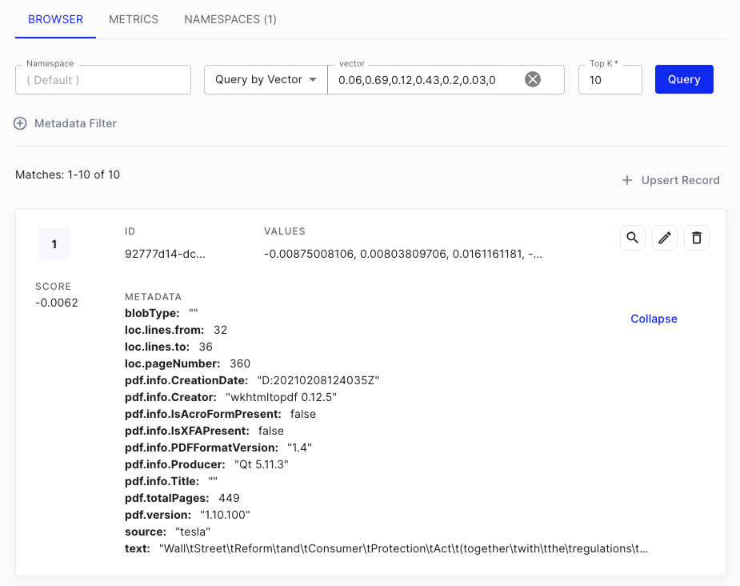

# 複数ドキュメントのQ&A

***

前回の[WebスクレイピングQ&A](web-scrape-qna.md)の例では、1つのウェブサイトのみをアップサートおよびクエリしていました。複数のウェブサイトやドキュメントがある場合はどうでしょうか？その方法を見ていきましょう。

この例では、APPLEとTESLAのFORM-10Kという2つのPDFを用いてQ&Aを行います。

<div align="left" data-full-width="false"><figure><figcaption></figcaption></figure> <figure><figcaption></figcaption></figure></div>

## アップサート

1. マーケットプレースのテンプレートから**Conversational Retrieval QA Chain**という例のフローを探します。
2. [PDFファイルローダー](../integrations/langchain/document-loaders/pdf-file.md)を使用し、それぞれのファイルをアップロードします：

<figure><figcaption></figcaption></figure>

3. PDFファイルローダーの**追加パラメータ**をクリックし、メタデータオブジェクトを指定します。例えば、APPLEのFORM-10KをアップロードしたPDFファイルには`{source: apple}`というメタデータオブジェクトを持たせ、TESLAのFORM-10KをアップロードしたPDFファイルには`{source: tesla}`を持たせることができます。これは取得時にドキュメントを区別するためです。

<div align="left"><figure><figcaption></figcaption></figure> <figure><figcaption></figcaption></figure></div>

4. Pineconeの資格情報を入力した後、アップサートをクリックします：

<figure><figcaption></figcaption></figure>

<figure><figcaption></figcaption></figure>

5. [Pineconeコンソール](https://app.pinecone.io)で、新しく追加されたベクトルを見ることができます。

<figure><figcaption></figcaption></figure>

## クエリ

1. データがPineconeにアップサートされたことが確認できたら、チャットで質問を始めることができます！

<figure><figcaption></figcaption></figure>

2. ただし、取得されるコンテキストはAPPLEとTESLAの両方のドキュメントが混在しています。ソースドキュメントから見てとれます：

<div align="left"><figure><figcaption></figcaption></figure> <figure><figcaption></figcaption></figure></div>

3. これを修正するために、Pineconeノードからメタデータフィルターを指定できます。例えば、APPLEのFORM-10Kからのみコンテキストを取得したい場合、[アップサート](multiple-documents-qna.md#upsert "mention")のステップで指定したメタデータを振り返り、下のメタデータフィルターに同じものを使用します：

<figure><figcaption></figcaption></figure>

4. 同じ質問をもう一度してみます。今度は取得されるコンテキストがすべてAPPLEのFORM-10Kからであることが確認できます：

<figure><figcaption></figcaption></figure>


各ベクトルデータベースプロバイダーには異なるフィルタリング構文の形式があります。それぞれのベクトルデータベースのドキュメントを読むことをお勧めします。


5. ただし、この問題の一つとして、メタデータフィルタリングが_**「ハードコーディング」**_されているという点があります。理想的には、LLMが質問に基づいてどのドキュメントを取得するかを決定するべきです。

## ツールエージェント

_**「ハードコーディング」**_されたメタデータフィルタの問題を解決するために、[ツールエージェント](../integrations/langchain/agents/tool-agent.md)を使用できます。

エージェントにツールを提供することで、エージェントが質問に応じてどのツールを適切に使用するかを決定できます。

1. 以下の名前と説明で[Retriever Tool](../integrations/langchain/tools/retriever-tool.md)を作成します：

<table><thead><tr><th width="178">名前</th><th>説明</th></tr></thead><tbody><tr><td>search_apple</td><td>Apple Inc (APPL)に関するユーザーの質問に答えるためにこの関数を使用します。Apple Inc (APPL)の2022年の財務を記述したSEC Form 10Kが含まれています。</td></tr></tbody></table>

2. メタデータフィルター`{source: apple}`を使用してPineconeノードに接続します。

<figure><figcaption></figcaption></figure>

3. Teslaについても同様に行います：

<table><thead><tr><th width="175">名前</th><th width="322">説明</th><th>Pineconeメタデータフィルター</th></tr></thead><tbody><tr><td>search_tsla</td><td>Tesla Inc (TSLA)に関するユーザーの質問に答えるためにこの関数を使用します。Tesla Inc (TSLA)の2022年の財務を記述したSEC Form 10Kが含まれています。</td><td><code>{source: tesla}</code></td></tr></tbody></table>


明確で簡潔な説明を指定することが重要です。これにより、LLMがどのツールをいつ使用するべきかをよりよく決定できます。


フローは以下のようになります：

<figure><figcaption></figcaption></figure>

4. 次に、ツールエージェントに一般的な指示を作成する必要があります。ノードの**追加パラメータ**をクリックし、**システムメッセージ**を指定します。例として：

```
あなたは常に最も関連性のある情報を使って質問に答える専門の金融アナリストです。
これらのツールには、ユーザーが興味を示した企業に関する情報が含まれています。
以下のガイドラインを遵守しなければなりません：
* 金融の質問については、ツールを使用して回答を見つけ、レスポンスを書かなければなりません。
* ツールで質問に答えられないように思える場合でも、それらを使用して最も関連性のある情報と洞察を見つけなければなりません。それらを使わないと、仕事をしていないように見えます。
* ユーザーの金融の質問は、選択されたドキュメントに関連していると想定できます。
* 金融分析に関連しないユーザーメッセージについては、回答を控え、関連する質問をするよう提案します。
* ツールが答えを見つけられない場合、答えが見つからなかったことを伝えつつ、ツールで見つけた役立つ情報を伝えます。
* 質問をクリアにするための質問をせず、ただ答えを返します。

あなたが使用できるツールには、ユーザーが討論するために選択した以下のSECドキュメントがあります：
- Apple Inc (APPL) FORM 10K 2022
- Tesla Inc (TSLA) FORM 10K 2022

現在の日付は: 2024-01-28
```

5. チャットフローを保存し、質問を始めてみてください！

<figure><figcaption></figcaption></figure>

<div align="left"><figure><figcaption></figcaption></figure> <figure><figcaption></figcaption></figure></div>

6. 続けてTeslaについて質問してください：

<figure><figcaption></figcaption></figure>

7. これで、ツールとエージェントを使用して、メタデータフィルタを「ハードコーディング」せずに、以前にベクトルデータベースにアップサートした任意のドキュメントについて質問することができます。

## メタデータリトリーバー

ツールエージェントアプローチでは、ユーザーが異なるソースからドキュメントを取得するために複数のリトリーバーツールを作成する必要があります。大量のドキュメントソースと異なるメタデータがある場合、これは問題となる可能性があります。前述のAppleとTeslaだけでなく、ディズニーやアマゾンなど他の企業にも拡張することが考えられます。この場合、会社ごとにリトリーバーツールを作成するのは面倒な作業になります。

メタデータリトリーバーが役立ちます。この概念は、ユーザーの質問からメタデータをLLMが抽出し、それをフィルターとしてベクトルデータベース検索を行うことです。

例えば、ユーザーがAppleに関連する質問をする場合、メタデータフィルター`{source: apple}`がベクトルデータベース検索で自動的に適用されます。

<div align="left"><figure><figcaption></figcaption></figure> <figure><figcaption></figcaption></figure></div>

このシナリオでは、単一のリトリーバーツールを持ち、ベクトルデータベースとリトリーバーツールの間に**メタデータリトリーバー**を配置することができます。

<figure><figcaption></figcaption></figure>

## XMLエージェント

一部のLLMは、関数呼び出し機能をサポートしていないことがあります。この場合、提供されたツールを使用する目的で、より構造化されたフォーマット/構文でLLMにプロンプトを送るためにXMLエージェントを使用します。

基本的なプロンプトは次のようなものです：

```xml
あなたは役立つアシスタントです。ユーザーの質問に答えてください。

あなたは以下のツールにアクセスできます：

{tools}

ツールを使用するためには、<tool></tool>と<tool_input></tool_input>タグを使用します。ツールを使用したら、<observation></observation>という形式で応答を受け取ります。
例えば、'search'というツールがあり、Google検索を行える場合、SFの天気を検索するには：

<tool>search</tool><tool_input>weather in SF</tool_input>
<observation>64 degrees</observation>

完了したら、<final_answer></final_answer>の間に最終回答を返します。例えば：

<final_answer>The weather in SF is 64 degrees</final_answer>

始めましょう！

前の会話：
{chat_history}

質問：{input}
{agent_scratchpad}
```

<figure><figcaption></figcaption></figure>

## 結論

複数のドキュメントをクエリする際に起こるConversational Retrieval QA Chainの制約と、その問題をOpenAI関数エージェント/XMLエージェント＋ツールを使用して克服する方法を解説しました。以下にテンプレートがあります：




