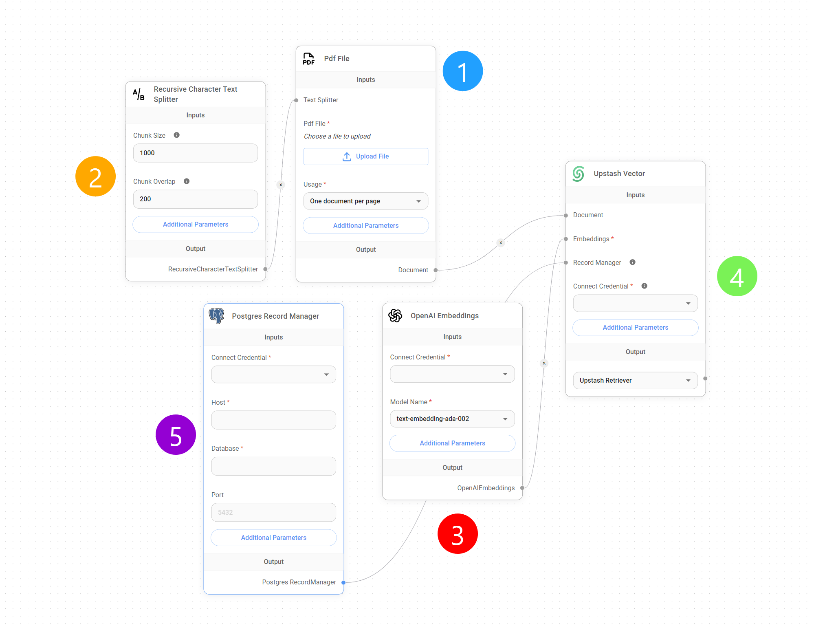
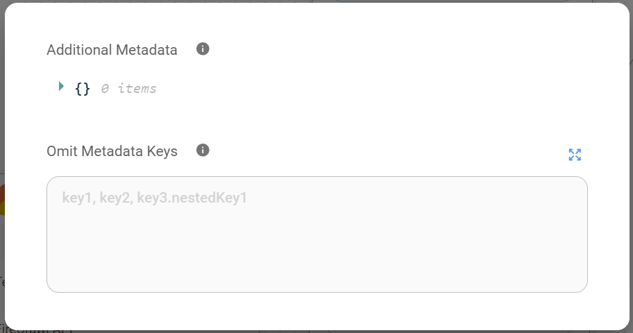
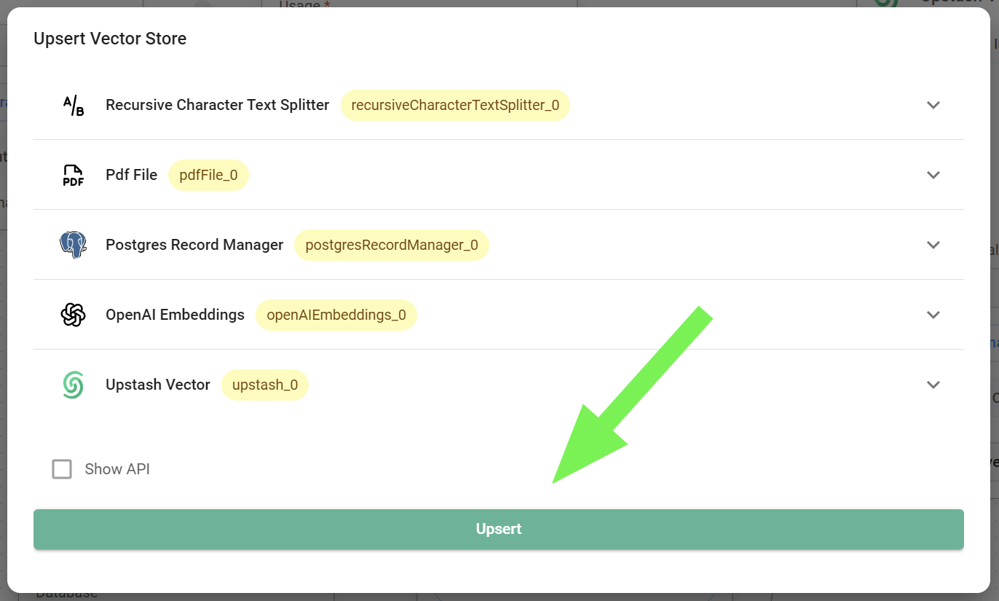

# データのアップサート

***

Flowiseを使用して[ベクトルストア](../integrations/langchain/vector-stores/)にデータをアップサートする方法は、[APIコール](../using-flowise/api.md#id-2.-vector-upsert-api)を使用する方法と、この目的のために用意された専用のノードセットを使用する方法の2つがあります。

このガイドでは、ベクトルストアにアップサートする前に[ドキュメントストア](../using-flowise/document-stores.md)を使用してデータを準備することを**強く推奨**しますが、この目的に必要な特定のノードを使用してプロセス全体を説明し、手順、このアプローチの利点、効率的なデータ処理のための最適化戦略について説明します。

## アップサートプロセスの理解

最初に理解する必要があるのは、[ベクトルストア](../integrations/langchain/vector-stores/)へのデータのアップサートプロセスは、[検索拡張生成(RAG)](multiple-documents-qna.md)システムの形成における基本的な要素だということです。ただし、このプロセスが完了すると、RAGは独立して実行できます。

つまり、Flowiseでは完全なRAGセットアップなしでデータをアップサートでき、アップサートプロセスで使用される特定のノードなしでRAGを実行できます。これは、適切に構築されたベクトルストアがRAGの機能に不可欠である一方で、実際の検索と生成のプロセスには継続的なアップサートは必要ないことを意味します。

<figure><figcaption>
アップサート vs. RAG
</figcaption></figure>

## セットアップ

PDFフォーマットの長いデータセットがあり、それを[Upstashベクトルストア](../integrations/langchain/vector-stores/upstash-vector.md)にアップサートして、LLMにそのドキュメントから特定の情報を取得するように指示したいとします。

そのために、このチュートリアルでは、5つの異なるノードを使用して**アップサートフロー**を作成する必要があります：

<figure><figcaption>
アップサートフロー
</figcaption></figure>## 1. ドキュメントローダー

最初のステップは、[ドキュメントローダーノード](../integrations/langchain/document-loaders/)を使用して**PDFデータをFlowiseインスタンスにアップロード**することです。ドキュメントローダーは、**PDF**、**TXT**、**CSV**、Notionページなど、様々なドキュメント形式の取り込みを処理する専用のノードです。

重要な点として、すべてのドキュメントローダーには、データセットからメタデータを任意に追加および省略できる2つの重要な**追加パラメータ**が付属しています。

<figure><figcaption>
追加パラメータ
</figcaption></figure>


**ヒント**：メタデータの追加/省略パラメータはオプションですが、ベクトルストアにアップサートされたデータセットをターゲットにしたり、不要なメタデータを削除したりする際に非常に便利です。


## 2. テキストスプリッター

PDFやデータセットをアップロードしたら、**それを小さな部分、ドキュメント、またはチャンクに分割**する必要があります。これは主に2つの理由で重要な前処理ステップです：

* **検索速度と関連性：**大きなドキュメントをベクトルデータベースに単一のエンティティとして保存して検索すると、検索時間が遅くなり、関連性の低い結果が得られる可能性があります。ドキュメントを小さなチャンクに分割することで、より的確な検索が可能になります。より小さく、焦点を絞った情報単位に対して検索を行うことで、より速いレスポンスタイムと検索結果の精度向上を実現できます。
* **コスト効率：**ドキュメント全体ではなく関連するチャンクのみを取得するため、LLMが処理するトークン数が大幅に削減されます。この的確な検索アプローチは、通常トークン消費量に基づいて課金されるLLMの使用コストの削減に直接つながります。LLMに送信される不要な情報を最小限に抑えることで、コストも最適化されます。

### ノード

Flowiseでは、この分割プロセスは[テキストスプリッターノード](../integrations/langchain/text-splitters/)を使用して実行されます。これらのノードは以下のようなテキスト分割戦略を提供します：

* **文字テキスト分割：**テキストを固定文字数のチャンクに分割します。この方法は単純ですが、単語やフレーズがチャンク間で分割される可能性があり、文脈が損なわれる可能性があります。
* **トークンテキスト分割：**選択したエンベッディングモデルに特有の単語境界やトークン化スキームに基づいてテキストを分割します。この方法は単語境界を保持し、テキストの基本的な言語構造を考慮するため、より意味的に一貫性のあるチャンクが得られることが多いです。
* **再帰的文字テキスト分割：**この戦略は、指定されたサイズ制限内で意味的な一貫性を維持しながらテキストをチャンクに分割することを目的としています。階層的なドキュメントやネストされたセクションを持つドキュメントに特に適しています。文字制限で単純に分割するのではなく、文末やセクション区切りなどの論理的な区切り点を見つけるために再帰的にテキストを分析します。この方法により、目標サイズを若干超えても、各チャンクが意味のある情報単位を表現することが保証されます。
* **マークダウンテキストスプリッター：**マークダウン形式のドキュメント用に設計されたこのスプリッターは、マークダウンの見出しと構造要素に基づいてテキストを論理的に分割し、ドキュメント内の論理的なセクションに対応するチャンクを作成します。
* **コードテキストスプリッター：**コードファイルの分割用に調整されたこの戦略は、コード構造、関数定義、その他のプログラミング言語固有の要素を考慮して、コード検索やドキュメント化などのタスクに適した意味のあるチャンクを作成します。
* **HTMLからマークダウンへのテキストスプリッター：**この特殊なスプリッターは、まずHTMLコンテンツをマークダウンに変換し、その後マークダウンテキストスプリッターを適用することで、Webページやその他のHTMLドキュメントの構造化された分割を可能にします。

テキストスプリッターノードは、以下のようなパラメータのカスタマイズを可能にし、テキスト分割の詳細な制御を提供します：

* **チャンクサイズ：**各チャンクの希望する最大サイズで、通常は文字数またはトークン数で定義されます。
* **チャンクオーバーラップ：**連続するチャンク間でオーバーラップさせる文字数またはトークン数で、チャンク間の文脈の流れを維持するのに役立ちます。


**ヒント：**チャンクサイズとチャンクオーバーラップの値は加算されません。`chunk_size=1200`と`chunk_overlap=400`を選択しても、合計チャンクサイズは1600にはなりません。オーバーラップ値は、文脈を維持するために前のチャンクから現在のチャンクに含まれるトークン数を決定します。全体のチャンクサイズを増加させるものではありません。


### チャンクオーバーラップの理解

ベクトルベースの検索とLLMのクエリの文脈において、チャンクオーバーラップは**文脈の連続性を維持**し、**応答の正確性を向上させる**上で**重要な役割**を果たします。特に、制限された検索深度または**top K**（クエリに応じて[ベクトルストア](../integrations/langchain/vector-stores/)から取得される最も類似したチャンクの最大数を決定するパラメータ）を扱う場合に重要です。

クエリ処理中、LLMはベクトルストアに対して類似度検索を実行し、与えられたクエリに対して意味的に最も関連性の高いチャンクを取得します。検索深度（top Kパラメータで表される）がデフォルトの4のような小さな値に設定されている場合、LLMは最初にこれら4つのチャンクからの情報のみを使用して応答を生成します。

このシナリオでは問題が発生します。オーバーラップのない限られた数のチャンクのみに依存すると、特に複数のチャンクにまたがる情報を必要とするクエリを扱う場合、不完全または不正確な回答につながる可能性があるためです。

チャンクオーバーラップは、連続するチャンク間でテキストの文脈の一部を共有することで、この問題を解決します。これにより、**与えられたクエリに関連するすべての情報が取得されたチャンク内に含まれる可能性が高まります**。

言い換えると、このオーバーラップはチャンク間の橋渡しとして機能し、取得されるチャンク（top K）が少数に制限されている場合でも、LLMがより広い文脈のウィンドウにアクセスできるようになります。クエリが単一のチャンクを超えて広がる概念や情報に関連する場合、オーバーラップ領域により、必要な文脈をすべて捉える可能性が高まります。

したがって、テキスト分割フェーズでチャンクオーバーラップを導入することで、LLMの以下の能力が向上します：

1. **文脈の連続性の保持：**オーバーラップするチャンクにより、連続するセグメント間の情報の移行がスムーズになり、モデルがテキストのより一貫した理解を維持できます。
2. **検索精度の向上：**ターゲットとなるtop K取得チャンク内に関連するすべての情報を捉える確率を高めることで、オーバーラップはより正確で文脈に適した応答に貢献します。

### 精度とコストのバランス

検索精度とコストのトレードオフをさらに最適化するために、2つの主要な戦略を使用できます：

1. **チャンクオーバーラップの増減：**テキスト分割時のオーバーラップ率を調整することで、チャンク間で共有される文脈の量を細かく制御できます。オーバーラップ率が高いほど、一般的に文脈の保持が改善されますが、ドキュメント全体を包含するためにより多くのチャンクが必要となるため、コストが増加する可能性があります。逆に、オーバーラップ率を低くするとコストを削減できますが、チャンク間の重要な文脈情報が失われるリスクがあり、LLMからの回答が不正確または不完全になる可能性があります。
2. **top Kの増減：**デフォルトのtop K値（4）を上げると、応答生成に考慮されるチャンクの数が増加します。これにより精度は向上しますが、コストも増加します。


**ヒント：**最適な**オーバーラップ**と**top K**の値の選択は、ドキュメントの複雑さ、エンベッディングモデルの特性、精度とコストのバランスの希望などの要因に依存します。特定のニーズに対する理想的な設定を見つけるためには、これらの値を実験することが重要です。


## 3. エンベッディング

これで、データセットをアップロードし、[ベクトルストア](../integrations/langchain/vector-stores/)にアップサートされる前にデータがどのように分割されるかを設定しました。この段階で、[エンベッディングノード](../integrations/langchain/embeddings/)が登場し、**それらのチャンクすべてをLLMが簡単に理解できる「言語」に変換します**。

この文脈において、エンベッディングはテキストをその意味を捉えた数値表現に変換するプロセスです。この数値表現（エンベッディングベクトルとも呼ばれる）は、各次元がテキストの意味の特定の側面を表す多次元の数値配列です。

これらのベクトルにより、LLMはこの多次元空間内でベクトル間の距離や類似性を測定することで、ベクトルストア内の類似したテキストを比較・検索することができます。

### エンベッディング/ベクトルストアの次元の理解

ベクトルストアインデックスの次元数は、データをアップサートする際に使用するエンベッディングモデルによって決定され、その逆も同様です。各次元はデータ内の特定の特徴や概念を表します。例えば、**次元**は**特定のトピック、感情、またはテキストの他の側面を表現**する可能性があります。

データのエンベッドに使用する次元が多いほど、テキストからより微妙な意味を捉える可能性が高まります。ただし、この増加はクエリごとの計算要件の増加というコストを伴います。

一般的に、次元数が大きいほど、結果として得られるエンベッディングベクトルの保存、処理、比較により多くのリソースが必要になります。したがって、768次元を使用するGoogle `embedding-001`のようなエンベッディングモデルは、理論的には3072次元を持つOpenAI `text-embedding-3-large`などと比べて安価です。

重要な点として、**次元と意味の捕捉の関係は厳密に線形ではありません**。次元を追加することで得られる利点が、不必要なコストの増加に対して無視できるレベルになる点が存在します。


**ヒント：**エンベッディングモデルとベクトルストアインデックス間の互換性を確保するには、次元の整合性が不可欠です。**モデルとインデックスの両方が、ベクトル表現に同じ次元数を使用する必要があります**。次元の不一致はアップサートエラーを引き起こします。これは、ベクトルストアが選択されたエンベッディングモデルによって決定される特定のサイズのベクトルを処理するように設計されているためです。


## 4. ベクトルストア

[ベクトルストアノード](../integrations/langchain/vector-stores/)は**アップサートフローの終端ノード**です。これはFlowiseインスタンスとベクトルデータベース間のブリッジとして機能し、生成されたエンベッディングを関連するメタデータと共に、永続的な保存と後続の検索のためにターゲットのベクトルストアインデックスに送信することを可能にします。

このノードで、先に説明した「**top K**」のようなパラメータを設定できます。これは、クエリに応答してベクトルストアから取得される最も類似したチャンクの最大数を決定するパラメータです。

<figure><figcaption></figcaption></figure>


**ヒント：**top Kの値が低いと、より少ないが潜在的により関連性の高い結果が得られ、値が高いとより広範な結果が返され、より多くの情報を捉える可能性があります。


## 5. レコードマネージャー

[レコードマネージャーノード](../integrations/langchain/record-managers.md)は、アップサートフローにおいてオプションですが、非常に有用な追加機能です。ベクトルストアにアップサートされたすべてのチャンクの記録を維持し、必要に応じてチャンクを効率的に追加または削除することができます。

より詳細なガイドについては、[このガイド](../integrations/langchain/record-managers.md)を参照してください。

<figure><figcaption></figcaption></figure>

## 6. 全体の概要

最後に、初期のドキュメント読み込みから最終的なベクトル表現まで、各段階を検証し、アップサートプロセスにおける主要なコンポーネントとその役割を強調します。

<figure><figcaption></figcaption></figure>

1. **ドキュメントの取り込み**：
   * データ形式に適した**ドキュメントローダーノード**を使用して、生データをFlowiseに取り込むことから始めます。
2. **戦略的分割**
   * 次に、**テキストスプリッターノード**がドキュメントをより小さく管理しやすいチャンクに分割します。これは効率的な検索とコスト管理に重要です。
   * 適切なテキストスプリッターノードを選択し、特にチャンクサイズとチャンクオーバーラップを微調整することで、文脈の保持と効率性のバランスを取りながら、この分割方法に柔軟性を持たせることができます。
3. **意味のあるエンベッディング**
   * データがベクトルストアに記録される直前に、**エンベッディングノード**が介入します。各テキストチャンクとその意味をLLMが理解できる数値表現に変換します。
4. **ベクトルストアインデックス**
   * 最後に、**ベクトルストアノード**がFlowiseとデータベース間のブリッジとして機能します。エンベッディングを関連するメタデータと共に、指定されたベクトルストアインデックスに送信します。
   * このノードで、クエリに回答する際に考慮されるチャンクの数に影響を与える**top K**パラメータを設定することで、検索動作を制御できます。
5. **データの準備完了**
   * アップサートが完了すると、データはベクトルストア内でベクトルとして表現され、類似度検索と取得の準備が整います。
6. **記録の保持（オプション）**
   * 拡張された制御とデータ管理のために、**レコードマネージャー**ノードはアップサートされたすべてのチャンクを追跡します。これにより、データやニーズの進化に応じて簡単に更新や削除が可能になります。

本質的に、アップサートプロセスは生データを高速でコスト効率の良い検索に最適化された、LLMが利用可能な形式に変換します。
