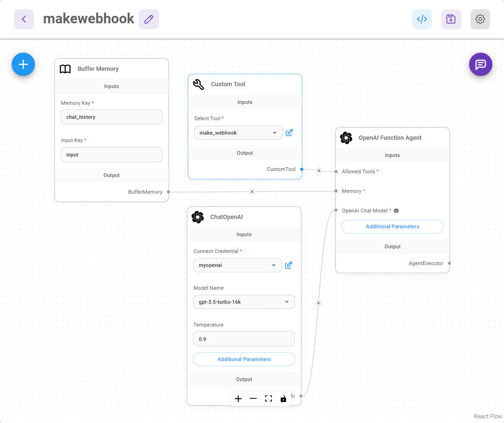

---

description: MakeでWebhookを呼び出す方法を学びます

---

# Webhookの呼び出し

***

このユースケースチュートリアルでは、Webhookエンドポイントを呼び出し、Webhookボディに必要なパラメータを渡すことができるカスタムツールを作成します。[Make.com](https://www.make.com/en) を使用してWebhookワークフローを作成します。

## Make

Make.comにアクセスし、アカウント登録後にWebhookモジュールとDiscordモジュールを持つワークフローを作成します。以下のようになります：

<figure><figcaption></figcaption></figure>

Webhookモジュールから、WebhookのURLを確認することができます：

<figure><figcaption></figcaption></figure>

Discordモジュールでは、Webhookから`message`ボディを受け取り、Discordチャンネルに送信するメッセージとして渡します：

<figure><figcaption></figcaption></figure>

テストするには、左下の「Run once」をクリックし、JSONボディを含むPOSTリクエストを送信します

```json
{
    "message": "Hello Discord!"
}
```

<figure><figcaption></figcaption></figure>

Discordチャンネルにメッセージが送信されるのが確認できます：

<figure><figcaption></figcaption></figure>

完璧です！メッセージを渡してDiscordチャンネルに送信できるワークフローの設定が完了しました[🎉 ](https://emojiterra.com/party-popper/)[🎉](https://emojiterra.com/party-popper/)

## Flowise

Flowiseでは、メッセージボディを含むWebhookのPOSTリクエストを呼び出すことができるカスタムツールを作成します。

ダッシュボードから、**Tools**をクリックし、その後に**Create**をクリックします。

<figure><figcaption></figcaption></figure>

以下の項目を入力します（必要に応じて変更してください）：

* **Tool Name**: make\_webhook（スネークケースでなければなりません）
* **Tool Description**: Discordにメッセージを送る必要がある時に便利です
* **Tool Icon Src**: [https://github.com/FlowiseAI/Flowise/assets/26460777/517fdab2-8a6e-4781-b3c8-fb92cc78aa0b](https://github.com/FlowiseAI/Flowise/assets/26460777/517fdab2-8a6e-4781-b3c8-fb92cc78aa0b)
* **Input Schema**:

<figure><figcaption></figcaption></figure>

* **JavaScript Function**:

```javascript
const fetch = require('node-fetch');
const webhookUrl = 'https://hook.eu1.make.com/abcdef';
const body = {
	"message": $message
};
const options = {
    method: 'POST',
    headers: {
        'Content-Type': 'application/json'
    },
    body: JSON.stringify(body)
};
try {
    const response = await fetch(webhookUrl, options);
    const text = await response.text();
    return text;
} catch (error) {
    console.error(error);
    return '';
}
```

**Add**をクリックしてカスタムツールを保存すると、ツールが表示されるはずです：

<figure><figcaption></figcaption></figure>

次に、以下のノードを使用して新しいキャンバスを作成します：

* **Buffer Memory**
* **ChatOpenAI**
* **Custom Tool**（先ほど作成したmake\_webhookツールを選択）
* **OpenAI Function Agent**

接続した後は、以下のように見えるはずです：

<figure><figcaption></figcaption></figure>

チャットフローを保存し、テストを始めてみましょう！

例えば、「卵の料理法を教えて」と質問することができます。

<figure><figcaption></figcaption></figure>

その後、エージェントにこれらをすべてDiscordに送信するように依頼します：

<figure><figcaption></figcaption></figure>

Discordチャンネルに移動すると、メッセージが表示されます：

<figure><figcaption></figcaption></figure>

以上です！OpenAI Function Agentは、メッセージとして何を渡すかを自動的に判断し、それをDiscordに送信します。これは、ダイナミックな本文でWebhookワークフローをトリガーする方法の簡単な例です。同じアイデアは、WebhookとGmail、Google Sheetsなどを持つワークフローにも適用できます。

`sessionId`、`flowid`、`variables`などのチャット情報をカスタムツールに渡す方法について、詳しくは[#additional](../integrations/langchain/tools/custom-tool.md#additional "mention")をご覧ください。

## チュートリアル

* WebhooksをFlowiseカスタムツールで使用するためのステップバイステップの指示ビデオをご覧ください。



* Webhooksを使用してFlowiseをGoogle Sheetsに接続する方法をご覧ください。



* Webhooksを使用してFlowiseをMicrosoft Excelに接続する方法をご覧ください。


