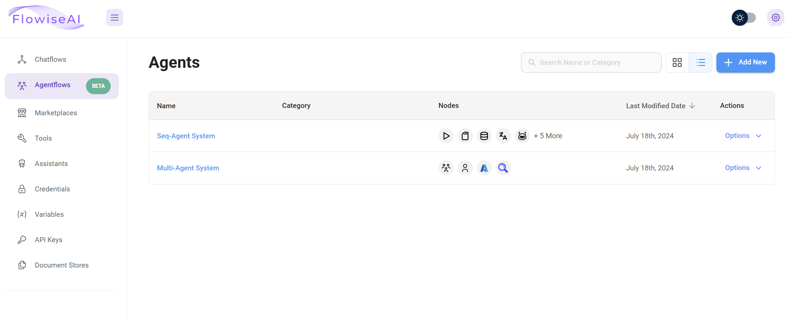

---

description: Flowiseでエージェンティックシステムを構築する方法を学ぶ

---

# エージェントフロー

## Flowiseにおけるエージェンティックシステムの紹介

Flowiseのエージェントフローセクションは、外部ツールやデータソースと対話するエージェントベースのシステムを構築するためのプラットフォームを提供します。

現在、Flowiseではこれらのシステムを設計するためのアプローチとして[**マルチエージェント**](#user-content-fn-1)[^1]と[**シーケンシャルエージェント**](#user-content-fn-2)[^2]の2つを提供しています。これらのアプローチは、異なるレベルの制御と複雑さを提供し、ニーズに最適なものを選択できます。

<figure><figcaption>
Flowise アプリ
</figcaption></figure>


このドキュメンテーションでは、シーケンシャルエージェントとマルチエージェントの両アプローチを探り、その特徴とさまざまな種類の会話型ワークフローを構築する方法を説明します。


[^1]: **マルチエージェント**は、シーケンシャルエージェントアーキテクチャの上に構築されており、コア要素を事前に設定し、より高いレベルの抽象化を提供することで、エージェントチームの構築と管理プロセスを簡素化します。

[^2]: **シーケンシャルエージェント**は、開発者に基盤となるワークフロー構造への直接アクセスを提供し、会話フローの各ステップに対する詳細な制御を可能にし、非常にカスタマイズされた会話型アプリケーションを構築するための最大限の柔軟性を提供します。
