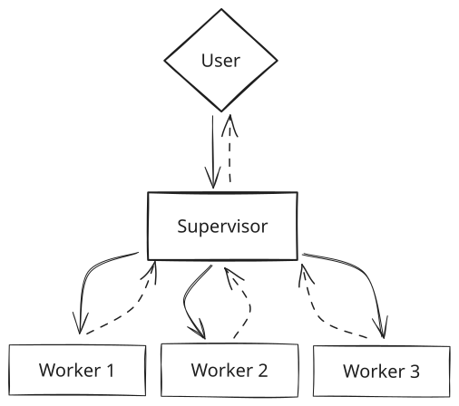
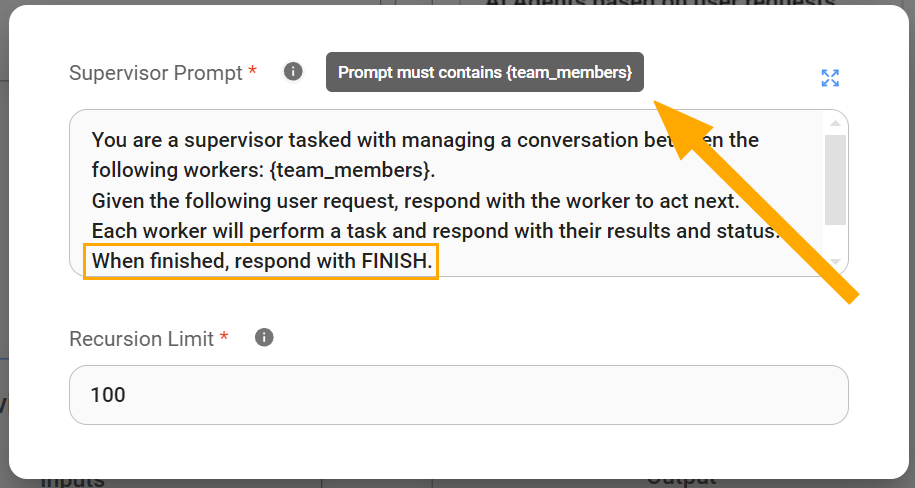
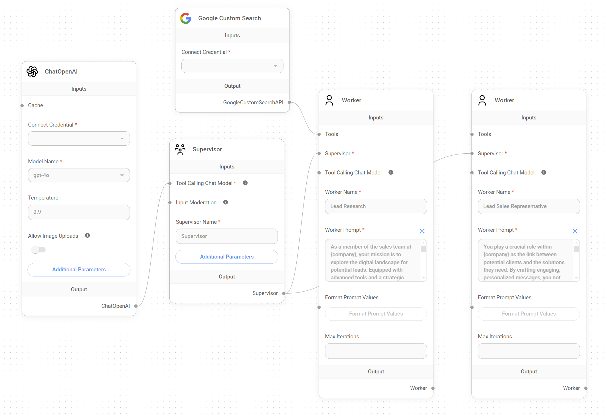

# マルチエージェント

このガイドでは、Flowise 内のマルチエージェント AI システムアーキテクチャについて、そのコンポーネント、運用上の制約、およびワークフローを詳しく説明します。

## コンセプト

複雑なプロジェクトで協力する専門家チームのように、マルチエージェントシステムは人工知能における専門化の原則を活用します。

このマルチエージェントシステムは、効率性と専門性を最大化する階層的で順序立ったワークフローを利用します。

### 1. システムアーキテクチャ

マルチエージェント AI アーキテクチャは、複雑なプロジェクトを管理可能なサブタスクに分解して処理できるスケーラブルな AI システムとして定義できます。

Flowise では、マルチエージェントシステムは2つの主要なノードまたはエージェントタイプとユーザーで構成され、リクエストを処理して目的の成果を提供するために階層的なグラフで相互作用します:

1. **ユーザー:** ユーザーは**システムの起点**として機能し、最初の入力またはリクエストを提供します。マルチエージェントシステムは幅広いリクエストを処理するように設計できますが、これらのユーザーリクエストがシステムの目的に合致していることが重要です。この範囲外のリクエストは、不正確な結果、予期せぬループ、さらにはシステムエラーを引き起こす可能性があります。そのため、ユーザーとの相互作用は柔軟でありながらも、最適なパフォーマンスを得るためには常にシステムのコア機能に沿ったものである必要があります。

2. **スーパーバイザー AI:** スーパーバイザーは**システムのオーケストレーター**として機能し、ワークフロー全体を監督します。ユーザーのリクエストを分析し、それをサブタスクのシーケンスに分解し、これらのサブタスクを専門のワーカーエージェントに割り当て、結果を集約し、最終的に処理された出力をユーザーに返します。

3. **ワーカー AI チーム:** このチームは、ワークフロー内の特定のタスクを処理するようにプロンプトメッセージで指示された専門の AI エージェント（ワーカー）で構成されています。これらのワーカーは独立して動作し、スーパーバイザーから指示とデータを受け取り、**専門的な機能を実行**し、必要に応じてツールを使用し、結果をスーパーバイザーに返します。

<figure><figcaption></figcaption></figure>

### 2. 運用上の制約

秩序と単純さを維持するため、このマルチエージェントシステムは2つの重要な制約の下で動作します:

* **一度に1つのタスク:** スーパーバイザーは意図的に一度に1つのタスクに焦点を当てるように設計されています。アクティブなワーカーがタスクを完了して結果を返すのを待ってから、次のステップを分析し、後続のタスクを委任します。これにより、次のステップに進む前に各ステップが正常に完了することが保証され、過度の複雑さを防ぎます。

* **フローごとに1つのスーパーバイザー:** LangChainが定義する "[階層的エージェントチーム](https://github.com/langchain-ai/langgraph/blob/main/examples/multi\_agent/hierarchical\_agent\_teams.ipynb)" のように、トップレベルのスーパーバイザーと中間レベルのスーパーバイザーがワーカーチームを管理する、より高度な階層構造を形成するために入れ子になったマルチエージェントシステムのセットを実装することは理論的には可能ですが、Flowise のマルチエージェントシステムは現在、単一のスーパーバイザーで動作します。


これらの2つの制約は、**アプリケーションのワークフローを計画する**際に重要です。スーパーバイザーが複数のタスクを同時に並行して委任する必要があるワークフローを設計しようとすると、システムはそれを処理できず、エラーが発生します。


## スーパーバイザー

全体のワークフローを管理し、適切なワーカーにタスクを委任する責任を持つスーパーバイザーには、正しく機能するために一連のコンポーネントが必要です:

* タスクの分解、委任、結果の集約の複雑さを管理するための**関数呼び出しが可能なチャットモデル**
* **エージェントメモリ (オプション)**: スーパーバイザーはエージェントメモリなしでも機能できますが、このノードは過去のスーパーバイザーの状態へのアクセスを必要とするワークフローを大幅に強化できます。この**状態の保存**により、スーパーバイザーは特定のポイントからジョブを再開したり、過去のデータを活用して意思決定を改善したりすることができます。

<figure><figcaption></figcaption></figure>

### スーパーバイザープロンプト

デフォルトでは、スーパーバイザープロンプトは、ユーザーのリクエストを分析し、それをサブタスクのシーケンスに分解し、これらのサブタスクを専門のワーカーエージェントに割り当てるように指示する方法で記述されています。

スーパーバイザープロンプトは特定のアプリケーションのニーズに合わせてカスタマイズ可能ですが、常に以下の2つの重要な要素が必要です:

* **{team\_members} 変数:** この変数は、利用可能なワーカーの名前のリストをスーパーバイザーに提供するため、スーパーバイザーが利用可能な労働力を理解する上で重要です。これにより、スーパーバイザーは各ワーカーの専門知識に基づいて、最も適切なワーカーに慎重にタスクを委任することができます。

* **"FINISH" キーワード:** このキーワードは、スーパーバイザープロンプト内でシグナルとして機能します。これは、スーパーバイザーがタスクを完了したと見なし、最終出力をユーザーに提示するタイミングを示します。明確な "FINISH" 指示がないと、スーパーバイザーは不必要にタスクを委任し続けたり、ユーザーに一貫性のある最終的な結果を提供できなかったりする可能性があります。これは、必要なすべてのサブタスクが実行され、ユーザーのリクエストが満たされたことを示します。

<figure><figcaption></figcaption></figure>


スーパーバイザーがワーカーとは非常に異なる役割を果たすことを理解することが重要です。非常に具体的な指示でカスタマイズできるワーカーとは異なり、**スーパーバイザーは一般的な指示で最も効果的に動作し、それにより適切だと判断したようにタスクを計画して委任することができます。** マルチエージェントシステムに慣れていない場合は、デフォルトのスーパーバイザープロンプトを使用することをお勧めします。


### スーパーバイザーノードの再帰制限について:

このパラメータは、アプリケーション内のネストされた関数呼び出しの最大深さを制限します。現在のコンテキストでは、**単一のワークフロー実行内でスーパーバイザーが自身をトリガーできる回数を制限します**。これは、無限の再帰を防ぎ、リソースが効率的に使用されることを保証するために重要です。

<figure><figcaption></figcaption></figure>

### スーパーバイザーの動作の仕組み

ユーザークエリを受け取ると、スーパーバイザーはリクエストを分析し、ユーザーの意図した成果を識別することでワークフローを開始します。

次に、利用可能なワーカー AI の名前のリストのみを提供するスーパーバイザープロンプトの `{team_members}` 変数を活用して、スーパーバイザーは各ワーカーの専門性を推測し、ワークフロー内の各タスクに最も適したワーカーを戦略的に選択します。


スーパーバイザーはワークフロー内でのワーカーの機能を推測するためにワーカーの名前のみを持っているため、これらの名前を適切に設定することが非常に重要です。**ワーカーの役割や専門分野を正確に反映した、明確で簡潔で説明的な名前は、スーパーバイザーがタスクを委任する際に十分な情報に基づいた決定を下すために重要です。** これにより、適切なワーカーが適切なジョブに選択され、ユーザーのリクエストを満たすシステムの精度が最大化されます。


***

## **ワーカー**

システム内の特定のタスクを処理するように指示された専門エージェントとしてのワーカーは、正しく機能するために2つの重要なコンポーネントを必要とします:

* **スーパーバイザー:** 各ワーカーは、タスクを委任する必要がある場合に呼び出されるように、スーパーバイザーに接続されている必要があります。この接続により、マルチエージェントシステム内の重要な階層関係が確立され、スーパーバイザーが適切な専門ワーカーに効率的に作業を分配できることが保証されます。

* **関数呼び出しが可能なチャットモデルノード**: デフォルトでは、ワーカーは直接割り当てられていない限り、スーパーバイザーのチャットモデルノードを継承します。この関数呼び出し機能により、ワーカーは専門タスク用に設計されたツールと対話することができます。

<figure><figcaption></figcaption></figure>


**各ワーカーに異なるチャットモデルを割り当てる**能力は、アプリケーションに大きな柔軟性と最適化の機会を提供します。特定のタスクに合わせた[チャットモデル](../../integrations/langchain/chat-models/)を選択することで、より単純なタスクにはより費用対効果の高いソリューションを活用し、本当に必要な場合には専門的で、潜在的により高価なモデルを確保することができます。


### ワーカーのマックスイテレーションパラメータについて

[LangChain](https://python.langchain.com/v0.1/docs/modules/agents/how\_to/max\_iterations/)は、エージェントシステム内の暴走を防ぐための重要な制御メカニズムとして `Max Iterations Cap` を参照しています。現在のこのコンテキストでは、スーパーバイザーとワーカー間の過度の、潜在的に無限の相互作用に対するガードレールとして機能します。

スーパーバイザーノードの `再帰制限` がスーパーバイザーが自身を呼び出せる回数を制限するのに対し、ワーカーノードの `マックスイテレーション` パラメータは、スーパーバイザーが特定のワーカーを繰り返しまたは照会できる回数を制限します。

マックスイテレーションに上限を設けることで、予期せぬシステムの動作が発生した場合でもコストが制御下に維持されることが保証されます。

***

## 例: 実践的なユースケース

Flowise 内でマルチエージェントシステムがどのように動作するかについての基本的な理解が確立されたので、実践的な応用例を見てみましょう。

**リードアウトリーチマルチエージェントシステム**（マーケットプレイスで利用可能）を想像してみてください。これは見込み客の特定、資格審査、エンゲージメントのプロセスを自動化するように設計されています。このシステムは、以下の2つのワーカーを調整するスーパーバイザーを利用します:

* **リードリサーチャー:** このワーカーは、Google検索ツールを使用して、ユーザー定義の基準に基づいて潜在的な見込み客を収集する責任があります。
* **リードセールスジェネレーター:** このワーカーは、リードリサーチャーが収集した情報を活用して、営業チーム向けのパーソナライズされたメール下書きを作成します。

<figure><figcaption></figcaption></figure>

**背景:** Solterra Renewablesで働くユーザーが、英国に拠点を置く評価の高い再生可能エネルギー企業であるEvergreen Energy Groupについての利用可能な情報を収集し、そのCEOであるAmelia Croftを潜在的な見込み客としてターゲットにしたいと考えています。

**ユーザーリクエスト:** Solterra Renewablesの従業員は、マルチエージェントシステムに次のクエリを提供します: "_Evergreen Energy GroupとAmelia Croftについて、我々のビジネスの潜在的な新規顧客として情報が必要です。_"

1. **スーパーバイザー:**
   * スーパーバイザーはユーザーリクエストを受け取り、"リードリサーチ"タスクを`リードリサーチャーワーカー`に委任します。
2. **リードリサーチャーワーカー:**
   * リードリサーチャーワーカーは、Google検索ツールを使用して、Evergreen Energy Groupに関する情報を収集します。以下に焦点を当てます:
     * 企業の背景、業界、規模、所在地
     * 最近のニュースと展開
     * 主要な経営陣（Amelia CroftのCEOとしての役割の確認を含む）
   * リードリサーチャーは収集した情報を`スーパーバイザー`に送り返します。
3. **スーパーバイザー:**
   * スーパーバイザーはリードリサーチャーワーカーから研究データを受け取り、Amelia Croftが関連する見込み客であることを確認します。
   * スーパーバイザーは"セールスメール生成"タスクを`リードセールスジェネレーターワーカー`に委任し、以下を提供します:
     * Evergreen Energy Groupに関する研究情報
     * Amelia Croftのメールアドレス
     * Solterra Renewablesに関するコンテキスト
4. **リードセールスジェネレーターワーカー:**
   * リードセールスジェネレーターワーカーは、以下を考慮しながら、Amelia Croft向けにパーソナライズされたメール下書きを作成します:
     * CEOとしての彼女の役割と、Solterra Renewablesのサービスが彼女の会社にとって持つ関連性
     * Evergreen Energy Groupの現在の焦点やプロジェクトに関する研究からの情報
   * リードセールスジェネレーターワーカーは完成したメール下書きを`スーパーバイザー`に送り返します。
5. **スーパーバイザー:**
   * スーパーバイザーは生成されたメール下書きを受け取り、"FINISH"指示を出します。
   * スーパーバイザーはメール下書きをユーザー（`Solterra Renewablesの従業員`）に出力します。
6. **ユーザーが出力を受け取る:** Solterra Renewablesの従業員は、レビューしてAmelia Croftに送信する準備ができたパーソナライズされたメール下書きを受け取ります。

## ビデオチュートリアル

ここでは、[LeonのYouTubeチャンネル](https://www.youtube.com/@leonvanzyl)からのビデオチュートリアルのリストを見つけることができます。これらは、ノーコードでFlowiseにマルチエージェントアプリケーションを構築する方法を示しています。






