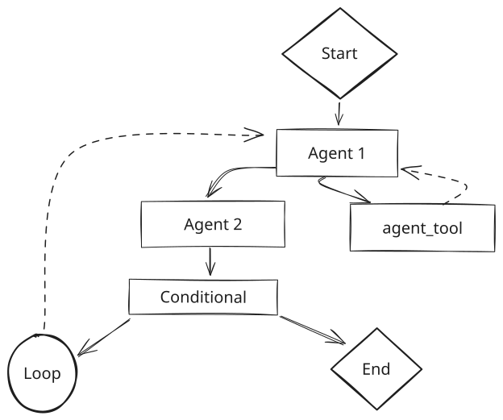
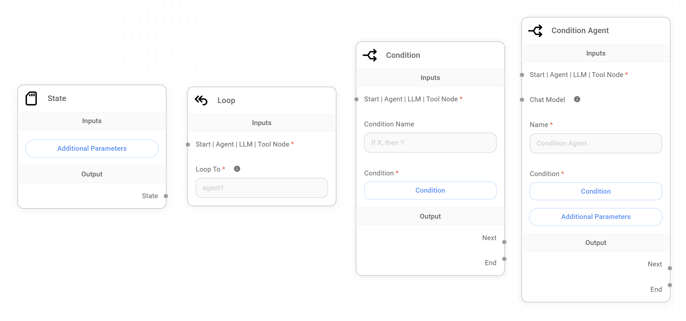
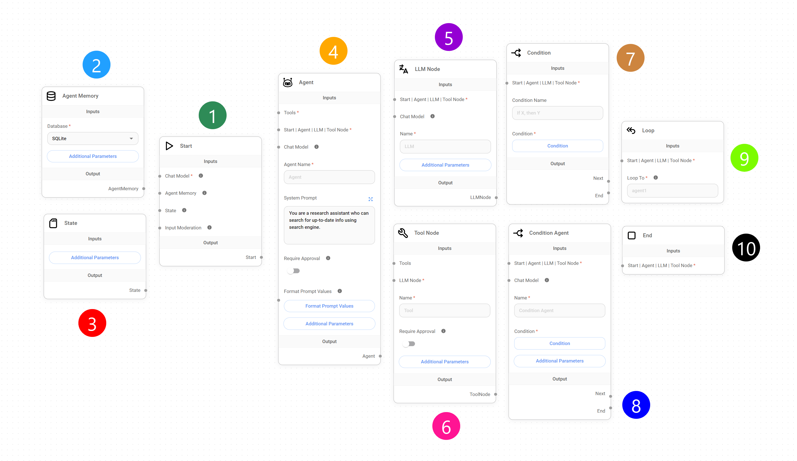
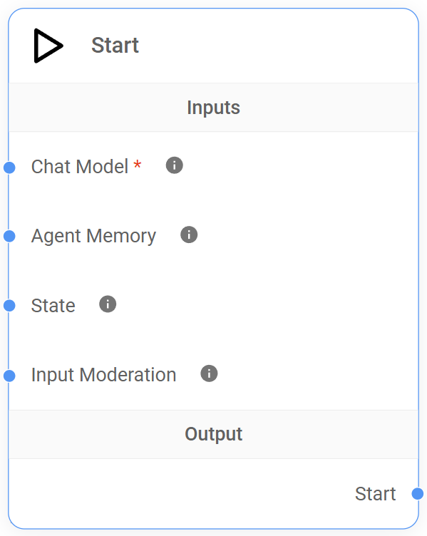
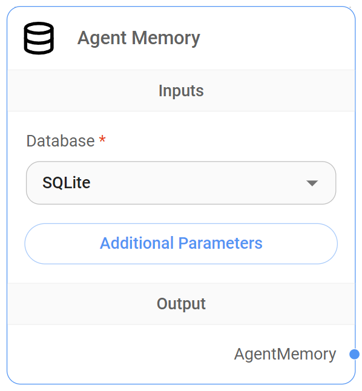
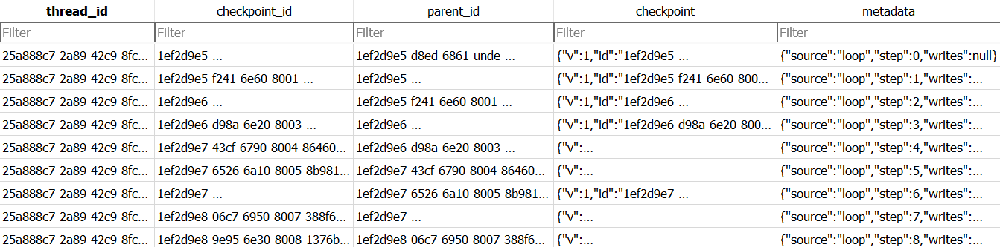
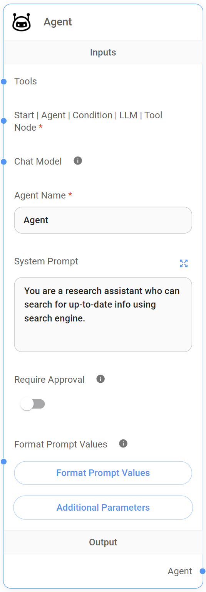
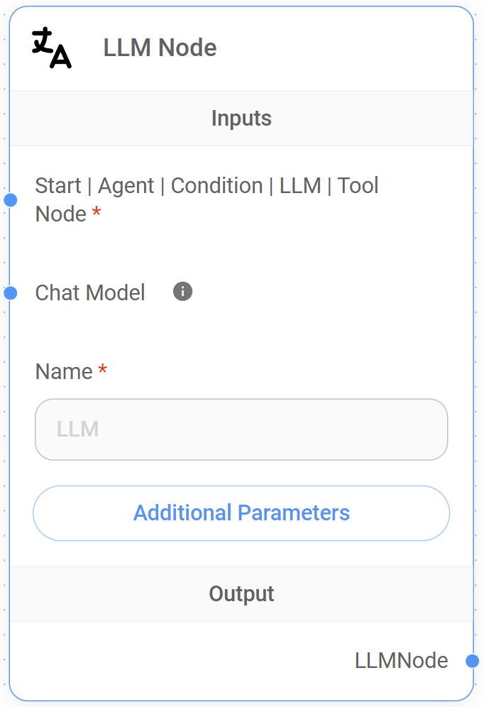
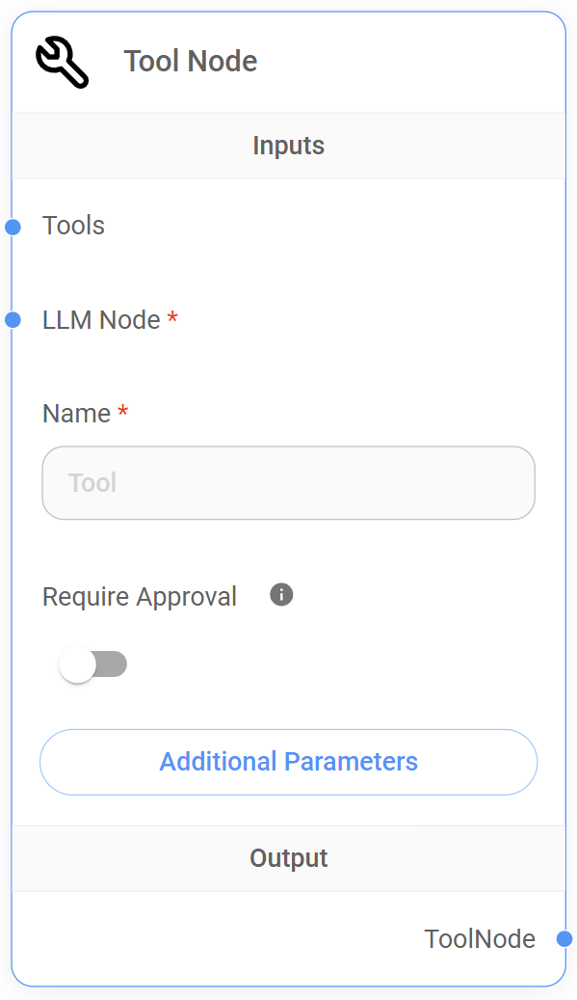

# シーケンシャルエージェント

このガイドでは、Flowise内のシーケンシャルエージェントAIシステムアーキテクチャの包括的な概要を説明し、そのコアコンポーネントとワークフローの設計原則について解説します。


**免責事項**: このドキュメントは、FlowiseユーザーがSequential Agentシステムアーキテクチャを使用して会話ワークフローを理解し構築するためのものです。LangGraphフレームワークの包括的な技術リファレンスではなく、業界標準やLangGraphのコアコンセプトを定義するものとして解釈されるべきではありません。


## コンセプト

[LangGraph](https://www.langchain.com/langgraph)をベースに構築されたFlowise のシーケンシャルエージェントアーキテクチャは、**ワークフローを有向循環グラフ(DCG)として構造化することで会話型エージェントシステムの開発を促進し**、制御されたループと反復プロセスを可能にします。

相互に接続されたノードで構成されるこのグラフは、情報とアクションのシーケンシャルなフローを定義し、エージェントが構造化された方法で入力を処理し、タスクを実行し、レスポンスを生成することを可能にします。

<figure><figcaption></figcaption></figure>

### シーケンシャルエージェントのDCGアーキテクチャについて

このアーキテクチャは、DCG構造を通じて明確で理解しやすい操作シーケンスを定義することで、複雑な会話ワークフローの管理を簡素化します。

このアプローチの主要な要素を見ていきましょう:



* **ノードベースの処理:** グラフの各ノードは独立した処理ユニットを表し、言語処理、ツールの実行、条件付きロジックなどの独自の機能をカプセル化します。
* **データフローとしての接続:** グラフのエッジはノード間のデータフローを表し、あるノードの出力が後続ノードの入力となり、処理ステップのチェーンを可能にします。
* **状態管理:** 状態は会話全体を通じて永続化される共有オブジェクトとして管理されます。これによりワークフローの進行に応じて、ノードが関連情報にアクセスできるようになります。



* **フロー:** ワークフロー内のデータの移動または方向。会話中にノード間で情報がどのように受け渡されるかを表します。
* **ワークフロー:** システムの全体的な設計と構造。ノードのシーケンス、その接続、会話フローを調整するロジックを定義する設計図です。
* **状態:** 会話の現在のスナップショットを表す共有データ構造。会話履歴 `state.messages` とユーザーが定義したカスタムステート変数が含まれます。
* **カスタムステート:** ワークフローに関連する追加情報を保存するために、状態オブジェクトに追加されるユーザー定義のキーと値のペア。
* **ツール:** 情報の取得、データの処理、他のアプリケーションとの対話などの特定のタスクを実行するために、ワークフローがアクセスして実行できる外部システム、API、またはサービス。
* **Human-in-the-Loop (HITL):** 主にツール実行時にワークフローへの人間の介入を可能にする機能。人間のレビュアーがツールの呼び出しを実行前に承認または拒否することができます。
* **ノードの並列実行:** 分岐メカニズムを使用してワークフロー内で複数のノードを同時に実行する機能を指します。これは、全体的な実行フローは順次的なままですが、ワークフローの異なるブランチが同時に情報を処理したりツールと対話したりできることを意味します。



***

## シーケンシャルエージェントとマルチエージェントの比較

FlowiseのマルチエージェントとシーケンシャルエージェントのシステムはどちらもLangGraphフレームワークをベースに構築され、同じ基本原則を共有していますが、シーケンシャルエージェントアーキテクチャは[より低いレベルの抽象化](#user-content-fn-1)[^1]を提供し、ワークフローの各ステップをより細かく制御することができます。

**マルチエージェントシステム**は、中央の監督エージェントが専門のワーカーエージェントにタスクを委任する階層構造を特徴とし、**複雑なワークフローをより管理しやすいサブタスクに分解して処理することに優れています**。このサブタスクへの分解は、シーケンシャルエージェントシステムでは手動設定が必要な条件ノードなどのコアシステム要素を事前に設定することで可能になります。その結果、ユーザーはより簡単にエージェントのチームを構築・管理できます。

対照的に、**シーケンシャルエージェントシステム**は、データがノードのチェーンを順番に流れる合理化された組立ラインのように動作し、正確な操作順序と段階的なデータの洗練を必要とするタスクに最適です。マルチエージェントシステムと比較して、基盤となるワークフロー構造へのより低レベルなアクセスにより、本質的に**より柔軟でカスタマイズ可能であり、ノードの並列実行とシステムロジックの完全な制御を提供**し、条件、状態、ループノードをワークフローに組み込むことで、新しい動的な分岐機能の作成が可能になります。

### 状態、ループ、条件ノードの紹介

Flowiseのシーケンシャルエージェントは、ユーザー入力に適応し、コンテキストに基づいて判断を下し、反復的なタスクを実行できる会話システムを作成するための新機能を提供します。

これらの機能は、4つの新しいコアノード - 状態ノード、ループノード、そして2つの条件ノードの導入により可能になりました。

<figure><figcaption></figcaption></figure>

* **状態ノード:** 状態とは、アプリケーションやワークフローの現在のスナップショットを表す共有データ構造として定義されます。状態ノードでは、会話の開始時から**カスタム状態**をワークフローに追加することができます。このカスタム状態はワークフロー内の他のノードからアクセスおよび変更が可能で、動的な振る舞いとデータ共有を可能にします。
* **ループノード:** このノードはシーケンシャルエージェントワークフロー内に**制御されたサイクル**を導入し、特定の条件に基づいてノードのシーケンスを繰り返すことができる反復プロセスを可能にします。これによりエージェントは出力の洗練、ユーザーからの追加情報の収集、タスクの複数回実行を行うことができます。
* **条件ノード:** 条件ノードと条件エージェントノードは、**分岐パスを持つ複雑な会話フローを作成**するために必要な制御を提供します。条件ノードは条件を直接評価し、条件エージェントノードはエージェントの推論を使用して分岐ロジックを決定します。これにより、ユーザー入力、カスタム状態、または他のノードによって実行されたアクションの結果に基づいて、フローの動作を動的に導くことができます。

### 適切なシステムの選択

アプリケーションに最適なシステムを選択するには、特定のワークフローのニーズを理解する必要があります。タスクの複雑さ、並列処理の必要性、データフローの制御レベルなど、すべての重要な考慮事項になります。

* **シンプルさを重視する場合:** タスクを順番に完了でき、ノードの並列実行やHuman-in-the-Loop (HITL)を必要としない比較的単純なワークフローの場合、マルチエージェントアプローチは使いやすく、素早いセットアップを提供します。
* **柔軟性を重視する場合:** 並列実行、動的な会話、カスタム状態管理、HITLの組み込みが必要なワークフローの場合、**シーケンシャルエージェント**アプローチが必要な柔軟性と制御を提供します。

以下の表は、Flowiseにおけるマルチエージェントとシーケンシャルエージェントの実装を比較し、主な違いと設計上の考慮事項を強調しています:

<table><thead><tr><th width="173.33333333333331"></th><th width="281">マルチエージェント</th><th>シーケンシャルエージェント</th></tr></thead><tbody><tr><td>構造</td><td><strong>階層的</strong>; スーパーバイザーが専門のワーカーに委任。</td><td><strong>直線的、循環的および/または分岐的</strong>; ノードが順序で接続され、分岐のための条件ロジックを持つ。</td></tr><tr><td>ワークフロー</td><td>柔軟; 複雑なタスクを<strong>サブタスクのシーケンス</strong>に分解し、順番に完了するように設計。</td><td>非常に柔軟; <strong>ノードの並列実行</strong>、複雑な対話フロー、分岐ロジック、単一の会話ターン内でのループをサポート。</td></tr><tr><td>ノードの並列実行</td><td><strong>不可</strong>; スーパーバイザーは一度に1つのタスクを処理。</td><td><strong>可能</strong>; 単一の実行内で複数のアクションを並列にトリガー可能。</td></tr><tr><td>状態管理</td><td><strong>暗黙的</strong>; 状態は存在するが、開発者が明示的に管理しない。</td><td><strong>明示的</strong>; 状態は存在し、開発者は状態ノードと様々なノードの「状態の更新」フィールドを使用して初期状態やカスタム状態を定義・管理可能。</td></tr><tr><td>ツールの使用</td><td><strong>ワーカー</strong>が必要に応じてツールにアクセスして使用。</td><td>ツールは<strong>エージェントノード</strong>と<strong>ツールノード</strong>を通じてアクセスおよび実行。</td></tr><tr><td>Human-in-the-Loop (HITL)</td><td>HITLは<strong>サポートされていない。</strong></td><td>エージェントノードとツールノードの「承認が必要」機能を通じて<strong>サポート</strong>され、ツール実行の人間によるレビューと承認または拒否が可能。</td></tr><tr><td>複雑さ</td><td>高いレベルの抽象化; <strong>ワークフロー設計を単純化。</strong></td><td>低いレベルの抽象化; <strong>より複雑なワークフロー設計</strong>で、ノード間の相互作用、カスタム状態管理、条件ロジックの慎重な計画が必要。</td></tr><tr><td>理想的なユースケース</td><td><ul><li>線形プロセスの自動化（データ抽出、リード生成など）。</li><li>サブタスクを順番に完了する必要がある状況。</li></ul></td><td><ul><li>動的なフローを持つ会話システムの構築。</li><li>ノードの並列実行や分岐ロジックを必要とする複雑なワークフロー。</li><li>会話の複数のポイントで意思決定が必要な状況。</li></ul></td></tr></tbody></table>


**注意**: マルチエージェントシステムは技術的にはシーケンシャルエージェントアーキテクチャの上に構築された高レベルレイヤーですが、ワークフロー設計に対して異なるユーザー体験とアプローチを提供します。上記の比較は、特定のニーズに最適なオプションを選択する際の参考として、これらを別個のシステムとして扱っています。


***

## シーケンシャルエージェントノード

シーケンシャルエージェントはFlowiseに全く新しい次元をもたらし、**10の専門ノードを導入**し、それぞれが特定の目的を果たし、会話エージェントがユーザーとどのように対話し、情報を処理し、判断を下し、アクションを実行するかについてより多くの制御を提供します。

以下のセクションでは、各ノードの機能、入力、出力、ベストプラクティスを包括的に理解することを目指し、最終的に様々なアプリケーションのための洗練された会話ワークフローを作成できるようにします。

<figure><figcaption></figcaption></figure>

***

## 1. スタートノード

その名の通り、スタートノードは**シーケンシャルエージェントアーキテクチャのすべてのワークフローのエントリーポイント**です。最初のユーザークエリを受け取り、会話の状態を初期化し、フローを開始します。

<figure><figcaption></figcaption></figure>

### スタートノードについて

スタートノードは、会話ワークフローが正しく機能するために必要なセットアップとコンテキストを確実に持つようにします。**ワークフローの残りの部分で使用される主要な機能のセットアップを担当**します:

* **デフォルトLLMの定義:** スタートノードでは、ワークフロー内のエージェントがツールや外部システムと対話できるようにするため、関数呼び出しに対応したチャットモデル(LLM)を指定する必要があります。これはワークフロー内で基盤として使用されるデフォルトのLLMとなります。
* **メモリの初期化:** オプションでエージェントメモリノードを接続して会話履歴を保存・取得し、よりコンテキストを意識した応答を可能にします。
* **カスタム状態の設定:** デフォルトでは、状態には不変の`state.messages`配列が含まれており、これはユーザーとエージェント間の会話の記録または履歴として機能します。スタートノードでは状態ノードを接続してワークフローにカスタム状態を追加し、ワークフローに関連する追加情報の保存を可能にします。
* **モデレーションの有効化:** オプションで入力モデレーションを接続して、ユーザーの入力を分析し、有害な可能性のあるコンテンツがLLMに送信されるのを防ぐことができます。

### 入力

<table><thead><tr><th width="212"></th><th width="102">必須</th><th>説明</th></tr></thead><tbody><tr><td>チャットモデル</td><td><strong>はい</strong></td><td>会話を動かすデフォルトのLLM。<strong>関数呼び出しが可能なモデル</strong>のみ対応。</td></tr><tr><td>エージェントメモリノード</td><td>いいえ</td><td>エージェントメモリノードを接続して<strong>永続性とコンテキストの保持を有効化</strong>。</td></tr><tr><td>状態ノード</td><td>いいえ</td><td>状態ノードを接続して<strong>カスタム状態を設定</strong>し、ワークフロー内の他のノードがアクセスおよび修正できる共有コンテキストを作成。</td></tr><tr><td>入力モデレーション</td><td>いいえ</td><td>モデレーションノードを接続して有害な出力を生成する可能性のあるテキストを検出し、LLMへの送信を防ぐことで<strong>コンテンツをフィルタリング</strong>。</td></tr></tbody></table>

### 出力

スタートノードは以下のノードに出力として接続できます:

* **エージェントノード:** 会話のフローをエージェントノードにルーティングし、会話のコンテキストに基づいてアクションを実行またはツールにアクセスできます。
* **LLMノード:** 会話のフローをLLMノードにルーティングして処理とレスポンス生成を行います。
* **条件エージェントノード:** エージェントによる会話の評価に基づいて分岐ロジックを実装するために条件エージェントノードに接続します。
* **条件ノード:** 事前定義された条件に基づいて分岐ロジックを実装するために条件ノードに接続します。

### ベストプラクティス



**適切なチャットモデルを選択**

選択したLLMがエージェントとツールの相互作用を可能にする重要な機能である関数呼び出しをサポートしていることを確認してください。さらに、アプリケーションの複雑さと要件に合ったLLMを選択してください。必要に応じて、エージェント/LLM/条件エージェントノードレベルで設定することでデフォルトのLLMを上書きできます。

**コンテキストと永続性を考慮**

ユースケースで必要な場合は、エージェントメモリノードを利用してコンテキストを維持し、対話をパーソナライズします。



**誤ったチャットモデル(LLM)の選択**

* **問題:** スタートノードで選択されたチャットモデルがワークフローの意図したタスクや機能に適していないため、パフォーマンスが低下したり不正確な応答が返されたりします。
* **例:** ワークフローが強力な要約機能を持つチャットモデルを必要とするのに、スタートノードでコード生成に最適化されたモデルを選択し、不適切な要約が生成される。
* **解決策:** ワークフローの特定の要件に合ったチャットモデルを選択します。モデルの長所、短所、および得意とするタスクの種類を考慮してください。ドキュメントを参照し、異なるモデルを試して最適なものを見つけてください。

**エージェントメモリノードの設定の見落とし**

* **問題:** エージェントメモリノードが適切に接続または設定されていないため、セッション間で会話履歴データが失われてしまいます。
* **例:** ユーザー設定を保存するために永続的なメモリを使用しようとしていますが、エージェントメモリノードがスタートノードに接続されていないため、新しい会話のたびに設定がリセットされてしまいます。
* **解決策:** エージェントメモリノードがスタートノードに接続され、適切なデータベース(SQLite)で設定されていることを確認します。ほとんどのユースケースでは、デフォルトのSQLiteデータベースで十分です。

**不適切な入力モデレーション**

* **問題:** 「入力モデレーション」が有効化されていないか正しく設定されていないため、潜在的に有害または不適切なユーザー入力がLLMに到達し、望ましくない応答が生成されます。
* **例:** ユーザーが攻撃的な言葉を送信しても、入力モデレーションがそれを検出できないか、そもそも設定されていないため、クエリがLLMに到達してしまいます。
* **解決策:** スタートノードに入力モデレーションノードを追加・設定して、潜在的に有害または不適切な言葉をフィルタリングします。特定の要件とユースケースに合わせてモデレーション設定をカスタマイズします。



## 2. エージェントメモリノード

エージェントメモリノードは**永続的なメモリストレージのメカニズムを提供**し、シーケンシャルエージェントワークフローが会話履歴`state.messages`と以前に定義されたカスタム状態を複数の対話にわたって保持することを可能にします。

この長期的なメモリは、エージェントが過去の対話から学び、長期的な会話でコンテキストを維持し、より関連性の高い応答を提供するために不可欠です。

<figure><figcaption></figcaption></figure>

### データが記録される場所

デフォルトでは、Flowiseは会話履歴とカスタム状態データを保存するために**組み込みのSQLiteデータベース**を使用し、この永続的な情報を管理するための「**checkpoints**」テーブルを作成します。

#### "checkpoints"テーブルの構造とデータフォーマットについて

このテーブルは**会話中の様々な時点でのシステムの状態のスナップショットを保存**し、会話履歴の永続化と取得を可能にします。各行はワークフローの実行における特定のポイントまたは「チェックポイント」を表します。

<figure><figcaption></figcaption></figure>

#### テーブル構造

* **thread_id:** 特定の会話セッションを表す一意の識別子、**セッションID**です。単一のワークフロー実行に関連するすべてのチェックポイントをグループ化します。
* **checkpoint_id:** ワークフロー内の各実行ステップ（ノード実行）の一意の識別子です。操作の順序を追跡し、各ステップでの状態を識別するのに役立ちます。
* **parent_id:** 現在のチェックポイントにつながった前の実行ステップのcheckpoint_idを示します。これによりチェックポイント間の階層関係が確立され、ワークフローの実行フローの再構築が可能になります。
* **checkpoint:** その特定のチェックポイントでのワークフローの現在の状態を表すJSON文字列が含まれます。これには変数の値、交換されたメッセージ、およびその実行時点で取得された他の関連データが含まれます。
* **metadata:** ノード操作に関連する、チェックポイントに関する追加のコンテキストを提供します。

#### 動作の仕組み

シーケンシャルエージェントワークフローが実行されると、システムは各重要なステップでこのテーブルにチェックポイントを記録します。このメカニズムには以下のような利点があります:

* **実行追跡:** チェックポイントにより、システムはワークフロー内の実行パスと操作の順序を理解できます。
* **状態管理:** チェックポイントは変数の値、会話履歴、その他の関連データを含むワークフローの各ステップでの状態を保存します。これによりシステムはコンテキストを認識し、現在の状態に基づいて適切な判断を下すことができます。
* **ワークフローの再開:** ワークフローが一時停止または中断された場合（システムエラーやユーザーリクエストなど）、システムは保存されたチェックポイントを使用して最後に記録された状態から実行を再開できます。これにより、会話やタスクが中断された場所から継続され、ユーザーの進行状況が保持されデータ損失が防止されます。

### **入力**

エージェントメモリノードには**特定の入力接続はありません**。

### ノードの設定

<table><thead><tr><th width="189"></th><th width="107">必須</th><th>説明</th></tr></thead><tbody><tr><td>データベース</td><td><strong>はい</strong></td><td>会話履歴の保存に使用されるデータベースの種類。現在は<strong>SQLiteのみがサポート</strong>されています。</td></tr></tbody></table>

### 追加パラメータ

<table><thead><tr><th width="189"></th><th width="107">必須</th><th>説明</th></tr></thead><tbody><tr><td>データベースファイルパス</td><td>いいえ</td><td>SQLiteデータベースファイルへのファイルパス。<strong>指定されない場合、システムはデフォルトの場所を使用します</strong>。</td></tr></tbody></table>

### **出力**

エージェントメモリノードは**スタートノード**とのみ相互作用し、ワークフローの最初から会話履歴を利用可能にします。

### **ベストプラクティス**



**戦略的な使用**

エージェントメモリは必要な場合にのみ使用してください。シンプルなステートレスな対話では過剰である可能性があります。ターンやセッションを超えて情報を保持する必要があるシナリオのために取っておきましょう。



**不必要なオーバーヘッド**

* **問題:** 必要のない場合でもすべての対話でエージェントメモリを使用すると、不必要なストレージと処理のオーバーヘッドが発生します。これにより応答時間が遅くなりリソース消費が増加する可能性があります。
* **例:** 単一のユーザーリクエストに基づいて情報を提供するシンプルな天気チャットボットは、会話履歴を保存する必要はありません。
* **解決策:** システムの要件を分析し、機能またはユーザー体験に永続的なデータストレージが不可欠な場合にのみエージェントメモリを使用してください。



***

## 3. 状態ノード

スタートノードにのみ接続できる状態ノードは、**会話の開始時にユーザー定義またはカスタム状態をワークフロー**に設定するメカニズムを提供します。このカスタム状態はJSONオブジェクトで共有され、フローの進行に伴って1つのノードから別のノードへと渡される中でグラフ内のノードによって更新できます。

<figure><figcaption></figcaption></figure>

### 状態ノードについて

デフォルトでは、状態には会話履歴として機能する`state.messages`配列が含まれています。この配列は、ユーザーとエージェント、またはワークフロー内の他のアクター間で交換されたすべてのメッセージを保存し、ワークフローの実行全体を通じて保持します。

この`state.messages`配列は定義上不変で変更できないため、**状態ノードの目的は、カスタムのキーと値のペアを定義できるようにすること**であり、状態オブジェクトを拡張してワークフローに関連する追加情報を保持できるようにします。


**エージェントメモリノード**が使用されていない場合、状態はメモリ内で動作し、将来の使用のために永続化されません。


### 入力

状態ノードには**特定の入力接続はありません**。

### 出力

状態ノードは**スタートノード**にのみ接続でき、ワークフローの最初からカスタム状態を設定し、他のノードがこの共有カスタム状態にアクセスし、潜在的に変更することを可能にします。

### 追加パラメータ

<table><thead><tr><th width="157"></th><th width="113">必須</th><th>説明</th></tr></thead><tbody><tr><td>カスタム状態</td><td><strong>はい</strong></td><td>ワークフローの<strong>初期カスタム状態</strong>を表すJSONオブジェクト。このオブジェクトにはアプリケーションに関連する任意のキーと値のペアを含めることができます。</td></tr></tbody></table>

### カスタム状態の設定方法 <a href="#alert-dialog-title" id="alert-dialog-title"></a>

状態オブジェクトの**キー**、**操作タイプ**、**デフォルト値**を指定します。操作タイプは「置換」または「追加」のいずれかです。

* **置換**
  1. 既存の値を新しい値で置き換えます。
  2. 新しい値がnullの場合、既存の値は保持されます。
* **追加**
  1. 新しい値を既存の値に追加します。
  2. デフォルト値は空または配列にできます。例: ["a", "b"]
  3. 最終的な値は配列になります。

#### JavaScriptを使用した例


```javascript
{
    aggregate: {
        value: (x, y) => x.concat(y), // ここでは新しいメッセージを既存のメッセージに追加します
        default: () => []
    }
}
```


#### テーブルを使用した例

状態ノードのテーブルインターフェースを使用してカスタム状態を定義するには、以下の手順に従います:

1. **アイテムの追加:** 「+ アイテムを追加」ボタンをクリックしてテーブルに行を追加します。各行はカスタム状態内のキーと値のペアを表します。
2. **キーの指定:** 「キー」列に、状態オブジェクトで定義したい各キーの名前を入力します。例えば、"userName"、"userLocation"などのキーを設定できます。
3. **操作の選択:** 「操作」列で、各キーに対して希望する操作を選択します。2つのオプションがあります:
   * **置換:** ノードから提供される新しい値でキーの既存の値を置き換えます。新しい値がnullの場合、既存の値は保持されます。
   * **追加:** 新しい値をキーの既存の値に追加します。最終的な値は配列になります。
4. **デフォルト値の設定:** 「デフォルト値」列に、各キーの初期値を入力します。他のノードがキーの値を提供しない場合、このデフォルト値が使用されます。デフォルト値は空または配列にできます。

#### テーブル例

| キー     | 操作 | デフォルト値 |
| -------- | ---- | ------------ |
| userName | 置換 | null         |

<figure><figcaption></figcaption></figure>

1. このテーブルはカスタム状態に1つのキーを定義します: `userName`
2. `userName`キーは「置換」操作を使用し、ノードが新しい値を提供するたびに値が更新されることを意味します。
3. `userName`キーのデフォルト値は_null_で、初期値がないことを示します。


このテーブルベースのアプローチは、JavaScriptを使用したカスタム状態の定義の代替方法であることを覚えておいてください。両方の方法で同じ結果が得られます。


#### APIを使用した例

```json
{
    "question": "hello",
    "overrideConfig": {
        "stateMemory": [
            {
                "Key": "userName",
                "Operation": "Replace",
                "Default Value": "somevalue"
            }
        ]
    }
}
```

### ベストプラクティス



**カスタム状態の構造を計画する**

ワークフローを構築する前に、カスタム状態の構造を設計してください。整理されたカスタム状態により、ワークフローの理解、管理、デバッグが容易になります。

**意味のあるキー名を使用する**

保持するデータの目的を明確に示す、わかりやすく一貫性のあるキー名を選択してください。これによりコードの可読性が向上し、他の人（または将来の自分）がカスタム状態の使用方法を理解しやすくなります。

**カスタム状態を最小限に保つ**

ワークフローのロジックと意思決定に不可欠な情報のみをカスタム状態に保存してください。

**状態の永続性を考慮する**

複数の会話セッションにわたって状態を保持する必要がある場合（ユーザー設定、注文履歴など）、エージェントメモリノードを使用して状態を永続的なデータベースに保存してください。



**一貫性のない状態の更新**

* **問題:** 明確な戦略なしに複数のノードでカスタム状態を更新すると、不整合や予期しない動作につながる可能性があります。
* **例**
  1. エージェント1が`orderStatus`を"Payment Confirmed"に更新します。
  2. エージェント2が別のブランチで、前の状態を確認せずに`orderStatus`を"Order Complete"に更新します。
* **解決策:** 条件ノードを使用してカスタム状態の更新のフローを制御し、カスタム状態の遷移が論理的で一貫性のある方法で行われるようにします。



***

## 4. エージェントノード

エージェントノードは**シーケンシャルエージェントアーキテクチャのコアコンポーネント**です。ワークフロー内で意思決定者およびオーケストレーターとして機能します。

<figure><figcaption></figcaption></figure>

### エージェントノードについて

実行時点での完全な会話履歴`state.messages`とカスタム状態を常に含む前のノードからの入力を受け取ると、エージェントノードはシステムプロンプトによって確立された「ペルソナ」を使用して、ユーザーのリクエストを満たすために外部ツールが必要かどうかを判断します。

* ツールが必要な場合、エージェントノードは適切なツールを自律的に選択して実行します。この実行は自動的に行われるか、機密性の高いタスクの場合は実行前に人間の承認(HITL)が必要になります。ツールが操作を完了すると、エージェントノードは結果を受け取り、指定されたチャットモデル(LLM)を使用して処理し、包括的な応答を生成します。
* ツールが不要な場合、エージェントノードは現在の会話のコンテキストに基づいて直接チャットモデル(LLM)を活用して応答を作成します。

### 入力

<table><thead><tr><th width="195"></th><th width="107">必須</th><th>説明</th></tr></thead><tbody><tr><td>外部ツール</td><td>いいえ</td><td>エージェントノードに<strong>外部ツールスイートへのアクセス</strong>を提供し、アクションの実行と情報の取得を可能にします。</td></tr><tr><td>チャットモデル</td><td>いいえ</td><td>新しいチャットモデルを追加してワークフローのデフォルトのチャットモデル(LLM)を<strong>上書き</strong>します。関数呼び出しが可能なモデルのみ対応。</td></tr><tr><td>スタートノード</td><td><strong>はい</strong></td><td>スタートノードから<strong>初期ユーザー入力</strong>、カスタム状態（設定されている場合）、およびデフォルトの<code>state.messages</code>配列の残りを受け取ります。</td></tr><tr><td>条件ノード</td><td><strong>はい</strong></td><td>先行する条件ノードからの入力を受け取り、エージェントノードが<strong>条件ノードの評価結果に基づいてアクションを実行したり会話を導いたり</strong>することを可能にします。</td></tr><tr><td>条件エージェントノード</td><td><strong>はい</strong></td><td>先行する条件エージェントノードからの入力を受け取り、エージェントノードが<strong>条件エージェントノードの評価結果に基づいてアクションを実行したり会話を導いたり</strong>することを可能にします。</td></tr><tr><td>エージェントノード</td><td><strong>はい</strong></td><td>先行するエージェントノードからの入力を受け取り、<strong>エージェントアクションの連鎖</strong>と会話コンテキストの維持を可能にします。</td></tr><tr><td>LLMノード</td><td><strong>はい</strong></td><td>LLMノードからの出力を受け取り、エージェントノードが<strong>LLMの応答を処理</strong>することを可能にします。</td></tr><tr><td>ツールノード</td><td><strong>はい</strong></td><td>ツールノードからの出力を受け取り、エージェントノードが<strong>ツールの出力を処理して応答に統合</strong>することを可能にします。</td></tr></tbody></table>


**エージェントノードには以下のノードのいずれかからの接続が少なくとも1つ必要です**: スタートノード、エージェントノード、条件ノード、条件エージェントノード、LLMノード、またはツールノード。


### 出力

エージェントノードは以下のノードに出力として接続できます:

* **エージェントノード:** 後続のエージェントノードに制御を渡し、ワークフロー内での複数のエージェントアクションの連鎖を可能にします。これにより、より複雑な会話フローとタスクのオーケストレーションが可能になります。
* **LLMノード:** エージェントの出力をLLMノードに渡し、エージェントのアクションと洞察に基づいて、さらなる言語処理、応答生成、または意思決定を可能にします。
* **条件エージェントノード:** フローを条件エージェントノードに向けます。このノードはエージェントノードの出力とその事前定義された条件を評価して、ワークフローの適切な次のステップを決定します。
* **条件ノード:** 条件エージェントノードと同様に、条件ノードは事前定義された条件を使用してエージェントノードの出力を評価し、結果に基づいて異なるブランチにフローを導きます。
* **終了ノード:** 会話フローを終了します。
* **ループノード:** フローを前のノードに戻し、ワークフロー内での反復的または循環的なプロセスを可能にします。これは、複数のステップを必要とするタスクや、前の対話に基づいて結果を改善する必要があるタスクに役立ちます。例えば、現在のエージェントノードの出力に基づいて追加情報を収集したり会話フローを改善したりするために、以前のエージェントノードやLLMノードにループバックすることができます。

### ノードの設定

<table><thead><tr><th width="201"></th><th width="101">必須</th><th>説明</th></tr></thead><tbody><tr><td>エージェント名</td><td><strong>はい</strong></td><td>エージェントノードにわかりやすい名前を追加して、ワークフローの可読性を高め、ワークフロー内で<strong>ループを使用する際に容易にターゲットにできる</strong>ようにします。</td></tr><tr><td>システムプロンプト</td><td>いいえ</td><td><strong>エージェントの'ペルソナ'</strong>を定義し、<strong>その振る舞いを導きます</strong>。例えば、"<em>あなたは技術サポートを専門とするカスタマーサービスエージェントです</em> [...]"</td></tr><tr><td>承認が必要</td><td>いいえ</td><td><strong>Human-in-the-loop (HITL)機能を有効化</strong>します。'<strong>True</strong>'に設定すると、エージェントノードはツールを実行する前に人間の承認を要求します。これは機密性の高い操作や人間による監督が望ましい場合に特に有用です。デフォルトは'<strong>False</strong>'で、エージェントノードが自律的にツールを実行できます。</td></tr></tbody></table>

### 追加パラメータ

<table><thead><tr><th width="200"></th><th width="102">必須</th><th>説明</th></tr></thead><tbody><tr><td>ヒューマンプロンプト</td><td>いいえ</td><td>このプロンプトは人間のメッセージとして<code>state.messages</code>配列に追加されます。エージェントノードが入力を処理した後、次のノードがエージェントノードの出力を受け取る前に、<strong>会話フローに人間のようなメッセージを注入</strong>することができます。</td></tr><tr><td>承認プロンプト</td><td>いいえ</td><td><strong>HITL機能が有効な場合に人間のレビュアーに表示されるカスタマイズ可能なプロンプト</strong>です。このプロンプトはツールの名前と目的を含むツール実行に関するコンテキストを提供します。プロンプト内の<code>{tools}</code>変数は、エージェントが提案した実際のツールリストに動的に置き換えられ、人間のレビュアーが情報に基づいた判断を行うために必要なすべての情報を持っていることを確認します。</td></tr><tr><td>承認ボタンテキスト</td><td>いいえ</td><td>HITLインターフェースで<strong>ツール実行を承認するボタンに表示されるテキストをカスタマイズ</strong>します。これにより、特定のコンテキストに合わせて言語を調整し、人間のレビュアーに明確さを確保できます。</td></tr><tr><td>拒否ボタンテキスト</td><td>いいえ</td><td>HITLインターフェースで<strong>ツール実行を拒否するボタンに表示されるテキストをカスタマイズ</strong>します。承認ボタンテキストと同様、このカスタマイズは明確さを高め、人間のレビュアーがツール実行を不要または潜在的に有害と判断した場合に取るべき明確なアクションを提供します。</td></tr><tr><td>状態の更新</td><td>いいえ</td><td>ワークフロー内で<strong>共有カスタム状態オブジェクトを変更するメカニズム</strong>を提供します。これはエージェントが収集した情報を保存したり、後続のノードの動作に影響を与えたりするのに役立ちます。</td></tr><tr><td>最大反復回数</td><td>いいえ</td><td>1回のワークフロー実行内でエージェントノードが行える<strong>反復回数を制限</strong>します。</td></tr></tbody></table>

### ベストプラクティス



**明確なシステムプロンプト**

エージェントの役割と能力を正確に反映した、簡潔で明確なシステムプロンプトを作成してください。これはエージェントの意思決定を導き、定義された範囲内で行動することを確実にします。

**戦略的なツール選択**

エージェントノードが利用できるツールを選択・設定し、それらがエージェントの目的とワークフローの全体的な目標に合致していることを確認してください。

**機密タスクのためのHITL**

機密データを扱うタスク、人間の判断が必要なタスク、または意図しない結果のリスクを伴うタスクには'承認が必要'オプションを活用してください。

**カスタム状態の更新を活用**

収集した情報を保存したり、下流のノードの動作に影響を与えたりするために、カスタム状態オブジェクトを戦略的に更新してください。



**ツールの過負荷によるエージェントの不作為**

* **問題:** 1回のワークフロー実行内でエージェントノードが多数のツールにアクセスできる場合、ツールが明らかに必要な場合でも、どのツールが最も適切かを判断するのに苦労する可能性があります。これにより、エージェントがツールを全く呼び出さず、不完全または不正確な応答につながる可能性があります。
* **例:** 幅広い問い合わせを処理するように設計されたカスタマーサポートエージェントを想像してください。注文の追跡、請求情報、商品の返品、技術サポートなどのツールを装備しています。ユーザーが「注文の状況はどうなっていますか？」と尋ねても、エージェントは多数の潜在的なツールに圧倒され、注文追跡ツールを使用せずに「お手伝いさせていただきます。注文番号を教えていただけますか？」といった一般的な回答をしてしまいます。
* **解決策**
  1. **システムプロンプトの改善:** エージェントノードのシステムプロンプトに、正しいツール選択を導くためのより明確な指示と例を提供します。必要に応じて、各ツールの特定の機能と使用すべき状況を強調します。
  2. **ノードごとのツール選択を制限:** 可能な場合は、複雑なワークフローをより小さく管理しやすいセグメントに分割し、それぞれにより焦点を絞ったツールセットを持たせます。これによりエージェントの認知負荷を軽減し、ツール選択の精度を向上させることができます。

**機密タスクに対するHITLの見落とし**

* **問題:** 機密情報、重要な決定、または現実世界に影響を及ぼす可能性のあるアクションを含むタスクに対して、エージェントノードの「承認が必要」(HITL)機能を活用しないことは、意図しない結果やユーザーの信頼の損失につながる可能性があります。
* **例:** 旅行予約エージェントがユーザーの支払い情報にアクセスでき、フライトとホテルを自動的に予約できます。HITLがない場合、ユーザーの意図の誤解やエージェントの理解の誤りにより、誤った予約やユーザーの支払い詳細の不正使用につながる可能性があります。
* **解決策**
  1. **機密アクションの特定:** ワークフローを分析し、機密データ（支払い情報、個人情報など）へのアクセスや処理を含むアクションを特定します。
  2. **「承認が必要」の実装:** これらの機密アクションに対して、エージェントノード内で「承認が必要」オプションを有効にします。これにより、機密データへのアクセスや取り消し不能なアクションを実行する前に、人間がエージェントの提案したアクションと関連するコンテキストをレビューすることを確実にします。
  3. **明確な承認プロンプトの設計:** 人間のレビュアーに向けて、エージェントの意図、提案されたアクション、およびレビュアーが情報に基づいた判断を行うために必要な関連情報を要約した、明確で簡潔なプロンプトを提供します。

**不明確または不完全なシステムプロンプト**

* **問題:** エージェントノードに提供されるシステムプロンプトが、意図したタスクを効果的に実行するためにエージェントを導くために必要な具体性とコンテキストを欠いています。曖昧または一般的すぎるプロンプトは、無関係な応答、ユーザーの意図の理解の困難さ、およびツールやデータを適切に活用できない状況につながる可能性があります。
* **例:** 旅行予約エージェントを構築していて、システムプロンプトが単に"_あなたは役立つAIアシスタントです_"と述べているだけです。これには、エージェントがフライト検索、ホテル予約、旅程計画を効果的にユーザーに案内するために必要な具体的な指示とコンテキストが欠けています。
* **解決策:** 詳細でコンテキストを意識したシステムプロンプトを作成します:


```
あなたは旅行予約エージェントです。あなたの主な目的は、ユーザーが旅行を計画し予約するのを支援することです。
- フライトの検索、宿泊施設の検索、目的地の探索をガイドしてください。
- 丁寧で忍耐強く、ユーザーの好みに基づいて旅行の推奨を提供してください。
- 利用可能なツールを活用して、フライトデータ、ホテルの空室状況、目的地の情報にアクセスしてください。
```




***

## 5. LLMノード

エージェントノードと同様に、LLMノードは**シーケンシャルエージェントアーキテクチャのコアコンポーネント**です。両方のノードはデフォルトで同じチャットモデル(LLM)を使用し、同じ基本的な言語処理機能を提供しますが、LLMノードは以下の主要な分野で区別されます。

<figure><figcaption></figcaption></figure>

### LLMノードの主な利点

LLMノードとエージェントノードの詳細な比較は[このセクション](sequential-agents.md#agent-node-vs.-llm-node-selecting-the-optimal-node-for-conversational-tasks)で確認できますが、**LLMノードの主な利点**の概要は以下の通りです:

* **構造化データ:** LLMノードは出力のためのJSONスキーマを定義する専用機能を提供します。これにより、LLMの応答から構造化情報を抽出し、そのデータをワークフロー内の後続のノードに渡すことが非常に簡単になります。エージェントノードにはこの組み込みのJSONスキーマ機能はありません。
* **HITL:** 両方のノードがツール実行のためのHITLをサポートしていますが、LLMノードはこの制御をツールノード自体に委ねており、ワークフロー設計においてより柔軟性を提供します。

### 入力

<table><thead><tr><th width="184"></th><th width="111">必須</th><th>説明</th></tr></thead><tbody><tr><td>チャットモデル</td><td>いいえ</td><td>新しいチャットモデルを追加してワークフローのデフォルトのチャットモデル(LLM)を<strong>上書き</strong>します。関数呼び出しが可能なモデルのみ対応。</td></tr><tr><td>スタートノード</td><td><strong>はい</strong></td><td>スタートノードから<strong>初期ユーザー入力</strong>、カスタム状態（設定されている場合）、およびデフォルトの<code>state.messages</code>配列の残りを受け取ります。</td></tr><tr><td>エージェントノード</td><td><strong>はい</strong></td><td>エージェントノードからの出力を受け取り、これにはツール実行の結果やエージェントが生成した応答が含まれる場合があります。</td></tr><tr><td>条件ノード</td><td><strong>はい</strong></td><td>先行する条件ノードからの入力を受け取り、LLMノードが<strong>条件ノードの評価結果に基づいてアクションを実行したり会話を導いたり</strong>することを可能にします。</td></tr><tr><td>条件エージェントノード</td><td><strong>はい</strong></td><td>先行する条件エージェントノードからの入力を受け取り、LLMノードが<strong>条件エージェントノードの評価結果に基づいてアクションを実行したり会話を導いたり</strong>することを可能にします。</td></tr><tr><td>LLMノード</td><td><strong>はい</strong></td><td>他のLLMノードからの出力を受け取り、複数のLLMノードにわたる<strong>連鎖的な推論</strong>または情報処理を可能にします。</td></tr><tr><td>ツールノード</td><td><strong>はい</strong></td><td>ツールノードからの出力を受け取り、さらなる処理や応答生成のために<strong>ツール実行の結果を提供</strong>します。</td></tr></tbody></table>


**LLMノードには以下のノードのいずれかからの接続が少なくとも1つ必要です**: スタートノード、エージェントノード、条件ノード、条件エージェントノード、LLMノード、またはツールノード。


### **ノードの設定**

<table><thead><tr><th width="240"></th><th width="118">必須</th><th>説明</th></tr></thead><tbody><tr><td>LLMノード名</td><td><strong>はい</strong></td><td>LLMノードにわかりやすい名前を追加して、ワークフローの可読性を高め、ワークフロー内で<strong>ループを使用する際に容易にターゲットにできる</strong>ようにします。</td></tr></tbody></table>

### 出力

LLMノードは以下のノードに出力として接続できます:

* **エージェントノード:** LLMの出力をエージェントノードに渡し、エージェントノードはその情報を使用してアクションを決定し、ツールを実行し、または会話フローを導くことができます。
* **LLMノード:** 出力を後続のLLMノードに渡し、複数のLLM操作の連鎖を可能にします。これはテキスト生成の改善、複数の分析の実行、または複雑な言語処理を段階に分けるなどのタスクに役立ちます。
* **ツールノード**: 出力をツールノードに渡し、LLMノードの指示に基づいて特定のツールの実行を可能にします。
* **条件エージェントノード:** フローを条件エージェントノードに向けます。このノードはLLMノードの出力とその事前定義された条件を評価して、ワークフローの適切な次のステップを決定します。
* **条件ノード:** 条件エージェントノードと同様に、条件ノードは事前定義された条件を使用してLLMノードの出力を評価し、結果に基づいて異なるブランチにフローを導きます。
* **終了ノード:** 会話フローを終了します。
* **ループノード:** フローを前のノードに戻し、ワークフロー内での反復的または循環的なプロセスを可能にします。これは複数の反復でLLMの出力を改善するために使用できます。

### 追加パラメータ

<table><thead><tr><th width="200"></th><th width="141">必須</th><th>説明</th></tr></thead><tbody><tr><td>システムプロンプト</td><td>いいえ</td><td><strong>エージェントの'ペルソナ'を定義し、その振る舞いを導きます</strong>。例えば、"<em>あなたは技術サポートを専門とするカスタマーサービスエージェントです</em> [...]"</td></tr><tr><td>ヒューマンプロンプト</td><td>いいえ</td><td>このプロンプトは人間のメッセージとして<code>state.messages</code>配列に追加されます。LLMノードが入力を処理した後、次のノードがLLMノードの出力を受け取る前に、<strong>会話フローに人間のようなメッセージを注入</strong>することができます。</td></tr><tr><td>JSON構造化出力</td><td>いいえ</td><td>LLM(チャットモデル)に<strong>JSON構造スキーマ（キー、タイプ、列挙値、説明）での出力を提供するよう指示</strong>します。</td></tr><tr><td>状態の更新</td><td>いいえ</td><td>ワークフロー内で<strong>共有カスタム状態オブジェクトを変更するメカニズム</strong>を提供します。これはLLMノードが収集した情報を保存したり、後続のノードの動作に影響を与えたりするのに役立ちます。</td></tr></tbody></table>

### ベストプラクティス



**明確なシステムプロンプト**

LLMノードの役割と能力を正確に反映した、簡潔で明確なシステムプロンプトを作成してください。これはLLMノードの意思決定を導き、定義された範囲内で行動することを確実にします。

**構造化出力の最適化**

JSONスキーマはできるだけ簡潔にし、必要不可欠なデータ要素に焦点を当ててください。LLMの応答から特定のデータポイントを抽出する必要がある場合や、下流のノードがJSON入力を必要とする場合にのみ、JSON構造化出力を有効にしてください。

**戦略的なツール選択**

LLMノード（ツールノード経由）が利用できるツールを選択・設定し、それらがアプリケーションの目的とワークフローの全体的な目標に合致していることを確認してください。

**機密タスクのためのHITL**

機密データを扱うタスク、人間の判断が必要なタスク、または意図しない結果のリスクを伴うタスクには'承認が必要'オプションを活用してください。

**状態の更新を活用**

収集した情報を保存したり、下流のノードの動作に影響を与えたりするために、カスタム状態オブジェクトを戦略的に更新してください。



**不適切なHITL設定によるツールの意図しない実行**

* **問題:** LLMノードはツールノードをトリガーできますが、Human-in-the-Loop(HITL)承認はツールノードの設定に依存しています。機密性の高いアクションに対してHITLを適切に設定しないと、人間のレビューなしにツールが実行され、意図しない結果を引き起こす可能性があります。
* **例:** LLMノードはユーザーデータを変更するツールと対話するように設計されています。実行前に人間がこれらの変更をレビューすることを意図していますが、接続されたツールノードの「承認が必要」オプションが有効になっていません。これにより、人間の監督なしにLLMの出力のみに基づいてツールが自動的にユーザーデータを変更してしまう可能性があります。
* **解決策**
  1. **ツールノードの設定を再確認:** 機密性の高いアクションを扱うツールノードの設定で「承認が必要」オプションが有効になっていることを常に確認してください。
  2. **HITLを徹底的にテスト:** ワークフローをデプロイする前に、HITLプロセスをテストして、人間のレビューステップが予期通りにトリガーされ、承認/拒否メカニズムが正しく機能することを確認してください。

**JSON構造化出力の過剰使用または誤解**

* **問題:** LLMノードのJSON構造化出力機能は強力ですが、誤用したり、その影響を十分に理解していないと、データエラーにつながる可能性があります。
* **例:** 下流のタスクが単純なテキスト応答しか必要としないのに、LLMノードの出力に複雑なJSONスキーマを定義しています。これにより不必要な複雑さが加わり、ワークフローの理解とメンテナンスが難しくなります。さらに、LLMの出力が定義されたスキーマに適合しない場合、後続のノードでエラーが発生する可能性があります。
* **解決策**
  1. **JSON出力を戦略的に使用:** LLMの応答から特定のデータポイントを抽出する明確なニーズがある場合や、下流のツールノードがJSON入力を必要とする場合にのみ、JSON構造化出力を有効にしてください。
  2. **スキーマをシンプルに保つ:** JSONスキーマはできるだけシンプルで簡潔に設計し、タスクに絶対に必要なデータ要素のみに焦点を当ててください。



***

## 6. ツールノード

ツールノードは、Flowiseのシーケンシャルエージェントシステムの重要なコンポーネントで、**会話ワークフロー内での外部ツールの統合と実行**を可能にします。LLMノードの言語ベースの処理と外部ツール、API、またはサービスの専門機能の間のブリッジとして機能します。

<figure><figcaption></figcaption></figure>

### ツールノードについて

ツールノードの主な機能は、LLMノードから受け取った指示に基づいて**外部ツールを実行**し、ツール実行プロセスにおける**Human-in-the-Loop (HITL)介入の柔軟性を提供する**ことです。

#### 動作の仕組みをステップバイステップで説明します

1. **ツールコールの受信:** ツールノードはLLMノードから入力を受け取ります。LLMの出力に`tool_calls`プロパティが含まれている場合、ツールノードはツールの実行を進めます。
2. **実行:** ツールノードはLLMの`tool_calls`（ツール名と必要なパラメータを含む）を指定された外部ツールに直接渡します。そうでない場合、ツールノードはその特定のワークフロー実行でツールを実行しません。LLMの出力を何らかの方法で処理または解釈することはありません。
3. **Human-in-the-Loop (HITL):** ツールノードはオプションでHITLを許可し、ツール実行前に人間によるレビューと承認または拒否を可能にします。
4. **出力の受け渡し:** ツールの実行後（自動または HITL承認後）、ツールノードはツールの出力を受け取り、ワークフロー内の次のノードに渡します。ツールノードの出力が後続のノードに接続されていない場合、ツールの出力は元のLLMノードに返され、さらに処理されます。

### 入力

<table><thead><tr><th width="164"></th><th width="107">必須</th><th>説明</th></tr></thead><tbody><tr><td>LLMノード</td><td><strong>はい</strong></td><td>LLMノードからの出力を受け取り、これには<code>tool_calls</code>プロパティが含まれている場合とそうでない場合があります。含まれている場合、ツールノードはそれらを使用して指定されたツールを実行します。</td></tr><tr><td>外部ツール</td><td>いいえ</td><td>ツールノードに<strong>外部ツールスイートへのアクセス</strong>を提供し、アクションの実行と情報の取得を可能にします。</td></tr></tbody></table>

### ノードの設定

<table><thead><tr><th width="183"></th><th width="101">必須</th><th>説明</th></tr></thead><tbody><tr><td>ツールノード名</td><td><strong>はい</strong></td><td>ツールノードにわかりやすい名前を追加してワークフローの可読性を向上させます。</td></tr><tr><td>承認が必要 (HITL)</td><td>いいえ</td><td><strong>Human-in-the-loop (HITL)機能を有効化</strong>します。'<strong>True</strong>'に設定すると、ツールノードはツールを実行する前に人間の承認を要求します。これは機密性の高い操作や人間による監督が望ましい場合に特に有用です。デフォルトは'<strong>False</strong>'で、ツールノードが自律的にツールを実行できます。</td></tr></tbody></table>

### 出力

ツールノードは以下のノードに出力として接続できます:

* **エージェントノード:** ツールノードの出力（実行されたツールの結果）をエージェントノードに渡します。エージェントノードはこの情報を使用してアクションを決定し、さらなるツールを実行し、または会話フローを導くことができます。
* **LLMノード:** 出力を後続のLLMノードに渡します。これによりツールの結果をLLMの処理に統合し、ツールの出力に基づいて会話フローのさらなる分析や改善を可能にします。
* **条件エージェントノード:** フローを条件ツールノードに向けます。このノードはツールノードの出力とその事前定義された条件を評価して、ワークフローの適切な次のステップを決定します。
* **条件ノード:** 条件エージェントノードと同様に、条件ノードは事前定義された条件を使用してツールノードの出力を評価し、結果に基づいて異なるブランチにフローを導きます。
* **終了ノード:** 会話フローを終了します。
* **ループノード:** フローを前のノードに戻し、ワークフロー内での反復的または循環的なプロセスを可能にします。これは複数のツール実行を必要とするタスクやツールの結果に基づいて会話を改善する必要があるタスクに使用できます。

### 追加パラメータ

<table><thead><tr><th width="200"></th><th width="102">必須</th><th>説明</th></tr></thead><tbody><tr><td>承認プロンプト</td><td>いいえ</td><td><strong>HITL機能が有効な場合に人間のレビュアーに表示されるカスタマイズ可能なプロンプト</strong>です。このプロンプトはツールの名前と目的を含むツール実行に関するコンテキストを提供します。プロンプト内の<code>{tools}</code>変数は、LLMノードが提案した実際のツールリストに動的に置き換えられ、人間のレビュアーが情報に基づいた判断を行うために必要なすべての情報を持っていることを確認します。</td></tr><tr><td>承認ボタンテキスト</td><td>いいえ</td><td>HITLインターフェースで<strong>ツール実行を承認するボタンに表示されるテキストをカスタマイズ</strong>します。これにより、特定のコンテキストに合わせて言語を調整し、人間のレビュアーに明確さを確保できます。</td></tr><tr><td>拒否ボタンテキスト</td><td>いいえ</td><td>HITLインターフェースで<strong>ツール実行を拒否するボタンに表示されるテキストをカスタマイズ</strong>します。承認ボタンテキストと同様、このカスタマイズは明確さを高め、人間のレビュアーがツール実行を不要または潜在的に有害と判断した場合に取るべき明確なアクションを提供します。</td></tr><tr><td>状態の更新</td><td>いいえ</td><td>ワークフロー内で<strong>カスタム状態オブジェクトを変更するメカニズム</strong>を提供します。これはツールノードが収集した情報（ツール実行後）を保存したり、後続のノードの動作に影響を与えたりするのに役立ちます。</td></tr></tbody></table>

### ベストプラクティス



**戦略的なHITLの配置**

人間の監督（HITL）を必要とするツールを検討し、それに応じて「承認が必要」オプションを有効にしてください。

**情報豊富な承認プロンプト**

HITLを使用する場合は、人間のレビュアーのために明確で情報豊富なプロンプトを設計してください。会話からの十分なコンテキストを提供し、ツールの意図されたアクションを要約してください。



**未処理のツール出力フォーマット**

* **問題:** ツールノードがワークフロー内の後続のノードが期待または処理できないフォーマットでデータを出力し、エラーまたは不正確な処理につながります。
* **例:** ツールノードがJSONフォーマットでAPIからデータを取得しますが、その後のLLMノードはテキスト入力を期待しており、パース エラーが発生します。
* **解決策:** 外部ツールの出力フォーマットがツールノードの出力に接続されたノードの入力要件と互換性があることを確認してください。



***

## 7. 条件ノード

条件ノードは、**シーケンシャルエージェントワークフローの意思決定ポイント**として機能し、事前定義された条件のセットを評価してフローの次のパスを決定します。

<figure><figcaption></figcaption></figure>

### 条件ノードについて

条件ノードは異なる状況やユーザー入力に適応するワークフローを構築する上で不可欠です。会話の現在の状態（交換されたすべてのメッセージと以前に定義されたカスタム状態変数を含む）を調査します。その後、ノード設定で指定された条件の評価に基づいて、条件ノードはフローをその出力の1つに導きます。

例えば、エージェントノードやLLMノードが応答を提供した後、条件ノードは応答に特定のキーワードが含まれているか、またはカスタム状態で特定の条件が満たされているかを確認できます。もしそうなら、フローは更なるアクションのためにエージェントノードに向けられるかもしれません。そうでない場合は、会話を終了したり、ユーザーに追加の質問を促したりする別のパスに導くかもしれません。

これにより、システムを流れるデータに応じてパスが選択される**ワークフローのブランチを作成**することができます。

#### 動作の仕組みをステップバイステップで説明します

1. 条件ノードは、スタートノード、エージェントノード、LLMノード、またはツールノードの先行するノードから入力を受け取ります。
2. 完全な会話履歴とカスタム状態（存在する場合）にアクセスでき、作業するための豊富なコンテキストを提供します。
3. ノードが評価する条件を定義します。これはキーワードのチェック、状態の値の比較、またはJavaScriptを介して実装できる他のロジックかもしれません。
4. 条件が**true**または**false**と評価されるかに基づいて、条件ノードは事前定義された出力パスの1つにフローを送ります。これによりワークフローの「分岐点」またはブランチが作成されます。

### 条件の設定方法

条件ノードでは、会話フローを制御する条件を定義するために**テーブルベースのインターフェース**または**JavaScriptコードエディタ**のいずれかを選択することで、ワークフローに動的な分岐ロジックを定義できます。

<figure><figcaption></figcaption></figure>

<details>

<summary>コードを使用した条件</summary>

**条件ノードはJavaScript**を使用して会話フロー内の特定の条件を評価します。

キーワード、状態の変更、または他の要因に基づいて条件を設定し、会話のコンテキストに基づいてワークフローを異なるブランチに動的に導くことができます。以下はいくつかの例です:

**キーワード条件**

会話履歴に特定の単語やフレーズが存在するかどうかをチェックします。

* **例:** ユーザーが最後のメッセージで「はい」と言ったかどうかをチェックしたい。


```javascript
const lastMessage = $flow.state.messages[$flow.state.messages.length - 1].content;
return lastMessage.includes("yes") ? "Output 1" : "Output 2";
```


1. このコードはstate.messagesから最後のメッセージを取得し、"yes"が含まれているかどうかをチェックします。
2. "yes"が見つかった場合、フローは"Output 1"に進みます。そうでない場合は"Output 2"に進みます。

**状態変更条件**

カスタム状態の特定の値が希望する値に変更されたかどうかをチェックします。

* **例:** カスタム状態でorderStatus変数を追跡しており、それが"confirmed"になったかどうかをチェックしたい。


```javascript
return $flow.state.orderStatus === "confirmed" ? "Output 1" : "Output 2";
```


1. このコードはカスタム状態のorderStatus値を"confirmed"と直接比較します。
2. 一致する場合、フローは"Output 1"に進みます。そうでない場合は"Output 2"に進みます。

</details>

<details>

<summary>テーブルを使用した条件</summary>

条件ノードでは、**ユーザーフレンドリーなテーブルインターフェース**を使用して条件を定義でき、JavaScriptコードを書かずに動的なワークフローを簡単に作成できます。

キーワード、状態の変更、または他の要因に基づいて条件を設定し、会話フローを異なるブランチに導くことができます。以下はいくつかの例です:

**キーワード条件**

会話履歴に特定の単語やフレーズが存在するかどうかをチェックします。

* **例:** ユーザーが最後のメッセージで「はい」と言ったかどうかをチェックしたい。
*   **設定**

    <table data-header-hidden><thead><tr><th width="294"></th><th width="116"></th><th width="99"></th><th></th></tr></thead><tbody><tr><td><strong>変数</strong></td><td><strong>操作</strong></td><td><strong>値</strong></td><td><strong>出力名</strong></td></tr><tr><td>$flow.state.messages[-1].content</td><td>Is</td><td>Yes</td><td>Output 1</td></tr></tbody></table>

    1. このテーブルエントリは`state.messages`の最後のメッセージ(\[-1])のコンテンツ(.content)が"Yes"に等しいかどうかをチェックします。
    2. 条件が満たされた場合、フローは"Output 1"に進みます。そうでない場合は、ワークフローはデフォルトの"End"出力に向けられます。

**状態変更条件**

カスタム状態の特定の値が希望する値に変更されたかどうかをチェックします。

* **例:** カスタム状態でorderStatus変数を追跡しており、それが"confirmed"になったかどうかをチェックしたい。
*   **設定**

    <table data-header-hidden><thead><tr><th width="266"></th><th width="113"></th><th></th><th></th></tr></thead><tbody><tr><td><strong>変数</strong></td><td><strong>操作</strong></td><td><strong>値</strong></td><td><strong>出力名</strong></td></tr><tr><td>$flow.state.orderStatus</td><td>Is</td><td>Confirmed</td><td>Output 1</td></tr></tbody></table>

    1. このテーブルエントリはカスタム状態のorderStatusの値が"confirmed"に等しいかどうかをチェックします。
    2. 条件が満たされた場合、フローは"Output 1"に進みます。そうでない場合は、ワークフローはデフォルトの"End"出力に向けられます。

</details>

### テーブルインターフェースを使用した条件の定義

この視覚的なアプローチにより、ユーザー入力、会話の現在の状態、または他のノードによって実行されたアクションの結果などの要因に基づいて、会話フローのパスを決定するルールを簡単に設定できます。

<details>

<summary>テーブルベース: 条件ノード</summary>

*   **2024年09月08日更新**

    <table><thead><tr><th width="134"></th><th width="189">説明</th><th>オプション/構文</th></tr></thead><tbody><tr><td><strong>変数</strong></td><td>条件で評価する変数またはデータ要素。</td><td>- <code>$flow.state.messages.length</code> (全メッセージ数)<br>- <code>$flow.state.messages[0].con</code> (最初のメッセージ内容)<br>- <code>$flow.state.messages[-1].con</code> (最後のメッセージ内容)<br>- <code>$vars.&#x3C;variable-name></code> (グローバル変数)</td></tr><tr><td><strong>操作</strong></td><td>変数に対して実行する比較または論理演算。</td><td>- Contains（含む）<br>- Not Contains（含まない）<br>- Start With（で始まる）<br>- End With（で終わる）<br>- Is（である）<br>- Is Not（でない）<br>- Is Empty（空である）<br>- Is Not Empty（空でない）<br>- Greater Than（より大きい）<br>- Less Than（より小さい）<br>- Equal To（等しい）<br>- Not Equal To（等しくない）<br>- Greater Than or Equal To（以上）<br>- Less Than or Equal To（以下）</td></tr><tr><td><strong>値</strong></td><td>変数と比較する値。</td><td>- 変数のデータ型と選択された操作に依存。<br>- 例: "yes", 10, "Hello"</td></tr><tr><td><strong>出力名</strong></td><td>条件が<code>true</code>と評価された場合に従う出力パスの名前。</td><td>- ユーザー定義の名前（例: "Agent1"、"End"、"Loop"）</td></tr></tbody></table>

</details>

### 入力

<table><thead><tr><th width="167"></th><th width="118">必須</th><th>説明</th></tr></thead><tbody><tr><td>スタートノード</td><td><strong>はい</strong></td><td>スタートノードから状態を受け取ります。これにより条件ノードはカスタム状態を含む<strong>会話の初期コンテキストに基づいて条件を評価</strong>できます。</td></tr><tr><td>エージェントノード</td><td><strong>はい</strong></td><td>エージェントノードの出力を受け取ります。これにより条件ノードは<strong>エージェントのアクションと会話履歴</strong>（カスタム状態を含む）に基づいて判断を下すことができます。</td></tr><tr><td>LLMノード</td><td><strong>はい</strong></td><td>LLMノードの出力を受け取ります。これにより条件ノードは<strong>LLMの応答と会話履歴</strong>（カスタム状態を含む）に基づいて条件を評価できます。</td></tr><tr><td>ツールノード</td><td><strong>はい</strong></td><td>ツールノードの出力を受け取ります。これにより条件ノードは<strong>ツール実行の結果と会話履歴</strong>（カスタム状態を含む）に基づいて判断を下すことができます。</td></tr></tbody></table>


**条件ノードには以下のノードのいずれかからの接続が少なくとも1つ必要です**: スタートノード、エージェントノード、LLMノード、またはツールノード。


### 出力

条件ノードは**テーブルベースのインターフェースまたはJavaScriptを使用して、事前定義された条件に基づいて出力パスを動的に決定**します。これにより条件評価に基づいてワークフローを導く柔軟性が提供されます。

#### 条件評価ロジック

* **テーブルベースの条件:** テーブルの条件は上から下に順番に評価されます。最初にtrueと評価される条件が、対応する出力をトリガーします。事前定義された条件のいずれも満たされない場合、ワークフローはデフォルトの"End"出力に向けられます。
* **コードベースの条件:** JavaScriptを使用する場合、デフォルトの"End"出力の名前を含む、希望する出力パスの名前を明示的に返す必要があります。
* **単一の出力パス:** 一度に1つの出力パスのみがアクティブになります。複数の条件がtrueになる可能性があっても、最初に一致した条件のみがフローを決定します。

#### 出力の接続

デフォルトの"End"出力を含む各事前定義された出力は、以下のノードのいずれかに接続できます:

* **エージェントノード:** 条件の結果に基づいてアクションを実行する可能性のあるエージェントとの会話を続けるため。
* **LLMノード:** 現在の状態と会話履歴をLLMで処理し、応答を生成したりさらなる判断を行ったりするため。
* **終了ノード:** 会話フローを終了するため。デフォルトの"End"出力を含む任意の出力が終了ノードに接続されている場合、条件ノードは先行するノードからの最後の応答を出力してワークフローを終了します。
* **ループノード:** 条件の結果に基づいて反復プロセスを可能にするため、フローを前のシーケンシャルノードに戻すため。

### ノードの設定

<table><thead><tr><th width="178"></th><th width="110">必須</th><th>説明</th></tr></thead><tbody><tr><td>条件ノード名</td><td>いいえ</td><td>評価される条件のオプションの<strong>人間が読みやすい名前</strong>です。これはワークフローを一目で理解するのに役立ちます。</td></tr><tr><td>条件</td><td><strong>はい</strong></td><td>ここで<strong>出力パスを決定するために評価されるロジックを定義</strong>します。</td></tr></tbody></table>

### ベストプラクティス



**明確な条件の命名**

ワークフローを理解してデバッグしやすくするために、条件に説明的な名前を使用してください（例: "ユーザーが18歳未満の場合はポリシーアドバイザーエージェントへ"、"注文が確認された場合は終了ノードへ"）。

**シンプルな条件を優先**

シンプルな条件から始めて、必要に応じて徐々に複雑さを追加してください。これによりワークフローがより管理しやすくなり、エラーのリスクが減少します。



**条件ロジックとワークフロー設計の不一致**

* **問題:** 条件ノードで定義した条件がワークフローの意図したロジックを正確に反映していないため、予期しない分岐や不正確な実行パスにつながります。
* **例:** ユーザーの年齢が18歳より大きいかどうかをチェックする条件を設定しましたが、その条件の出力パスが18歳未満のユーザー向けに設計されたセクションに導いています。
* **解決策:** 条件を見直し、各条件に関連付けられた出力パスが意図したワークフローロジックと一致することを確認してください。混乱を避けるために、出力に明確で説明的な名前を使用してください。

**不十分な状態管理**

* **問題:** 条件ノードがカスタム状態変数に依存していますが、その変数が正しく更新されていないため、不正確な条件評価と不正確な分岐につながります。
* **例:** カスタム状態で"userLocation"変数を追跡していますが、ユーザーが場所を提供したときに変数が更新されていません。条件ノードは古い値に基づいて条件を評価し、不正確なパスにつながります。
* **解決策:** 条件で使用される任意のカスタム状態変数がワークフロー全体で正しく更新されていることを確認してください。



***

## 8. 条件エージェントノード

条件エージェントノードは、**シーケンシャルエージェントフロー内で動的でインテリジェントなルーティング**を提供します。**LLMノード**（LLMとJSON構造化出力）と**条件ノード**（ユーザー定義の条件）の機能を組み合わせ、1つのノード内でエージェントベースの推論と条件ロジックを活用することができます。

<figure><figcaption></figcaption></figure>

### 主な機能

* **統合されたエージェントベースのルーティング:** エージェントの推論、構造化出力、条件ロジックを1つのノードに組み合わせ、ワークフロー設計を単純化します。
* **コンテキストの認識:** エージェントは条件を評価する際に、会話の全履歴とカスタム状態を考慮します。
* **柔軟性:** 異なるユーザーの好みとスキルレベルに対応する際に、テーブルベースとコードベースの両方のオプションを条件定義に提供します。

### 条件エージェントノードの設定

条件エージェントノードは**情報を処理しルーティングの決定を行う**ことができる特殊なエージェントとして機能します。設定方法は以下の通りです:

1. **エージェントのペルソナを定義する**
   * 「システムプロンプト」フィールドで、条件付きルーティングのためにエージェントが実行する必要のある役割とタスクの明確で簡潔な説明を提供します。このプロンプトはエージェントの会話の理解と意思決定プロセスを導きます。
2. **エージェントの出力を構造化する（オプション）**
   * エージェントに構造化された出力を生成させたい場合は、「JSON構造化出力」機能を使用します。キー、データ型、および列挙値を指定して、出力の希望するスキーマを定義します。この構造化された出力は、エージェントが条件を評価する際に使用されます。
3. **条件を定義する**
   * テーブルベースのインターフェースまたはJavaScriptコードエディタのいずれかを選択して、ルーティング動作を決定する条件を定義します。
     * **テーブルベースのインターフェース:** テーブルに行を追加し、チェックする変数、比較操作、比較する値、条件が満たされた場合に従う出力名を指定します。
     * **JavaScriptコード:** 条件を評価するカスタムJavaScriptスニペットを記述します。条件の結果に基づいて従うべき出力パスの名前を指定するために`return`文を使用します。
4. **出力を接続する**
   * デフォルトの「End」出力を含む各事前定義された出力を、ワークフロー内の適切な後続ノードに接続します。これはエージェントノード、LLMノード、ループノード、または終了ノードにできます。

### 条件の設定方法

条件エージェントノードでは、会話フローを制御する条件を定義するために**テーブルベースのインターフェース**または**JavaScriptコードエディタ**のいずれかを選択することで、ワークフローに動的な分岐ロジックを定義できます。

<figure><figcaption></figcaption></figure>

<details>

<summary>コードを使用した条件</summary>

条件エージェントノードは、条件ノードと同様に、会話フロー内の特定の条件を評価するために**JavaScriptコードを使用**します。

ただし、条件エージェントノードは、キーワード、状態の変更、および自身の出力の内容（フリーフォームテキストまたは構造化JSONデータとして）を含むより広範な要因に基づいて条件を評価できます。これにより、よりニュアンスのあるコンテキストを認識したルーティングの判断が可能になります。以下はいくつかの例です:

**キーワード条件**

会話履歴に特定の単語やフレーズが存在するかどうかをチェックします。

* **例:** ユーザーが最後のメッセージで「はい」と言ったかどうかをチェックしたい。


```javascript
const lastMessage = $flow.state.messages[$flow.state.messages.length - 1].content;
return lastMessage.includes("yes") ? "Output 1" : "Output 2";
```


1. このコードはstate.messagesから最後のメッセージを取得し、"yes"が含まれているかどうかをチェックします。
2. "yes"が見つかった場合、フローは"Output 1"に進みます。そうでない場合は"Output 2"に進みます。

**状態変更条件**

カスタム状態の特定の値が希望する値に変更されたかどうかをチェックします。

* **例:** カスタム状態でorderStatus変数を追跡しており、それが"confirmed"になったかどうかをチェックしたい。


```javascript
return $flow.state.orderStatus === "confirmed" ? "Output 1" : "Output 2";
```


1. このコードはカスタム状態のorderStatus値を"confirmed"と直接比較します。
2. 一致する場合、フローは"Output 1"に進みます。そうでない場合は"Output 2"に進みます。

</details>

<details>

<summary>テーブルを使用した条件</summary>

条件エージェントノードは、条件ノードと同様に、**条件を定義するためのユーザーフレンドリーなテーブルインターフェース**も提供します。キーワード、状態の変更、またはエージェント自身の出力に基づいて条件を設定でき、JavaScriptコードを書かずに動的なワークフローを作成できます。

このテーブルベースのアプローチは条件管理を単純化し、分岐ロジックを視覚化しやすくします。以下はいくつかの例です:

**キーワード条件**

会話履歴に特定の単語やフレーズが存在するかどうかをチェックします。

* **例:** ユーザーが最後のメッセージで「はい」と言ったかどうかをチェックしたい。
*   **設定**

    <table data-header-hidden><thead><tr><th width="305"></th><th width="116"></th><th width="99"></th><th></th></tr></thead><tbody><tr><td><strong>変数</strong></td><td><strong>操作</strong></td><td><strong>値</strong></td><td><strong>出力名</strong></td></tr><tr><td>$flow.state.messages[-1].content</td><td>Is</td><td>Yes</td><td>Output 1</td></tr></tbody></table>

    1. このテーブルエントリは`state.messages`の最後のメッセージ(\[-1])のコンテンツ(.content)が"Yes"に等しいかどうかをチェックします。
    2. 条件が満たされた場合、フローは"Output 1"に進みます。そうでない場合は、ワークフローはデフォルトの"End"出力に向けられます。

**状態変更条件**

カスタム状態の特定の値が希望する値に変更されたかどうかをチェックします。

* **例:** カスタム状態でorderStatus変数を追跡しており、それが"confirmed"になったかどうかをチェックしたい。
*   **設定**

    <table data-header-hidden><thead><tr><th width="266"></th><th width="113"></th><th></th><th></th></tr></thead><tbody><tr><td><strong>変数</strong></td><td><strong>操作</strong></td><td><strong>値</strong></td><td><strong>出力名</strong></td></tr><tr><td>$flow.state.orderStatus</td><td>Is</td><td>Confirmed</td><td>Output 1</td></tr></tbody></table>

    1. このテーブルエントリはカスタム状態のorderStatusの値が"confirmed"に等しいかどうかをチェックします。
    2. 条件が満たされた場合、フローは"Output 1"に進みます。そうでない場合は、ワークフローはデフォルトの"End"出力に向けられます。

</details>

### テーブルインターフェースを使用した条件の定義

この視覚的なアプローチにより、ユーザー入力、会話の現在の状態、または他のノードによって実行されたアクションの結果などの要因に基づいて、会話フローのパスを決定するルールを簡単に設定できます。

<details>

<summary>テーブルベース: 条件エージェントノード</summary>

*   **2024年09月08日更新**

    <table><thead><tr><th width="125"></th><th width="186">説明</th><th>オプション/構文</th></tr></thead><tbody><tr><td><strong>変数</strong></td><td>条件で評価する変数またはデータ要素。これにはエージェントの出力からのデータを含めることができます。</td><td>- <code>$flow.output.content</code> (エージェント出力 - 文字列)<br>- <code>$flow.output.&#x3C;replace-with-key></code> (エージェントのJSONキー出力 - 文字列/数値)<br>- <code>$flow.state.messages.length</code> (全メッセージ数)<br>- <code>$flow.state.messages[0].con</code> (最初のメッセージ内容)<br>- <code>$flow.state.messages[-1].con</code> (最後のメッセージ内容)<br>- <code>$vars.&#x3C;variable-name></code> (グローバル変数)</td></tr><tr><td><strong>操作</strong></td><td>変数に対して実行する比較または論理演算。</td><td>- Contains（含む）<br>- Not Contains（含まない）<br>- Start With（で始まる）<br>- End With（で終わる）<br>- Is（である）<br>- Is Not（でない）<br>- Is Empty（空である）<br>- Is Not Empty（空でない）<br>- Greater Than（より大きい）<br>- Less Than（より小さい）<br>- Equal To（等しい）<br>- Not Equal To（等しくない）<br>- Greater Than or Equal To（以上）<br>- Less Than or Equal To（以下）</td></tr><tr><td><strong>値</strong></td><td>変数と比較する値。</td><td>- 変数のデータ型と選択された操作に依存。<br>- 例: "yes", 10, "Hello"</td></tr><tr><td><strong>出力名</strong></td><td>条件が<code>true</code>と評価された場合に従う出力パスの名前。</td><td>- ユーザー定義の名前（例: "Agent1"、"End"、"Loop"）</td></tr></tbody></table>

</details>

### 入力

<table><thead><tr><th width="167"></th><th width="118">必須</th><th>説明</th></tr></thead><tbody><tr><td>スタートノード</td><td>はい</td><td>スタートノードから状態を受け取ります。これにより条件エージェントノードはカスタム状態を含む会話の<strong>初期コンテキストに基づいて条件を評価</strong>できます。</td></tr><tr><td>エージェントノード</td><td>はい</td><td>エージェントノードの出力を受け取ります。これにより条件エージェントノードは<strong>エージェントのアクションと会話履歴</strong>（カスタム状態を含む）に基づいて判断を下すことができます。</td></tr><tr><td>LLMノード</td><td>はい</td><td>LLMノードの出力を受け取ります。これにより条件エージェントノードは<strong>LLMの応答と会話履歴</strong>（カスタム状態を含む）に基づいて条件を評価できます。</td></tr><tr><td>ツールノード</td><td>はい</td><td>ツールノードの出力を受け取ります。これにより条件エージェントノードは<strong>ツール実行の結果と会話履歴</strong>（カスタム状態を含む）に基づいて判断を下すことができます。</td></tr></tbody></table>


**条件エージェントノードには以下のノードのいずれかからの接続が少なくとも1つ必要です**: スタートノード、エージェントノード、LLMノード、またはツールノード。


### ノードの設定

<table><thead><tr><th width="178">パラメータ</th><th width="110">必須</th><th>説明</th></tr></thead><tbody><tr><td>名前</td><td>いいえ</td><td>条件エージェントノードにわかりやすい名前を追加してワークフローの可読性を高めます。</td></tr><tr><td>条件</td><td><strong>はい</strong></td><td>ここで<strong>出力パスを決定するために評価されるロジックを定義</strong>します。</td></tr></tbody></table>

### 出力

条件エージェントノードは、条件ノードと同様に、テーブルベースのインターフェースまたはJavaScriptを使用して、**定義された条件に基づいて出力パスを動的に決定**します。これにより条件評価に基づいてワークフローを導く柔軟性が提供されます。

#### 条件評価ロジック

* **テーブルベースの条件:** テーブルの条件は上から下に順番に評価されます。最初にtrueと評価される条件が、対応する出力をトリガーします。事前定義された条件のいずれも満たされない場合、ワークフローはデフォルトの"End"出力に向けられます。
* **コードベースの条件:** JavaScriptを使用する場合、デフォルトの"End"出力の名前を含む、希望する出力パスの名前を明示的に返す必要があります。
* **単一の出力パス:** 一度に1つの出力パスのみがアクティブになります。複数の条件がtrueになる可能性があっても、最初に一致した条件のみがフローを決定します。

#### 出力の接続

デフォルトの"End"出力を含む各事前定義された出力は、以下のノードのいずれかに接続できます:

* **エージェントノード:** 条件の結果に基づいてアクションを実行する可能性のあるエージェントとの会話を続けるため。
* **LLMノード:** 現在の状態と会話履歴をLLMで処理し、応答を生成したりさらなる判断を行ったりするため。
* **終了ノード:** 会話フローを終了するため。デフォルトの"End"出力が終了ノードに接続されている場合、条件ノードは先行するノードからの最後の応答を出力して会話を終了します。
* **ループノード:** 条件の結果に基づいて反復プロセスを可能にするため、フローを前のシーケンシャルノードに戻すため。

#### 条件ノードとの主な違い

* 条件エージェントノードは条件評価プロセスに**エージェントの推論**と構造化出力を組み込みます。
* エージェントベースの条件ルーティングにより統合されたアプローチを提供します。

### 追加パラメータ

<table><thead><tr><th width="180"></th><th width="111">必須</th><th>説明</th></tr></thead><tbody><tr><td>システムプロンプト</td><td>いいえ</td><td><strong>条件エージェントの'ペルソナ'を定義し、ルーティングの決定を行うための動作を導きます。</strong> 例: "あなたは技術サポートを専門とするカスタマーサービスエージェントです。あなたの目標は、製品に関する技術的な問題についてお客様を支援することです。ユーザーのクエリに基づいて、特定の技術的問題（接続の問題、ソフトウェアのバグ、ハードウェアの故障など）を特定してください。"</td></tr><tr><td>ヒューマンプロンプト</td><td>いいえ</td><td>このプロンプトは人間のメッセージとして<code>state.messages</code>配列に追加されます。条件エージェントノードが入力を処理した後、次のノードが条件エージェントノードの出力を受け取る前に、<strong>会話フローに人間のようなメッセージを注入</strong>することができます。</td></tr><tr><td>JSON構造化出力</td><td>いいえ</td><td>条件エージェントノードに<strong>JSON構造スキーマ（キー、タイプ、列挙値、説明）での出力を提供するよう指示</strong>します。</td></tr></tbody></table>

### ベストプラクティス



**明確で焦点を絞ったシステムプロンプトを作成する**

システムプロンプトでエージェントに明確に定義されたペルソナと明確な指示を提供してください。これによりエージェントの推論を導き、条件ロジックに関連する出力の生成を支援します。

**信頼性の高い条件のために出力を構造化する**

JSON構造化出力機能を使用して、条件エージェントの出力のスキーマを定義してください。これにより出力が一貫性があり簡単に解析できるようになり、条件評価での使用がより信頼性の高いものになります。



**構造化されていない出力によるルーティングの信頼性低下**

* **問題:** 条件エージェントノードが構造化されたJSONデータを出力するように設定されていないため、予測不可能な出力フォーマットとなり、信頼性の高い条件を定義することが困難になります。
* **例:** 条件エージェントノードはユーザーの感情（ポジティブ、ネガティブ、中立）を判断するように求められていますが、その評価を自由形式のテキスト文字列として出力します。エージェントの言葉遣いの変動性により、条件テーブルやコードで正確な条件を作成することが困難になります。
* **解決策:** JSON構造化出力機能を使用してエージェントの出力のスキーマを定義してください。例えば、「感情」キーに「ポジティブ」「ネガティブ」「中立」の列挙を指定します。これによりエージェントの出力が一貫して構造化され、信頼性の高い条件を作成することがはるかに容易になります。



***

## 9. ループノード

ループノードを使用すると、会話フロー内でループを作成し、**会話を特定のポイントに戻す**ことができます。これは、ユーザー入力や特定の条件に基づいて特定のアクションやクエスチョンのシーケンスを繰り返す必要があるシナリオで役立ちます。

<figure><figcaption></figcaption></figure>

### ループノードについて

ループノードはコネクタとして機能し、フローをグラフの特定のポイントに戻すことで、会話フロー内でループを作成することができます。**ループノードの前のノードの出力を含む現在の状態をターゲットノードに渡します。**このデータ転送により、ターゲットノードはループの前の反復からの情報を処理し、それに応じて動作を調整することができます。

例えば、ユーザーのフライト予約を支援するチャットボットを構築しているとします。ユーザーのフィードバックに基づいて検索条件を反復的に改善するためにループを使用できます。

#### ループノードの使用方法の例

1. **LLMノード（初期検索）:** LLMノードはユーザーの初期フライトリクエスト（例: 「7月のマドリッドからニューヨークへのフライトを探して」）を受け取ります。フライト検索APIにクエリを送信し、可能なフライトのリストを返します。
2. **エージェントノード（オプションの提示）:** エージェントノードはフライトオプションをユーザーに提示し、検索を絞り込みたいかどうかを尋ねます（例: 「価格、航空会社、出発時刻で絞り込みますか？」）。
3. **条件エージェントノード:** 条件エージェントノードはユーザーの応答をチェックし、2つの出力を持ちます:
   * **ユーザーが絞り込みを希望する場合:** フローは「検索の絞り込み」LLMノードに進みます。
   * **ユーザーが結果に満足している場合:** フローは予約プロセスに進みます。
4. **LLMノード（検索の絞り込み）:** このLLMノードはユーザーの絞り込み条件（例: 「500ドル未満のフライトのみ表示」）を収集し、新しい検索パラメータで状態を更新します。
5. **ループノード:** ループノードはフローを初期LLMノード（「初期検索」）に戻します。更新された状態（絞り込まれた検索条件を含む）を渡します。
6. **反復:** 初期LLMノードは絞り込まれた条件を使用して新しい検索を実行し、ステップ2からプロセスが繰り返されます。

**この例では、ループノードが反復的な検索絞り込みプロセスを可能にします。**システムは、ユーザーが提示されたオプションに満足するまで、ループバックして検索結果を絞り込み続けることができます。

### 入力

<table><thead><tr><th width="197"></th><th width="104">必須</th><th>説明</th></tr></thead><tbody><tr><td>エージェントノード</td><td><strong>はい</strong></td><td>先行するエージェントノードの出力を受け取ります。このデータは「ループ先」パラメータで指定されたターゲットノードに送り返されます。</td></tr><tr><td>LLMノード</td><td><strong>はい</strong></td><td>先行するLLMノードの出力を受け取ります。このデータは「ループ先」パラメータで指定されたターゲットノードに送り返されます。</td></tr><tr><td>ツールノード</td><td><strong>はい</strong></td><td>先行するツールノードの出力を受け取ります。このデータは「ループ先」パラメータで指定されたターゲットノードに送り返されます。</td></tr><tr><td>条件ノード</td><td><strong>はい</strong></td><td>先行する条件ノードの出力を受け取ります。このデータは「ループ先」パラメータで指定されたターゲットノードに送り返されます。</td></tr><tr><td>条件エージェントノード</td><td><strong>はい</strong></td><td>先行する条件エージェントノードの出力を受け取ります。このデータは「ループ先」パラメータで指定されたターゲットノードに送り返されます。</td></tr></tbody></table>


**ループノードには以下のノードのいずれかからの接続が少なくとも1つ必要です**: エージェントノード、LLMノード、ツールノード、条件ノード、または条件エージェントノード。


### ノードの設定

<table><thead><tr><th width="125"></th><th width="109">必須</th><th>説明</th></tr></thead><tbody><tr><td>ループ先</td><td><strong>はい</strong></td><td>ループノードでは、会話フローをリダイレクトする<strong>ターゲットノード</strong>（「ループ先」）を<strong>指定する必要があります</strong>。このターゲットノードは<strong>エージェントノード</strong>または<strong>LLMノード</strong>である必要があります。</td></tr></tbody></table>

### 出力

**ループノードには直接の出力接続はありません**。グラフ内の特定のシーケンシャルノードにフローを戻します。

### ベストプラクティス



**明確なループの目的**

ワークフロー内の各ループの明確な目的を定義してください。可能であれば、付箋を使用してループで達成しようとしていることを文書化してください。



**混乱したワークフロー構造**

* **問題:** 過度または設計の悪いループにより、ワークフローの理解とメンテナンスが困難になります。
* **例:** 明確な目的やラベルのない複数のネストされたループを使用し、会話のフローを追跡するのが難しくなります。
* **解決策:** ループは必要な場合にのみ控えめに使用してください。ループノードとそれらが接続するノードを明確に文書化してください。

**終了条件の欠如または不正確な定義によるデッドロック**

* **問題:** ループの終了をトリガーする条件が欠落しているか不正確に定義されているため、ループが終了しません。
* **例:** ループノードを使用してユーザー情報を反復的に収集します。しかし、ワークフローには必要な情報がすべて収集されたかどうかをチェックする条件エージェントノードがありません。その結果、ループは無限に続き、同じ情報を繰り返しユーザーに要求します。
* **解決策:** ループには常に明確で正確な終了条件を定義してください。ループを終了するタイミングを示す状態変数、ユーザー入力、または他の要因をチェックする条件ノードを使用してください。



***

## 10. 終了ノード

終了ノードは、シーケンシャルエージェントワークフローにおける会話の**確定的な終了点**をマークします。これ以上の処理、アクション、または対話が不要であることを示します。

<figure><figcaption></figcaption></figure>

### 終了ノードについて

終了ノードは、Flowiseのシーケンシャルエージェントアーキテクチャ内で、**会話が意図した結論に達したことを示す**シグナルとして機能します。終了ノードに到達すると、システムは会話の目的が達成され、フロー内でこれ以上のアクションや対話が不要であることを「理解」します。

### 入力

<table><thead><tr><th width="212"></th><th width="103">必須</th><th>説明</th></tr></thead><tbody><tr><td>エージェントノード</td><td><strong>はい</strong></td><td>先行するエージェントノードからの最終出力を受け取り、エージェントの処理の終了を示します。</td></tr><tr><td>LLMノード</td><td><strong>はい</strong></td><td>先行するLLMノードからの最終出力を受け取り、LLMノードの処理の終了を示します。</td></tr><tr><td>ツールノード</td><td><strong>はい</strong></td><td>先行するツールノードからの最終出力を受け取り、ツールノードの実行の完了を示します。</td></tr><tr><td>条件ノード</td><td><strong>はい</strong></td><td>先行する条件ノードからの最終出力を受け取り、条件ノードの実行の終了を示します。</td></tr><tr><td>条件エージェントノード</td><td><strong>はい</strong></td><td>先行する条件ノードからの最終出力を受け取り、条件エージェントノードの処理の完了を示します。</td></tr></tbody></table>


**終了ノードには以下のノードのいずれかからの接続が少なくとも1つ必要です**: エージェントノード、LLMノード、またはツールノード。


### 出力

**終了ノードには出力接続はありません**。これは情報フローの終了を示すためです。

### ベストプラクティス



**最終応答を提供する**

適切な場合は、終了ノードを専用のLLMまたはエージェントノードに接続して、ユーザーに対する最終メッセージまたはまとめを生成し、会話のクロージャーを提供してください。



**早すぎる会話の終了**

* **問題:** 終了ノードがワークフローの早すぎる段階に配置されており、必要なステップがすべて完了する前、またはユーザーのリクエストが完全に対応される前に会話が終了してしまいます。
* **例:** ユーザーフィードバックを収集するように設計されたチャットボットが、ユーザーが最初のコメントを提供した後に、追加のフィードバックを提供したり質問したりする機会を与えずに会話を終了します。
* **解決策:** ワークフローのロジックを見直し、すべての重要なステップが完了した後、またはユーザーが会話を終了する意図を明示的に示した後にのみ、終了ノードが配置されていることを確認してください。

**ユーザーにとってのクロージャーの欠如**

* **問題:** ユーザーに対する明確なシグナルやクロージャーの感覚を提供する最終メッセージなしに、会話が突然終了します。
* **例:** カスタマーサポートチャットボットが、問題の解決をユーザーに確認したり、さらなる支援を提供したりすることなく、問題を解決した直後に会話を終了します。
* **解決策:** 終了ノードを専用のLLMまたはエージェントノードに接続して、会話をまとめ、実行されたアクションを確認し、ユーザーにクロージャーの感覚を提供する最終応答を生成してください。



***

## 条件ノードと条件エージェントノードの比較

条件ノードと条件エージェントノードは、Flowiseのシーケンシャルエージェントアーキテクチャにおいて、動的な会話体験を作成するために不可欠です。

これらのノードはユーザー入力、コンテキスト、複雑な判断に応答する適応型ワークフローを可能にしますが、条件評価とその洗練度のアプローチに違いがあります。

<details>

<summary><strong>条件ノード</strong></summary>

**目的**

シンプルで事前定義された論理条件に基づいてブランチを作成します。

**条件評価**

テーブルベースのインターフェースまたはJavaScriptコードエディタを使用して、カスタム状態および/または完全な会話履歴に対してチェックされる条件を定義します。

**出力動作**

* 特定の条件に関連付けられた複数の出力パスをサポートします。
* 条件は順番に評価されます。最初に一致する条件が出力を決定します。
* 条件が満たされない場合、フローはデフォルトの「End」出力に従います。

**最適な用途**

* 簡単に定義できる条件に基づく単純なルーティング判断。
* シンプルな比較、キーワードチェック、またはカスタム状態変数の値を使用してロジックを表現できるワークフロー。

</details>

<details>

<summary><strong>条件エージェントノード</strong></summary>

**目的**

会話のエージェントの分析とその構造化出力に基づいて動的なルーティングを作成します。

**条件評価**

* チャットモデルが接続されていない場合、デフォルトのシステムLLM（スタートノードから）を使用して会話履歴とカスタム状態を処理します。
* 構造化された出力を生成でき、それを条件評価に使用します。
* テーブルベースのインターフェースまたはJavaScriptコードエディタを使用して、エージェント自身の出力（構造化されているかどうかに関わらず）に対してチェックされる条件を定義します。

**出力動作**

条件ノードと同じ:

* 特定の条件に関連付けられた複数の出力パスをサポートします。
* 条件は順番に評価されます。最初に一致する条件が出力を決定します。
* 条件が満たされない場合、フローはデフォルトの「End」出力に従います。

**最適な用途**

* 会話のコンテキスト、ユーザーの意図、またはニュアンスのある要因の理解を必要とするより複雑なルーティング判断。
* シンプルな論理条件では望ましいルーティングロジックを捉えるのに不十分なシナリオ。
* **例:** チャットボットがユーザーの質問が特定の製品カテゴリに関連しているかどうかを判断する必要がある場合。条件エージェントノードを使用してユーザーのクエリを分析し、「カテゴリ」フィールドを持つJSONオブジェクトを出力できます。その後、条件エージェントノードはこの構造化された出力を使用して、ユーザーを適切な製品スペシャリストにルーティングできます。

</details>

### まとめ

<table><thead><tr><th width="218"></th><th width="258">条件ノード</th><th>条件エージェントノード</th></tr></thead><tbody><tr><td><strong>判断ロジック</strong></td><td>事前定義された論理条件に基づきます。</td><td>エージェントの推論と構造化出力に基づきます。</td></tr><tr><td><strong>エージェントの関与</strong></td><td>条件評価にエージェントは関与しません。</td><td>コンテキストを処理し条件のための出力を生成するためにエージェントを使用します。</td></tr><tr><td><strong>構造化出力</strong></td><td>不可能です。</td><td>可能で、信頼性の高い条件評価のために推奨されます。</td></tr><tr><td><strong>条件評価</strong></td><td>完全な会話履歴に対してチェックされる条件のみを定義します。</td><td>エージェント自身の出力（構造化されているかどうかに関わらず）に対してチェックされる条件を定義できます。</td></tr><tr><td><strong>複雑さ</strong></td><td>シンプルな分岐ロジックに適しています。</td><td>よりニュアンスのあるコンテキストを認識したルーティングを処理します。</td></tr><tr><td><strong>理想的なユースケース</strong></td><td><ul><li>ユーザーの年齢や会話のキーワードに基づくルーティング。</li></ul></td><td><ul><li>ユーザーの感情、意図、または複雑なコンテキスト要因に基づくルーティング。</li></ul></td></tr></tbody></table>

### 適切なノードの選択

* **条件ノード:** 簡単に定義できる条件に基づく単純な判断にルーティングロジックが含まれる場合は、条件ノードを使用します。例えば、特定のキーワードのチェック、状態の値の比較、または他のシンプルな論理式の評価に最適です。
* **条件エージェントノード:** しかし、ルーティングが会話のニュアンスをより深く理解する必要がある場合は、条件エージェントノードがより良い選択です。このノードはインテリジェントなルーティングアシスタントとして機能し、LLMを活用して会話を分析し、コンテキストに基づいて判断を下し、より洗練された動的なルーティングを駆動する構造化出力を提供します。

***

## エージェントノードとLLMノードの比較

**LLMノードとエージェントノードの両方がシステム内のエージェント的なエンティティと見なされる**ことは重要です。両方のノードが大規模言語モデル（LLM）またはチャットモデルの機能を活用するためです。

しかし、両方のノードが言語を処理しツールと対話できますが、ワークフロー内で異なる目的のために設計されています。

<details>

<summary>エージェントノード</summary>

**焦点**

エージェントノードの主な焦点は、会話コンテキスト内での人間のエージェントのアクションと意思決定をシミュレートすることです。

より人間らしい会話体験を作成するために、言語理解、ツール実行、意思決定を組み合わせて、ワークフロー内のハイレベルなコーディネーターとして機能します。

**強み**

* 複数のツールの実行を効果的に管理し、その結果を統合します。
* Human-in-the-Loop（HITL）の組み込みサポートを提供し、機密性の高い操作の人間によるレビューと承認を可能にします。

**最適な用途**

* エージェントがユーザーを導き、情報を収集し、選択を行い、全体的な会話フローを管理する必要があるワークフロー。
* 複数の外部ツールとの統合を必要とするシナリオ。
* 金融取引の承認など、人間の監督が有益な機密データやアクションを含むタスク。

</details>

<details>

<summary>LLMノード</summary>

**焦点**

エージェントノードと同様ですが、ツールノードを介してツールとHuman-in-the-Loop（HITL）の使用においてより柔軟性を提供します。

**強み**

* LLMの出力を構造化するためのJSONスキーマの定義を可能にし、特定の情報の抽出を容易にします。
* ツール統合における柔軟性を提供し、LLMとツールコールのより複雑なシーケンスを可能にし、HITL機能の細かい制御を提供します。

**最適な用途**

* LLMの応答から構造化データを抽出する必要があるシナリオ。
* 自動化された実行と人間によるレビューを必要とするツール実行を混在させるワークフロー。例えば、LLMノードが製品情報を取得するツール（自動化）を呼び出し、その後、HITLの承認が必要な支払いを処理する別のツールを呼び出す場合など。

</details>

### まとめ

<table><thead><tr><th width="206"></th><th width="253">エージェントノード</th><th>LLMノード</th></tr></thead><tbody><tr><td><strong>ツールの対話</strong></td><td>複数のツールを直接呼び出して管理し、HITLを組み込みます。</td><td>ツールノードを介してツールをトリガーし、ツールレベルで細かいHITL制御を行います。</td></tr><tr><td><strong>Human-in-the-Loop (HITL)</strong></td><td>HITLはエージェントノードレベルで制御されます（接続されたすべてのツールに影響）。</td><td>HITLは個々のツールノードレベルで管理されます（より柔軟）。</td></tr><tr><td><strong>構造化出力</strong></td><td>LLMの自然な出力フォーマットに依存します。</td><td>LLMの自然な出力フォーマットに依存しますが、必要に応じてLLM出力を構造化するためのJSONスキーマ定義を提供します。</td></tr><tr><td><strong>理想的なユースケース</strong></td><td><ul><li>複雑なツールオーケストレーションを持つワークフロー。</li><li>エージェントレベルでの簡略化されたHITL。</li></ul></td><td><ul><li>LLM出力からの構造化データの抽出</li><li>複雑なLLMとツールの相互作用を持ち、混在したHITLレベルを必要とするワークフロー。</li></ul></td></tr></tbody></table>

### 適切なノードの選択

* **エージェントノードを選択:** すべてのツールが同じHITL設定（エージェントノード全体で有効または無効）を共有する複数のツールの実行を管理できる会話システムを作成する必要がある場合は、エージェントノードを使用します。エージェントノードは、一貫したエージェントのような振る舞いが望ましい複雑な多段階の会話を処理するのにも適しています。
* **LLMノードを選択:** 一方、JSONスキーマ機能を使用してLLMの出力から構造化データを抽出する必要がある場合は、エージェントノードでは利用できないこの機能のためにLLMノードを使用します。LLMノードは、個々のツールレベルでHITLを細かく制御してツール実行をオーケストレーションすることにも優れており、LLMノードに接続された複数のツールノードを使用することで、自動化された実行と人間によるレビューを必要とするツール実行を混在させることができます。

[^1]: 現在のコンテキストでは、より低いレベルの抽象化は、開発者により多くの実装の詳細を公開するシステムを指します。
