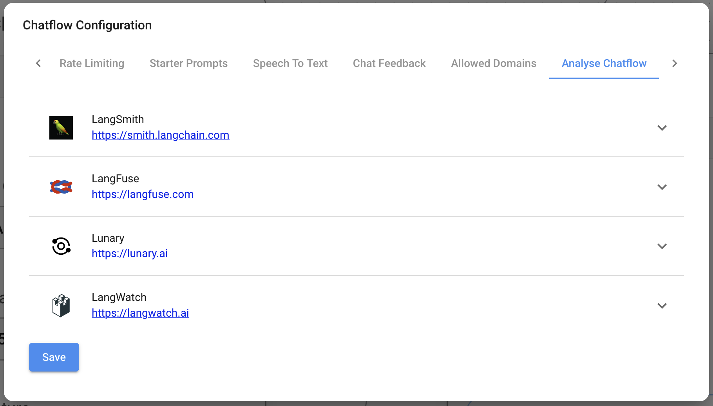

# アナリティクス

***

Flowiseは以下の分析プロバイダーと統合されています:

* [LunaryAI](https://lunary.ai/)
* [Langsmith](https://smith.langchain.com/)
* [Langfuse](https://langfuse.com/)
* [LangWatch](https://langwatch.ai/)

## Lunary

[Lunary](https://lunary.ai/)は、LLMチャットボット用の監視・分析プラットフォームです。

Flowiseは、ユーザートレース、フィードバック追跡、会話のリプレイ、詳細なLLM分析をサポートする完全な統合を提供するためにLunaryと提携しています。

Flowiseユーザーは、チェックアウト時にコード`FLOWISEFRIENDS`を使用することで、チームプランで30%の割引を受けることができます。

FlowiseでLunaryをセットアップする方法の詳細については[こちら](https://lunary.ai/docs/integrations/flowise)をご覧ください。

## セットアップ

1. チャットフローまたはエージェントフローの右上隅で、**設定** > **構成**をクリックします

<figure><figcaption></figcaption></figure>

2. チャットフロー分析セクションに移動します

<figure><figcaption></figcaption></figure>

3. プロバイダーのリストと、その設定フィールドが表示されます

<figure><figcaption></figcaption></figure>

3. 認証情報やその他の設定詳細を入力し、プロバイダーを**オン**にします

<figure><figcaption></figcaption></figure>

## API

UIから分析をオンにすると、[予測API](api.md#prediction-api)のボディで設定を上書きまたは追加設定を提供できます:

```json
{
  "question": "hi there",
  "overrideConfig": {
    "analytics": {
      "langFuse": {
        // langSmith, langFuse, lunary, langWatch
        "userId": "user1"
      }
    }
  }
}
```
