# ドキュメントストア

***

Flowiseのドキュメントストアは、データ管理に関して柔軟なアプローチを提供し、データセットのアップロード、分割、準備、そして1つの場所への追加挿入(アップサート)を可能にします。

この一元化されたアプローチによってデータ処理が簡素化され、様々なデータ形式を効率的に管理することができ、Flowiseアプリ内でのデータの整理とアクセスが容易になります。

## セットアップ

このチュートリアルでは、LLMが広範に学習していない「LibertyGuard Deluxe住宅所有者保険」に関する情報を取得するための[検索拡張生成(RAG)](../use-cases/multiple-documents-qna.md)システムをセットアップします。

**Flowiseドキュメントストア**を使用して、LibertyGuardとその住宅保険商品に関するデータを準備し、アップサートします。これにより、RAGシステムがLibertyGuardの住宅保険商品に関するユーザーの質問に正確に回答できるようになります。

## 1. ドキュメントストアの追加

* まず、ドキュメントストアを追加して名前を付けます。この例では、「LibertyGuard Deluxe住宅所有者保険」とします。

<figure><figcaption></figcaption></figure>

## 2. ドキュメントローダーの選択

* 作成したドキュメントストアに入り、使用する[ドキュメントローダー](../integrations/langchain/document-loaders/)を選択します。この例では、データセットがPDF形式なので、[PDFローダー](../integrations/langchain/document-loaders/pdf-file.md)を使用します。

<figure>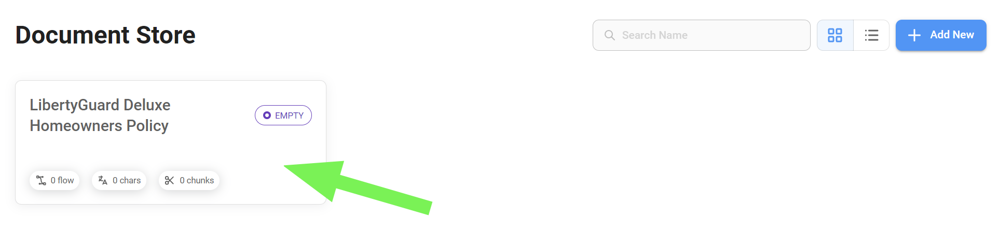<figcaption></figcaption></figure>

<figure>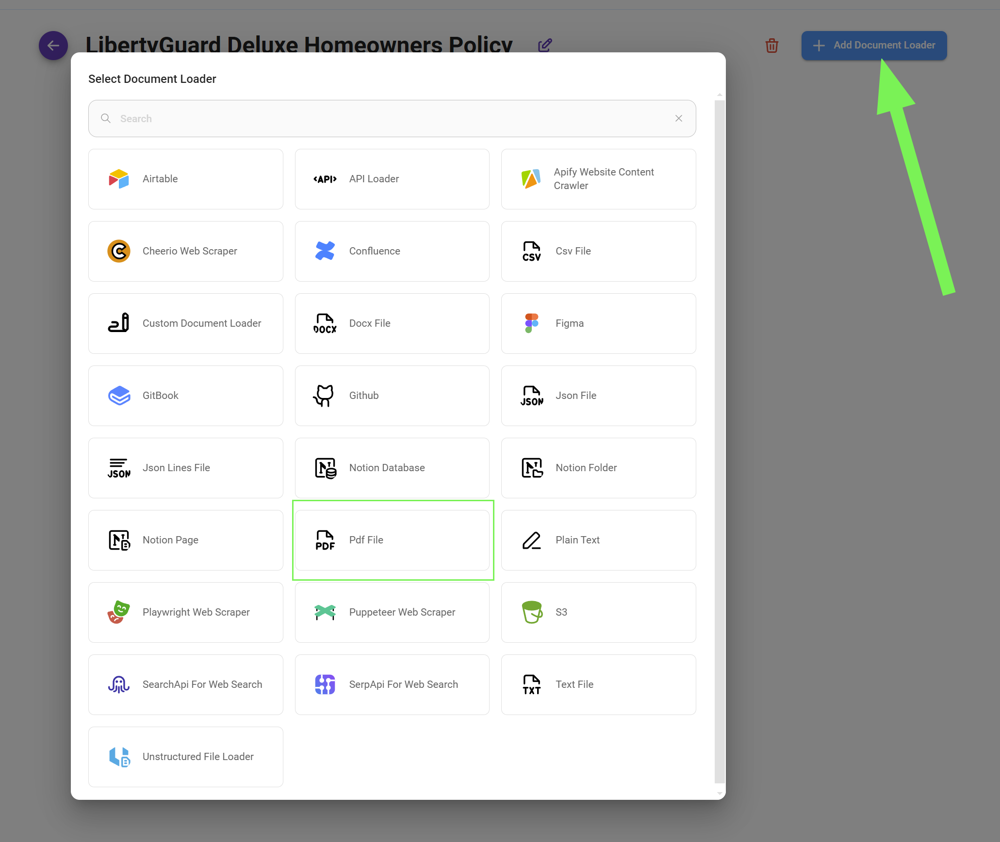<figcaption></figcaption></figure>

## 3. データの準備

* まず、PDFファイルをアップロードすることから始めます。
* 次に、**ユニークなメタデータキー**を追加します。これはオプションですが、後で同じデータセットを対象にしてフィルタリングする必要がある場合に備えて、これを追加しておくことをお勧めします。

<figure>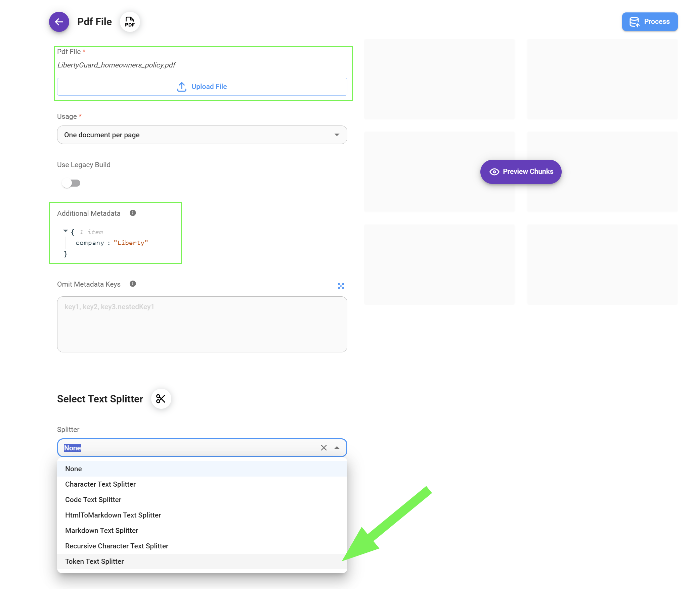<figcaption></figcaption></figure>

* 最後に、データを分割するための[テキストスプリッター](../integrations/langchain/text-splitters/)を選択します。この例では、[再帰的文字テキストスプリッター](../integrations/langchain/text-splitters/recursive-character-text-splitter.md)を使用します。


このガイドでは、チャンク間で関連データが失われないように、余裕を持った**チャンクオーバーラップ**サイズを設定しています。ただし、最適なオーバーラップサイズはデータの複雑さによって異なります。特定のデータセットや抽出したい情報の性質に基づいて、この値を調整する必要があるかもしれません。この詳細については[こちらのガイド](../use-cases/upserting-data.md)を参照してください。


<figure>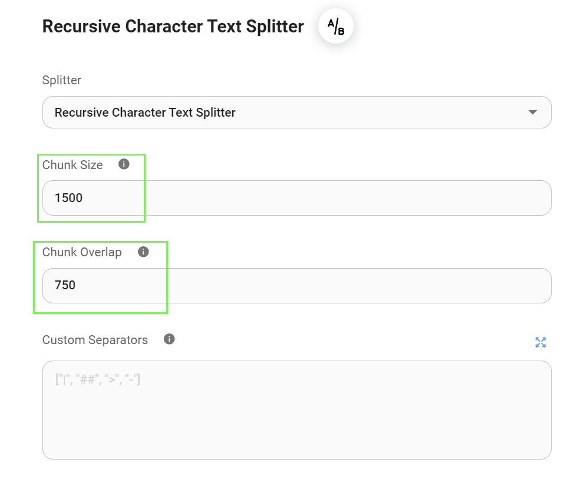<figcaption></figcaption></figure>

## 4. データのプレビュー

* 現在の[テキストスプリッター](../integrations/langchain/text-splitters/)の設定（`chunk_size=1500`および`chunk_overlap=750`）を使用して、データがどのように分割されるかをプレビューできます。

<figure><figcaption></figcaption></figure>

* 特定のデータセットに最適な設定を見つけるために、異なる[テキストスプリッター](../integrations/langchain/text-splitters/)、チャンクサイズ、オーバーラップ値を試すことが重要です。このプレビューによって、分割プロセスを調整し、結果として得られるチャンクがRAGシステムに適していることを確認できます。

<figure><figcaption></figcaption></figure>


各チャンクにカスタムメタデータ`company: "liberty"`が挿入されていることに注目してください。このメタデータにより、同じベクトルストアインデックスを他のデータセットにも使用している場合でも、この特定のデータセットから簡単に情報をフィルタリングして取得できます。


## 5. データの処理

* チャンク分割プロセスに満足したら、データを処理する段階です。

<figure>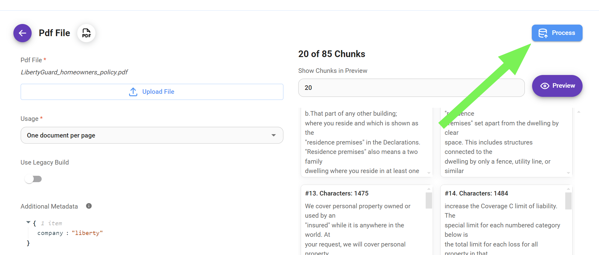<figcaption></figcaption></figure>

<figure><figcaption></figcaption></figure>

データを処理した後でも、個々のチャンクを削除したり追加したりして調整することができます。この詳細な制御には以下のような利点があります：

* **精度の向上:** 元のデータに含まれる不正確さや矛盾を特定して修正し、アプリケーションで使用される情報の信頼性を確保します。
* **関連性の改善:** チャンクの内容を調整して重要な情報を強調し、関連性の低い部分を削除することで、検索プロセスの精度と効果を高めます。
* **クエリの最適化:** 予想されるユーザークエリにより適合するようにチャンクを調整し、より的確な検索を実現してユーザー体験全体を向上させます。

## 6. アップサートプロセスの設定

* データが適切に処理され（ドキュメントローダーを介してロードされ、適切にチャンク分割された状態）たら、アップサートプロセスの設定に進むことができます。

<figure>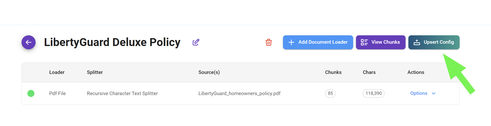<figcaption></figcaption></figure>

アップサートプロセスは3つの基本的なステップで構成されています：

* **埋め込みの選択:** まずデータセットをエンコードするための適切な埋め込みモデルを選択します。このモデルによってデータは数値ベクトル表現に変換されます。
* **データストアの選択:** 次に、データセットを格納するベクトルストアを決定します。
* **レコードマネージャーの選択（オプション）:** 最後に、レコードマネージャーを実装するオプションがあります。このコンポーネントは、ベクトルストア内に格納されたデータセットを管理するための機能を提供します。

<figure>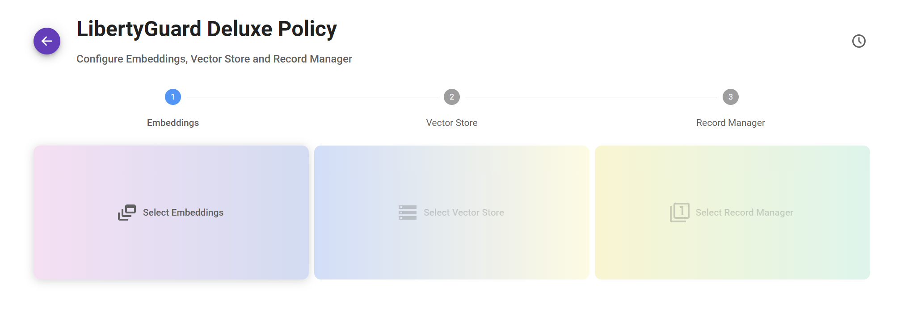<figcaption></figcaption></figure>

### 1. 埋め込みの選択

* 「Select Embeddings」カードをクリックし、お好みの[埋め込みモデル](../integrations/langchain/embeddings/)を選択します。この例では、OpenAIを埋め込みプロバイダーとして選択し、1536次元の「text-embedding-ada-002」モデルを使用します。

<figure>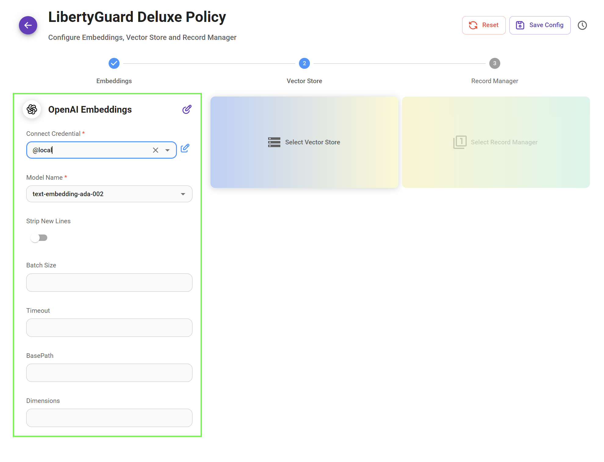<figcaption></figcaption></figure>

### 2. ベクトルストアの選択

* 「Select Vector Store」カードをクリックし、お好みの[ベクトルストア](../integrations/langchain/vector-stores/)を選択します。この例では、本番環境に対応したオプションが必要なため、Upstashを選択します。

<figure><figcaption></figcaption></figure>

### 3. レコードマネージャーの選択

* ベクトルストア内のデータセットの高度な管理のために、オプションで[レコードマネージャー](../integrations/langchain/record-managers.md)を選択・設定することができます。この機能の設定と使用方法の詳細については、専用の[ガイド](../integrations/langchain/record-managers.md)を参照してください。

<figure><figcaption></figcaption></figure>

## 7. ベクトルストアへのデータのアップサート

* データをベクトルストアに転送するアップサートプロセスを開始するには、「Upsert」ボタンをクリックします。

<figure>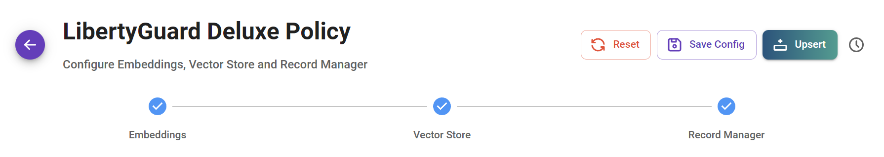<figcaption></figcaption></figure>

* 下図のように、データはUpstashベクトルデータベースに正常にアップサートされました。アップサートプロセスを最適化し、効率的な保存と検索を確保するために、データは85のチャンクに分割されました。

<figure><figcaption></figcaption></figure>

## 8. データセットのテスト

* ドキュメントストアから離れることなくデータセットの機能を素早くテストするには、「Retrieval Query」ボタンを使用します。これによってテストクエリが開始され、データ検索プロセスの正確性と効果を確認することができます。

<figure><figcaption></figcaption></figure>

* この例では、保険契約のキッチンフローリングの補償に関する情報を検索すると、指定したベクトルストアであるUpstashから4つの関連チャンクが取得されます。この検索は定義された「top k」パラメータにより4チャンクに制限されており、不要な重複を避けながら最も関連性の高い情報を受け取ることができます。

<figure><figcaption></figcaption></figure>

## 9. RAGのテスト

* 最後に、検索拡張生成（RAG）システムが稼働状態になります。LLMがクエリを効果的に解釈し、チャンク分割されたデータから関連情報を活用して包括的な回答を構築する様子は注目に値します。

先に設定したベクトルストアを使用することができます：

<figure>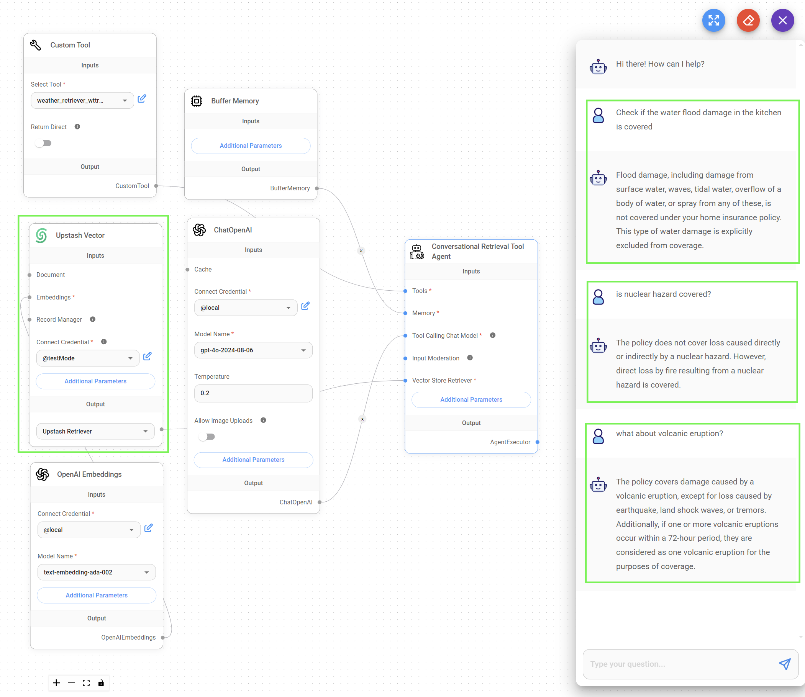<figcaption></figcaption></figure>

または、ドキュメントストア（ベクトル）を使用することができます：

<figure><figcaption></figcaption></figure>

## 10. API

ドキュメントストアの作成、更新、削除をサポートするAPIも用意されています。詳細については[ドキュメントストアAPI](../api-reference/document-store.md)を参照してください。このセクションでは、最もよく使用される2つのAPI（アップサートと更新）について説明します。

### アップサートAPI

アップサートプロセスにはいくつかの異なるシナリオがあり、それぞれ異なる結果をもたらします。

#### シナリオ1: 同じドキュメントストア内で、既存のドキュメントローダー設定を使用し、新しいドキュメントローダーとしてアップサートする

<figure><figcaption></figcaption></figure>


**`docId`**は既存のドキュメントローダーIDを表します。このシナリオではリクエストボディに必須です。




```python
import requests
import json

DOC_STORE_ID = "your_doc_store_id"
DOC_LOADER_ID = "your_doc_loader_id"
API_URL = f"http://localhost:3000/api/v1/document-store/upsert/{DOC_STORE_ID}"
API_KEY = "your_api_key_here"

form_data = {
    "files": ('my-another-file.pdf', open('my-another-file.pdf', 'rb'))
}

body_data = {
    "docId": DOC_LOADER_ID
}

headers = {
    "Authorization": f"Bearer {BEARER_TOKEN}"
}

def query(form_data):
    response = requests.post(API_URL, files=form_data, data=body_data, headers=headers)
    print(response)
    return response.json()

output = query(form_data)
print(output)
```



```javascript
const DOC_STORE_ID = "your_doc_store_id"
const DOC_LOADER_ID = "your_doc_loader_id"

let formData = new FormData();
formData.append("files", input.files[0]);
formData.append("docId", DOC_LOADER_ID)

async function query(formData) {
    const response = await fetch(
        `http://localhost:3000/api/v1/document-store/upsert/${DOC_STORE_ID}`,
        {
            method: "POST",
            headers: {
                "Authorization": "Bearer <your_api_key_here>"
            },
            body: formData
        }
    );
    const result = await response.json();
    return result;
}

query(formData).then((response) => {
    console.log(response);
});
```



#### シナリオ2: 同じドキュメントストア内で、既存のドキュメントローダーを新しいファイルで置き換える

<figure><figcaption></figcaption></figure>


このシナリオでは**`docId`**と**`replaceExisting`**の両方がリクエストボディに必須です。




```python
import requests
import json

DOC_STORE_ID = "your_doc_store_id"
DOC_LOADER_ID = "your_doc_loader_id"
API_URL = f"http://localhost:3000/api/v1/document-store/upsert/{DOC_STORE_ID}"
API_KEY = "your_api_key_here"

form_data = {
    "files": ('my-another-file.pdf', open('my-another-file.pdf', 'rb'))
}

body_data = {
    "docId": DOC_LOADER_ID,
    "replaceExisting": True
}

headers = {
    "Authorization": f"Bearer {BEARER_TOKEN}"
}

def query(form_data):
    response = requests.post(API_URL, files=form_data, data=body_data, headers=headers)
    print(response)
    return response.json()

output = query(form_data)
print(output)
```



```javascript
const DOC_STORE_ID = "your_doc_store_id";
const DOC_LOADER_ID = "your_doc_loader_id";

let formData = new FormData();
formData.append("files", input.files[0]);
formData.append("docId", DOC_LOADER_ID);
formData.append("replaceExisting", true);

async function query(formData) {
    const response = await fetch(
        `http://localhost:3000/api/v1/document-store/upsert/${DOC_STORE_ID}`,
        {
            method: "POST",
            headers: {
                "Authorization": "Bearer <your_api_key_here>"
            },
            body: formData
        }
    );
    const result = await response.json();
    return result;
}

query(formData).then((response) => {
    console.log(response);
});
```



#### シナリオ3: 同じドキュメントストア内で、最初から新しいドキュメントローダーとしてアップサートする

<figure><figcaption></figcaption></figure>


このシナリオでは**`loader`**、**`splitter`**、**`embedding`**、**`vectorStore`**がすべてリクエストボディに必須です。**`recordManager`**はオプションです。




```python
import requests
import json

DOC_STORE_ID = "your_doc_store_id"
API_URL = f"http://localhost:3000/api/v1/document-store/upsert/{DOC_STORE_ID}"
API_KEY = "your_api_key_here"

form_data = {
    "files": ('my-another-file.pdf', open('my-another-file.pdf', 'rb'))
}

loader = {
    "name": "pdfFile",
    "config": {} # デフォルト設定を使用する場合は空にできます
}

splitter = {
    "name": "recursiveCharacterTextSplitter",
    "config": {
        "chunkSize": 1400,
        "chunkOverlap": 100
    }
}

embedding = {
    "name": "openAIEmbeddings",
    "config": {
        "modelName": "text-embedding-ada-002",
        "credential": <your_credential_id>
    }
}

vectorStore = {
    "name": "pinecone",
    "config": {
        "pineconeIndex": "exampleindex",
        "pineconeNamespace": "examplenamespace",
        "credential":  <your_credential_i
    }
}

body_data = {
    "docId": DOC_LOADER_ID,
    "loader": json.dumps(loader),
    "splitter": json.dumps(splitter),
    "embedding": json.dumps(embedding),
    "vectorStore": json.dumps(vectorStore)
}

headers = {
    "Authorization": f"Bearer {BEARER_TOKEN}"
}

def query(form_data):
    response = requests.post(API_URL, files=form_data, data=body_data, headers=headers)
    print(response)
    return response.json()

output = query(form_data)
print(output)
```



```javascript
const DOC_STORE_ID = "your_doc_store_id";
const API_URL = `http://localhost:3000/api/v1/document-store/upsert/${DOC_STORE_ID}`;
const API_KEY = "your_api_key_here";

const formData = new FormData();
formData.append("files", new Blob([await (await fetch('my-another-file.pdf')).blob()]), "my-another-file.pdf");

const loader = {
    name: "pdfFile",
    config: {} // デフォルト設定を使用する場合は空にできます
};

const splitter = {
    name: "recursiveCharacterTextSplitter",
    config: {
        chunkSize: 1400,
        chunkOverlap: 100
    }
};

const embedding = {
    name: "openAIEmbeddings",
    config: {
        modelName: "text-embedding-ada-002",
        credential: "your_credential_id"
    }
};

const vectorStore = {
    name: "pinecone",
    config: {
        pineconeIndex: "exampleindex",
        pineconeNamespace: "examplenamespace",
        credential: "your_credential_id"
    }
};

const bodyData = {
    docId: "DOC_LOADER_ID",
    loader: JSON.stringify(loader),
    splitter: JSON.stringify(splitter),
    embedding: JSON.stringify(embedding),
    vectorStore: JSON.stringify(vectorStore)
};

const headers = {
    "Authorization": `Bearer BEARER_TOKEN`
};

async function query() {
    try {
        const response = await fetch(API_URL, {
            method: "POST",
            headers: headers,
            body: formData
        });

        const result = await response.json();
        console.log(result);
        return result;
    } catch (error) {
        console.error("Error:", error);
    }
}

query();
```




最初から作成することは、認証情報IDが露出するため推奨されません。推奨される方法は、プレースホルダーのドキュメントストアを作成し、UIでパラメータを設定することです。その後、そのプレースホルダーを新しいドキュメントローダーの追加や新しいドキュメントストアの作成のベースとして使用します。


#### シナリオ4: アップサートごとに新しいドキュメントストアを作成する

<figure>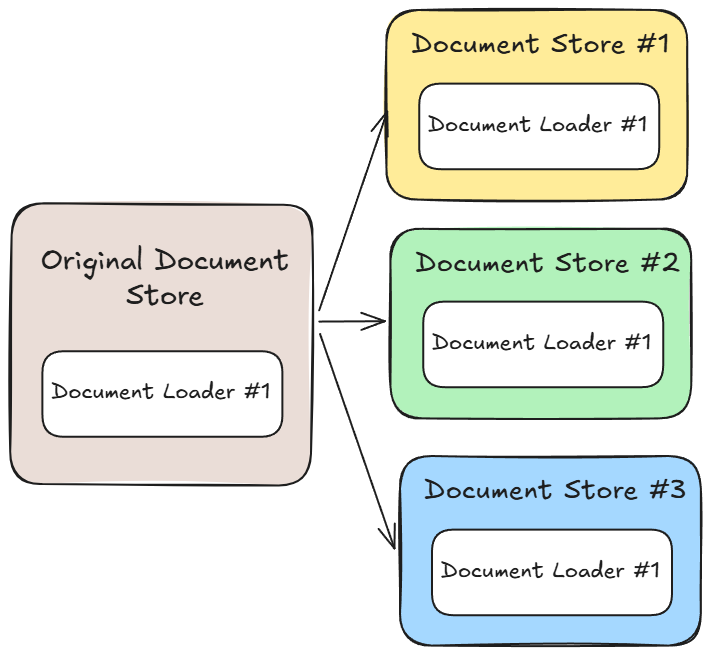<figcaption></figcaption></figure>


このシナリオでは**`createNewDocStore`**と**`docStore`**の両方がリクエストボディに必須です。




```python
import requests
import json

DOC_STORE_ID = "your_doc_store_id"
DOC_LOADER_ID = "your_doc_loader_id"
API_URL = f"http://localhost:3000/api/v1/document-store/upsert/{DOC_STORE_ID}"
API_KEY = "your_api_key_here"

form_data = {
    "files": ('my-another-file.pdf', open('my-another-file.pdf', 'rb'))
}

body_data = {
    "docId": DOC_LOADER_ID,
    "createNewDocStore": True,
    "docStore": json.dumps({"name":"My NEW Doc Store"})
}

headers = {
    "Authorization": f"Bearer {BEARER_TOKEN}"
}

def query(form_data):
    response = requests.post(API_URL, files=form_data, data=body_data, headers=headers)
    print(response)
    return response.json()

output = query(form_data)
print(output)
```



```javascript
const DOC_STORE_ID = "your_doc_store_id";
const DOC_LOADER_ID = "your_doc_loader_id";

let formData = new FormData();
formData.append("files", input.files[0]);
formData.append("docId", DOC_LOADER_ID);
formData.append("createNewDocStore", true);
formData.append("docStore", JSON.stringify({ "name": "My NEW Doc Store" }));

async function query(formData) {
    const response = await fetch(
        `http://localhost:3000/api/v1/document-store/upsert/${DOC_STORE_ID}`,
        {
            method: "POST",
            headers: {
                "Authorization": "Bearer <your_api_key_here>"
            },
            body: formData
        }
    );
    const result = await response.json();
    return result;
}

query(formData).then((response) => {
    console.log(response);
});
```



#### Q: ドキュメントストアIDとドキュメントローダーIDはどこで確認できますか？

A: それぞれのIDはURLから確認できます。

<figure>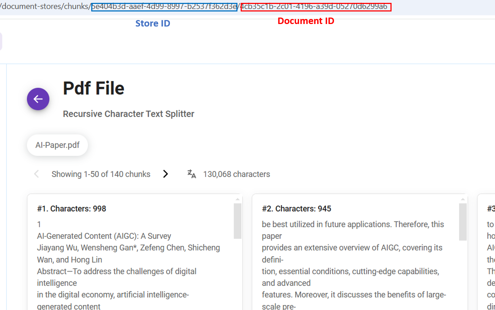<figcaption></figcaption></figure>

#### Q: オーバーライド可能な設定はどこで確認できますか？

A: 各ドキュメントローダーの**View API**ボタンから利用可能な設定を確認できます：

<figure>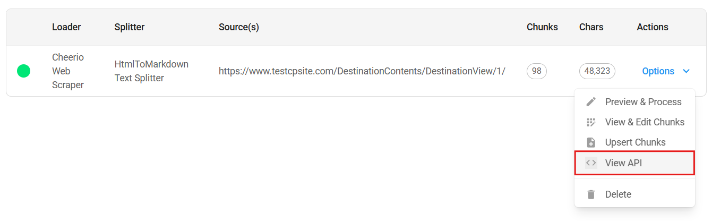<figcaption></figcaption></figure>

<figure><figcaption></figcaption></figure>

各アップサートには5つの要素が関係します：

* **`loader`**
* **`splitter`**
* **`embedding`**
* **`vectorStore`**
* **`recordManager`**

要素の**`config`**ボディで既存の設定をオーバーライドできます。例えば、上のスクリーンショットを使用して、新しい**`url`**で新しいドキュメントローダーを作成できます：



```python
import requests

API_URL = "http://localhost:3000/api/v1/document-store/upsert/<storeId>"

def query(payload):
    response = requests.post(API_URL, json=payload)
    return response.json()

output = query({
    "docId": <docLoaderId>,
    # 既存の設定をオーバーライド
    "loader": {
        "config": {
            "url": "https://new-url.com"
        }
    }
})
print(output)
```



```javascript
async function query(data) {
    const response = await fetch(
        "http://localhost:3000/api/v1/document-store/upsert/<storeId>",
        {
            method: "POST",
            headers: {
                "Content-Type": "application/json"
            },
            body: JSON.stringify(data)
        }
    );
    const result = await response.json();
    return result;
}

query({
    "docId": <docLoaderId>,
    // 既存の設定をオーバーライド
    "loader": {
        "config": {
            "url": "https://new-url.com"
        }
    }
}).then((response) => {
    console.log(response);
});
```



ローダーがファイルアップロードを持っている場合はどうでしょうか？そうです、form dataをボディとして使用する必要があります！

以下の画像を例として、PDFファイルローダーの**`usage`**パラメータを次のようにオーバーライドできます：

<figure><figcaption></figcaption></figure>



```python
import requests
import json

API_URL = "http://localhost:3000/api/v1/document-store/upsert/<storeId>"
API_KEY = "your_api_key_here"

form_data = {
    "files": ('my-another-file.pdf', open('my-another-file.pdf', 'rb'))
}

override_loader_config = {
    "config": {
        "usage": "perPage"
    }
}

body_data = {
    "docId": <docLoaderId>,
    "loader": json.dumps(override_loader_config) # 既存の設定をオーバーライド
}

headers = {
    "Authorization": f"Bearer {BEARER_TOKEN}"
}

def query(form_data):
    response = requests.post(API_URL, files=form_data, data=body_data, headers=headers)
    print(response)
    return response.json()

output = query(form_data)
print(output)
```



```javascript
const DOC_STORE_ID = "your_doc_store_id";
const DOC_LOADER_ID = "your_doc_loader_id";

const overrideLoaderConfig = {
    "config": {
        "usage": "perPage"
    }
}

let formData = new FormData();
formData.append("files", input.files[0]);
formData.append("docId", DOC_LOADER_ID);
formData.append("loader", JSON.stringify(overrideLoaderConfig));

async function query(formData) {
    const response = await fetch(
        `http://localhost:3000/api/v1/document-store/upsert/${DOC_STORE_ID}`,
        {
            method: "POST",
            headers: {
                "Authorization": "Bearer <your_api_key_here>"
            },
            body: formData
        }
    )
    const result = await response.json();
    return result;
}

query(formData).then((response) => {
    console.log(response);
});e
```



#### Q: APIリクエストのボディとしてForm DataとJSONをどのように使い分けるべきですか？

A: PDFやDOCX、TXTなどのファイルアップロード機能を持つ[ドキュメントローダー](../integrations/langchain/document-loaders/)の場合、ボディはForm Dataとして送信する必要があります。


送信するファイルタイプが、ドキュメントローダーが想定しているファイルタイプと互換性があることを確認してください。

例えば、[PDFファイルローダー](../integrations/langchain/document-loaders/pdf-file.md)を使用している場合は、**.pdf**ファイルのみを送信する必要があります。

異なるファイルタイプごとに別々のローダーを用意することを避けるために、[ファイルローダー](../integrations/langchain/document-loaders/file-loader.md)の使用をお勧めします。




```python
import requests
import json

API_URL = "http://localhost:3000/api/v1/document-store/upsert/<storeId>"

# ファイルをアップロードするためにform dataを使用
form_data = {
    "files": ('my-another-file.pdf', open('my-another-file.pdf', 'rb'))
}

body_data = {
    "docId": <docId>
}

def query(form_data):
    response = requests.post(API_URL, files=form_data, data=body_data)
    print(response)
    return response.json()

output = query(form_data)
print(output)
```



```javascript
// ファイルをアップロードするためにFormDataを使用
let formData = new FormData();
formData.append("files", input.files[0]);
formData.append("docId", <docId>);

async function query(formData) {
    const response = await fetch(
        "http://localhost:3000/api/v1/document-store/upsert/<storeId>",
        {
            method: "POST",
            body: formData
        }
    );
    const result = await response.json();
    return result;
}

query(formData).then((response) => {
    console.log(response);
});
```



ファイルアップロード機能を持たない他の[ドキュメントローダー](https://docs.flowiseai.com/integrations/langchain/document-loaders)ノードの場合、APIボディは**JSON**形式です：



```python
import requests

API_URL = "http://localhost:3000/api/v1/document-store/upsert/<storeId>"

def query(payload):
    response = requests.post(API_URL, json=payload)
    return response.json()

output = query({
    "docId": <docId>
})
print(output)
```



```javascript
async function query(data) {
    const response = await fetch(
        "http://localhost:3000/api/v1/document-store/upsert/<storeId>",
        {
            method: "POST",
            headers: {
                "Content-Type": "application/json"
            },
            body: JSON.stringify(data)
        }
    );
    const result = await response.json();
    return result;
}

query({
    "docId": <docId>
}).then((response) => {
    console.log(response);
});
```



#### Q: 新しいメタデータを追加できますか？

A: リクエストボディの中に**`metadata`**を含めることで、新しいメタデータを提供できます：

```json
{
    "docId": <doc-id>,
    "metadata": {
        "source: "abc"
    }
}
```

### 更新API

ドキュメントストア内のすべてのドキュメントローダーを再処理して最新のデータを取得し、ベクトルストアにアップサートして、すべてを同期した状態に保ちたい場合があります。これは更新APIを通じて実行できます：



```python
import requests

API_URL = "http://localhost:3000/api/v1/document-store/refresh/<storeId>"

def query():
    response = requests.post(API_URL)
    return response.json()

output = query()
print(output)
```



```javascript
async function query(data) {
    const response = await fetch(
        "http://localhost:3000/api/v1/document-store/refresh/<storeId>",
        {
            method: "POST",
            headers: {
                "Content-Type": "application/json"
            }
        }
    );
    const result = await response.json();
    return result;
}

query().then((response) => {
    console.log(response);
});
```



特定のドキュメントローダーの既存の設定をオーバーライドすることもできます：



```python
import requests

API_URL = "http://localhost:3000/api/v1/document-store/refresh/<storeId>"

def query(payload):
    response = requests.post(API_URL, json=payload)
    return response.json()

output = query(
{
    "items": [
        {
            "docId": <docId>,
            "splitter": {
                "name": "recursiveCharacterTextSplitter",
                "config": {
                    "chunkSize": 2000,
                    "chunkOverlap": 100
                }
            }
        }
    ]
}
)
print(output)
```



```javascript
async function query(data) {
    const response = await fetch(
        "http://localhost:3000/api/v1/document-store/refresh/<storeId>",
        {
            method: "POST",
            headers: {
                "Content-Type": "application/json"
            },
            body: JSON.stringify(data)
        }
    );
    const result = await response.json();
    return result;
}

query({
    "items": [
        {
            "docId": <docId>,
            "splitter": {
                "name": "recursiveCharacterTextSplitter",
                "config": {
                    "chunkSize": 2000,
                    "chunkOverlap": 100
                }
            }
        }
    ]
}).then((response) => {
    console.log(response);
});
```



## 11. まとめ

私たちはLibertyGuard Deluxe住宅所有者保険のデータを整理するためにドキュメントストアを作成することから始めました。このデータは、アップロード、チャンク分割、処理、アップサートを行って準備され、RAGシステムで使用できる状態になりました。

**ドキュメントストアの利点：**

ドキュメントストアは、検索拡張生成（RAG）システム用のデータ管理と準備に関して、いくつかの利点を提供します：

* **整理と管理：** データの保存、管理、準備のための中心的な場所を提供します。
* **データ品質：** チャンク分割プロセスにより、正確な検索と分析のためのデータ構造化を支援します。
* **柔軟性：** ドキュメントストアは必要に応じてデータを改良・調整することができ、RAGシステムの精度と関連性を向上させます。

## 12. ビデオチュートリアル

### RAG Like a Boss - Flowise Document Store チュートリアル

このビデオでは、[Leon](https://youtube.com/@leonvanzyl)がFlowiseAIでRAGナレッジベースを簡単に管理するためのドキュメントストアの使用方法について、ステップバイステップのチュートリアルを提供しています。


